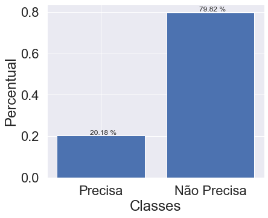
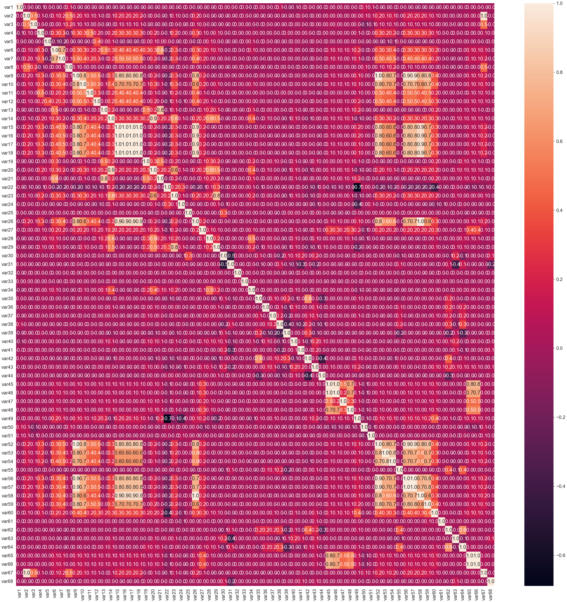
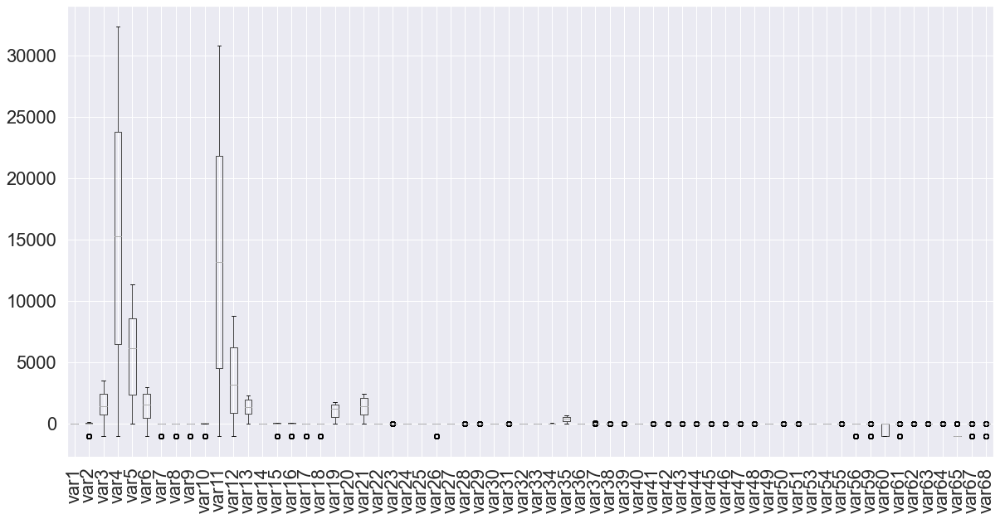
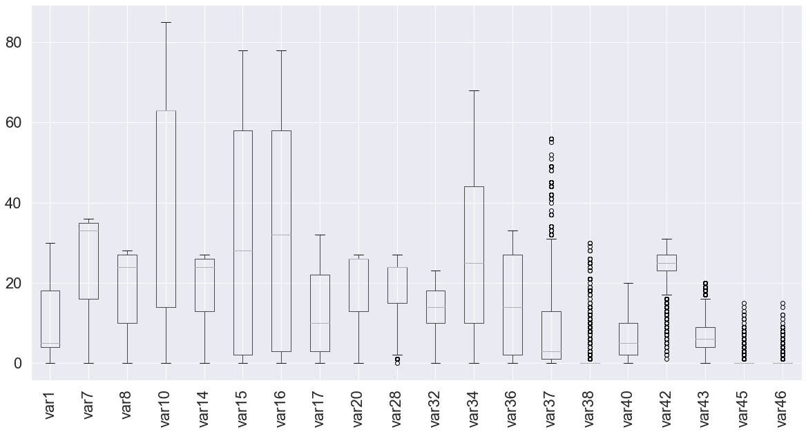

#  <span style="color:orange">Analise de Dados Serviço de Telemarketing</span>

**Erik Tavares dos Anjos** <br />
**Date Updated: 05/06/2022** <br />
**GIT: https://github.com/eriktavares/compass-telemarketing**

# Cenário </br>
“Você provavelmente já recebeu uma ligação de telemarketing oferecendo um produto que você não precisa. Essa situação de estresse é minimizada quando você oferece um produto que o cliente realmente precisa.”

# Objetivo </br>
Este documento tem como objetivo analisar os dados do dataset com as informações dos clientes em potêncial e atraveis dos seus dados avaliar se eles precisam ou não de um determinado produto. Dessa forma será feito uma analise exploratória dos dados e modelagem através de algoritmos de machine learning para classificação 

# Ambiente

O ambiente utilizado é a plataforma Anaconda [https://www.anaconda.com/] e o experimento feito com jupyter notebook. No diretório backups existe o arquivo environments_user.yaml com o backup do ambiente do ananda com todas as versões das ferramentas utilizadas neste documento.

Um notebook MLFlow Run está com o código para iniciar o MLflow, após iniciado o acesso pelo endereço http://127.0.0.1:5000/. Dentro da ferramenta podem ser visto do o log dos experimentos.

# Leitura dos dados


```python
import pandas as pd
df_metadata= pd.read_csv('../Data/raw/metadata.csv')
df_train= pd.read_csv('../Data/raw/train.csv')
```

# MLFLOW


Para realizar o gerenciamento do ciclo de vida deste projeto de machine learning, será utilizado o MLFLOW. Conforme a descrição do site "O MLflow é uma plataforma de código aberto para gerenciar o ciclo de vida do ML, incluindo experimentação, reprodutibilidade, implantação e um registro de modelo central. Atualmente, o MLflow oferece quatro componentes: " https://mlflow.org/


```python
# Para usar o sqlite como repositorio
import mlflow
mlflow.set_tracking_uri("sqlite:///mlruns.db")

experiment_name = 'Telemarketing_Experiment'
experiment = mlflow.get_experiment_by_name(experiment_name)
if experiment is None:
    experiment_id = mlflow.create_experiment(experiment_name)
    experiment = mlflow.get_experiment(experiment_id)
experiment_id = experiment.experiment_id
```

# Metadata

O metadata tem a descrição do tipo da variável, Quantitativa ou Qualidativa. Abaixo pode ser visto as quantidades de cada tipo
de váriavel. 


As variáveis quantitativas ou numéricas podem ser

**Discretas:** assumem apenas valores inteiros. Ex.: número de irmãos, número de passageiros <br />
**Contínuas:** assume qualquer valor no intervalo dos números reais. Ex.: peso, altura 
As variáveis qualitativas ou categóricas podem ser <br />
**Nominais:** quando as categorias não possuem uma ordem natural. Ex.: nomes, cores, sexo. <br />
**Ordinais:** quando as categorias podem ser ordenadas. Ex.: tamanho (pequeno, médio, grande), classe social (baixa, média, alta), grau de instrução (básico, médio, graduação, pós-graduação)
                                                                                                                                                  
[https://www.inf.ufsc.br/~andre.zibetti/probabilidade/aed.html]        


```python
df_metadata.head()
```


<div>
<style scoped>
    .dataframe tbody tr th:only-of-type {
        vertical-align: middle;
    }

    .dataframe tbody tr th {
        vertical-align: top;
    }

    .dataframe thead th {
        text-align: right;
    }
</style>
<table border="1" class="dataframe">
  <thead>
    <tr style="text-align: right;">
      <th></th>
      <th>Variavel cod</th>
      <th>Variavel tipo</th>
    </tr>
  </thead>
  <tbody>
    <tr>
      <th>0</th>
      <td>id</td>
      <td>Qualitativo nominal</td>
    </tr>
    <tr>
      <th>1</th>
      <td>var1</td>
      <td>Qualitativo nominal</td>
    </tr>
    <tr>
      <th>2</th>
      <td>var2</td>
      <td>Qualitativo nominal</td>
    </tr>
    <tr>
      <th>3</th>
      <td>var3</td>
      <td>Qualitativo nominal</td>
    </tr>
    <tr>
      <th>4</th>
      <td>var4</td>
      <td>Qualitativo nominal</td>
    </tr>
  </tbody>
</table>
</div>


Quantidade de cada tipo de váriável


```python
df_metadata['Variavel tipo'].value_counts()
```


    Qualitativo nominal      36
    Quantitativo discreto    18
    Quantitativo continua    12
    Qualitativo ordinal       4
    Name: Variavel tipo, dtype: int64


```python
df_metadata_vars=df_metadata[df_metadata['Variavel cod']!='id'].copy()
df_metadata_vars=df_metadata_vars[df_metadata_vars['Variavel cod']!='y'].copy()
df_metadata_vars=df_metadata_vars.reset_index()
df_metadata_vars
```


<div>
<style scoped>
    .dataframe tbody tr th:only-of-type {
        vertical-align: middle;
    }

    .dataframe tbody tr th {
        vertical-align: top;
    }

    .dataframe thead th {
        text-align: right;
    }
</style>
<table border="1" class="dataframe">
  <thead>
    <tr style="text-align: right;">
      <th></th>
      <th>index</th>
      <th>Variavel cod</th>
      <th>Variavel tipo</th>
    </tr>
  </thead>
  <tbody>
    <tr>
      <th>0</th>
      <td>1</td>
      <td>var1</td>
      <td>Qualitativo nominal</td>
    </tr>
    <tr>
      <th>1</th>
      <td>2</td>
      <td>var2</td>
      <td>Qualitativo nominal</td>
    </tr>
    <tr>
      <th>2</th>
      <td>3</td>
      <td>var3</td>
      <td>Qualitativo nominal</td>
    </tr>
    <tr>
      <th>3</th>
      <td>4</td>
      <td>var4</td>
      <td>Qualitativo nominal</td>
    </tr>
    <tr>
      <th>4</th>
      <td>5</td>
      <td>var5</td>
      <td>Qualitativo nominal</td>
    </tr>
    <tr>
      <th>...</th>
      <td>...</td>
      <td>...</td>
      <td>...</td>
    </tr>
    <tr>
      <th>63</th>
      <td>64</td>
      <td>var64</td>
      <td>Quantitativo continua</td>
    </tr>
    <tr>
      <th>64</th>
      <td>65</td>
      <td>var65</td>
      <td>Quantitativo continua</td>
    </tr>
    <tr>
      <th>65</th>
      <td>66</td>
      <td>var66</td>
      <td>Quantitativo continua</td>
    </tr>
    <tr>
      <th>66</th>
      <td>67</td>
      <td>var67</td>
      <td>Quantitativo discreto</td>
    </tr>
    <tr>
      <th>67</th>
      <td>68</td>
      <td>var68</td>
      <td>Quantitativo discreto</td>
    </tr>
  </tbody>
</table>
<p>68 rows × 3 columns</p>
</div>


Separação das variáveis qualitativas


```python
df_Qualitativo_nominal = df_metadata_vars[df_metadata_vars['Variavel tipo']=='Qualitativo nominal']
df_Qualitativo_ordinal = df_metadata_vars[df_metadata_vars['Variavel tipo']=='Qualitativo ordinal']
df_Qualitativo = pd.concat([df_Qualitativo_nominal, df_Qualitativo_ordinal], axis=0)
df_Qualitativo
#df_Qualitativo_ordinal
```


<div>
<style scoped>
    .dataframe tbody tr th:only-of-type {
        vertical-align: middle;
    }

    .dataframe tbody tr th {
        vertical-align: top;
    }

    .dataframe thead th {
        text-align: right;
    }
</style>
<table border="1" class="dataframe">
  <thead>
    <tr style="text-align: right;">
      <th></th>
      <th>index</th>
      <th>Variavel cod</th>
      <th>Variavel tipo</th>
    </tr>
  </thead>
  <tbody>
    <tr>
      <th>0</th>
      <td>1</td>
      <td>var1</td>
      <td>Qualitativo nominal</td>
    </tr>
    <tr>
      <th>1</th>
      <td>2</td>
      <td>var2</td>
      <td>Qualitativo nominal</td>
    </tr>
    <tr>
      <th>2</th>
      <td>3</td>
      <td>var3</td>
      <td>Qualitativo nominal</td>
    </tr>
    <tr>
      <th>3</th>
      <td>4</td>
      <td>var4</td>
      <td>Qualitativo nominal</td>
    </tr>
    <tr>
      <th>4</th>
      <td>5</td>
      <td>var5</td>
      <td>Qualitativo nominal</td>
    </tr>
    <tr>
      <th>5</th>
      <td>6</td>
      <td>var6</td>
      <td>Qualitativo nominal</td>
    </tr>
    <tr>
      <th>6</th>
      <td>7</td>
      <td>var7</td>
      <td>Qualitativo nominal</td>
    </tr>
    <tr>
      <th>7</th>
      <td>8</td>
      <td>var8</td>
      <td>Qualitativo nominal</td>
    </tr>
    <tr>
      <th>8</th>
      <td>9</td>
      <td>var9</td>
      <td>Qualitativo nominal</td>
    </tr>
    <tr>
      <th>9</th>
      <td>10</td>
      <td>var10</td>
      <td>Qualitativo nominal</td>
    </tr>
    <tr>
      <th>10</th>
      <td>11</td>
      <td>var11</td>
      <td>Qualitativo nominal</td>
    </tr>
    <tr>
      <th>11</th>
      <td>12</td>
      <td>var12</td>
      <td>Qualitativo nominal</td>
    </tr>
    <tr>
      <th>12</th>
      <td>13</td>
      <td>var13</td>
      <td>Qualitativo nominal</td>
    </tr>
    <tr>
      <th>13</th>
      <td>14</td>
      <td>var14</td>
      <td>Qualitativo nominal</td>
    </tr>
    <tr>
      <th>14</th>
      <td>15</td>
      <td>var15</td>
      <td>Qualitativo nominal</td>
    </tr>
    <tr>
      <th>15</th>
      <td>16</td>
      <td>var16</td>
      <td>Qualitativo nominal</td>
    </tr>
    <tr>
      <th>16</th>
      <td>17</td>
      <td>var17</td>
      <td>Qualitativo nominal</td>
    </tr>
    <tr>
      <th>17</th>
      <td>18</td>
      <td>var18</td>
      <td>Qualitativo nominal</td>
    </tr>
    <tr>
      <th>18</th>
      <td>19</td>
      <td>var19</td>
      <td>Qualitativo nominal</td>
    </tr>
    <tr>
      <th>19</th>
      <td>20</td>
      <td>var20</td>
      <td>Qualitativo nominal</td>
    </tr>
    <tr>
      <th>20</th>
      <td>21</td>
      <td>var21</td>
      <td>Qualitativo nominal</td>
    </tr>
    <tr>
      <th>21</th>
      <td>22</td>
      <td>var22</td>
      <td>Qualitativo nominal</td>
    </tr>
    <tr>
      <th>22</th>
      <td>23</td>
      <td>var23</td>
      <td>Qualitativo nominal</td>
    </tr>
    <tr>
      <th>27</th>
      <td>28</td>
      <td>var28</td>
      <td>Qualitativo nominal</td>
    </tr>
    <tr>
      <th>28</th>
      <td>29</td>
      <td>var29</td>
      <td>Qualitativo nominal</td>
    </tr>
    <tr>
      <th>29</th>
      <td>30</td>
      <td>var30</td>
      <td>Qualitativo nominal</td>
    </tr>
    <tr>
      <th>30</th>
      <td>31</td>
      <td>var31</td>
      <td>Qualitativo nominal</td>
    </tr>
    <tr>
      <th>32</th>
      <td>33</td>
      <td>var33</td>
      <td>Qualitativo nominal</td>
    </tr>
    <tr>
      <th>33</th>
      <td>34</td>
      <td>var34</td>
      <td>Qualitativo nominal</td>
    </tr>
    <tr>
      <th>34</th>
      <td>35</td>
      <td>var35</td>
      <td>Qualitativo nominal</td>
    </tr>
    <tr>
      <th>35</th>
      <td>36</td>
      <td>var36</td>
      <td>Qualitativo nominal</td>
    </tr>
    <tr>
      <th>36</th>
      <td>37</td>
      <td>var37</td>
      <td>Qualitativo nominal</td>
    </tr>
    <tr>
      <th>37</th>
      <td>38</td>
      <td>var38</td>
      <td>Qualitativo nominal</td>
    </tr>
    <tr>
      <th>38</th>
      <td>39</td>
      <td>var39</td>
      <td>Qualitativo nominal</td>
    </tr>
    <tr>
      <th>40</th>
      <td>41</td>
      <td>var41</td>
      <td>Qualitativo nominal</td>
    </tr>
    <tr>
      <th>25</th>
      <td>26</td>
      <td>var26</td>
      <td>Qualitativo ordinal</td>
    </tr>
    <tr>
      <th>31</th>
      <td>32</td>
      <td>var32</td>
      <td>Qualitativo ordinal</td>
    </tr>
    <tr>
      <th>41</th>
      <td>42</td>
      <td>var42</td>
      <td>Qualitativo ordinal</td>
    </tr>
    <tr>
      <th>42</th>
      <td>43</td>
      <td>var43</td>
      <td>Qualitativo ordinal</td>
    </tr>
  </tbody>
</table>
</div>


Separação das variáveis quantitativas


```python
df_Quantitativo_continua = df_metadata_vars[df_metadata_vars['Variavel tipo']=='Quantitativo continua']
df_Quantitativo_discreto = df_metadata_vars[df_metadata_vars['Variavel tipo']=='Quantitativo discreto']
df_Quantitativo = pd.concat([df_Quantitativo_continua, df_Quantitativo_discreto], axis=0)
df_Quantitativo
```


<div>
<style scoped>
    .dataframe tbody tr th:only-of-type {
        vertical-align: middle;
    }

    .dataframe tbody tr th {
        vertical-align: top;
    }

    .dataframe thead th {
        text-align: right;
    }
</style>
<table border="1" class="dataframe">
  <thead>
    <tr style="text-align: right;">
      <th></th>
      <th>index</th>
      <th>Variavel cod</th>
      <th>Variavel tipo</th>
    </tr>
  </thead>
  <tbody>
    <tr>
      <th>54</th>
      <td>55</td>
      <td>var55</td>
      <td>Quantitativo continua</td>
    </tr>
    <tr>
      <th>55</th>
      <td>56</td>
      <td>var56</td>
      <td>Quantitativo continua</td>
    </tr>
    <tr>
      <th>56</th>
      <td>57</td>
      <td>var57</td>
      <td>Quantitativo continua</td>
    </tr>
    <tr>
      <th>57</th>
      <td>58</td>
      <td>var58</td>
      <td>Quantitativo continua</td>
    </tr>
    <tr>
      <th>58</th>
      <td>59</td>
      <td>var59</td>
      <td>Quantitativo continua</td>
    </tr>
    <tr>
      <th>59</th>
      <td>60</td>
      <td>var60</td>
      <td>Quantitativo continua</td>
    </tr>
    <tr>
      <th>60</th>
      <td>61</td>
      <td>var61</td>
      <td>Quantitativo continua</td>
    </tr>
    <tr>
      <th>61</th>
      <td>62</td>
      <td>var62</td>
      <td>Quantitativo continua</td>
    </tr>
    <tr>
      <th>62</th>
      <td>63</td>
      <td>var63</td>
      <td>Quantitativo continua</td>
    </tr>
    <tr>
      <th>63</th>
      <td>64</td>
      <td>var64</td>
      <td>Quantitativo continua</td>
    </tr>
    <tr>
      <th>64</th>
      <td>65</td>
      <td>var65</td>
      <td>Quantitativo continua</td>
    </tr>
    <tr>
      <th>65</th>
      <td>66</td>
      <td>var66</td>
      <td>Quantitativo continua</td>
    </tr>
    <tr>
      <th>23</th>
      <td>24</td>
      <td>var24</td>
      <td>Quantitativo discreto</td>
    </tr>
    <tr>
      <th>24</th>
      <td>25</td>
      <td>var25</td>
      <td>Quantitativo discreto</td>
    </tr>
    <tr>
      <th>26</th>
      <td>27</td>
      <td>var27</td>
      <td>Quantitativo discreto</td>
    </tr>
    <tr>
      <th>39</th>
      <td>40</td>
      <td>var40</td>
      <td>Quantitativo discreto</td>
    </tr>
    <tr>
      <th>43</th>
      <td>44</td>
      <td>var44</td>
      <td>Quantitativo discreto</td>
    </tr>
    <tr>
      <th>44</th>
      <td>45</td>
      <td>var45</td>
      <td>Quantitativo discreto</td>
    </tr>
    <tr>
      <th>45</th>
      <td>46</td>
      <td>var46</td>
      <td>Quantitativo discreto</td>
    </tr>
    <tr>
      <th>46</th>
      <td>47</td>
      <td>var47</td>
      <td>Quantitativo discreto</td>
    </tr>
    <tr>
      <th>47</th>
      <td>48</td>
      <td>var48</td>
      <td>Quantitativo discreto</td>
    </tr>
    <tr>
      <th>48</th>
      <td>49</td>
      <td>var49</td>
      <td>Quantitativo discreto</td>
    </tr>
    <tr>
      <th>49</th>
      <td>50</td>
      <td>var50</td>
      <td>Quantitativo discreto</td>
    </tr>
    <tr>
      <th>50</th>
      <td>51</td>
      <td>var51</td>
      <td>Quantitativo discreto</td>
    </tr>
    <tr>
      <th>51</th>
      <td>52</td>
      <td>var52</td>
      <td>Quantitativo discreto</td>
    </tr>
    <tr>
      <th>52</th>
      <td>53</td>
      <td>var53</td>
      <td>Quantitativo discreto</td>
    </tr>
    <tr>
      <th>53</th>
      <td>54</td>
      <td>var54</td>
      <td>Quantitativo discreto</td>
    </tr>
    <tr>
      <th>66</th>
      <td>67</td>
      <td>var67</td>
      <td>Quantitativo discreto</td>
    </tr>
    <tr>
      <th>67</th>
      <td>68</td>
      <td>var68</td>
      <td>Quantitativo discreto</td>
    </tr>
  </tbody>
</table>
</div>


# Dataset Train

No dados contidos no arquivo train, estão os valores das variáveis e o valor da váriável alvo y, com o inderesse do cliente.


```python
df_train.head()
```


<div>
<style scoped>
    .dataframe tbody tr th:only-of-type {
        vertical-align: middle;
    }

    .dataframe tbody tr th {
        vertical-align: top;
    }

    .dataframe thead th {
        text-align: right;
    }
</style>
<table border="1" class="dataframe">
  <thead>
    <tr style="text-align: right;">
      <th></th>
      <th>var1</th>
      <th>var2</th>
      <th>var3</th>
      <th>var4</th>
      <th>var5</th>
      <th>var6</th>
      <th>var7</th>
      <th>var8</th>
      <th>var9</th>
      <th>var10</th>
      <th>...</th>
      <th>var60</th>
      <th>var61</th>
      <th>var62</th>
      <th>var63</th>
      <th>var64</th>
      <th>var65</th>
      <th>var66</th>
      <th>var67</th>
      <th>var68</th>
      <th>y</th>
    </tr>
  </thead>
  <tbody>
    <tr>
      <th>0</th>
      <td>18</td>
      <td>19</td>
      <td>2853</td>
      <td>29442</td>
      <td>1386</td>
      <td>2435</td>
      <td>35</td>
      <td>-999</td>
      <td>3</td>
      <td>63</td>
      <td>...</td>
      <td>0.311441</td>
      <td>0.142303</td>
      <td>0.056146</td>
      <td>0.632694</td>
      <td>0.024054</td>
      <td>0.253356</td>
      <td>0.00603</td>
      <td>0.132353</td>
      <td>0.139706</td>
      <td>1</td>
    </tr>
    <tr>
      <th>1</th>
      <td>4</td>
      <td>110</td>
      <td>1986</td>
      <td>13684</td>
      <td>7189</td>
      <td>-999</td>
      <td>-999</td>
      <td>17</td>
      <td>3</td>
      <td>63</td>
      <td>...</td>
      <td>-999.000000</td>
      <td>-999.000000</td>
      <td>0.070991</td>
      <td>0.773966</td>
      <td>0.019315</td>
      <td>-999.000000</td>
      <td>-999.00000</td>
      <td>0.147059</td>
      <td>0.106618</td>
      <td>0</td>
    </tr>
    <tr>
      <th>2</th>
      <td>0</td>
      <td>39</td>
      <td>1019</td>
      <td>10232</td>
      <td>678</td>
      <td>791</td>
      <td>16</td>
      <td>-999</td>
      <td>3</td>
      <td>63</td>
      <td>...</td>
      <td>-999.000000</td>
      <td>0.200814</td>
      <td>0.051046</td>
      <td>0.980827</td>
      <td>0.018536</td>
      <td>-999.000000</td>
      <td>-999.00000</td>
      <td>0.382353</td>
      <td>0.242647</td>
      <td>0</td>
    </tr>
    <tr>
      <th>3</th>
      <td>20</td>
      <td>39</td>
      <td>1751</td>
      <td>2689</td>
      <td>8235</td>
      <td>1042</td>
      <td>13</td>
      <td>10</td>
      <td>1</td>
      <td>14</td>
      <td>...</td>
      <td>-999.000000</td>
      <td>0.352379</td>
      <td>0.044301</td>
      <td>0.951564</td>
      <td>0.023684</td>
      <td>0.363370</td>
      <td>0.00201</td>
      <td>0.147059</td>
      <td>0.132353</td>
      <td>0</td>
    </tr>
    <tr>
      <th>4</th>
      <td>7</td>
      <td>44</td>
      <td>2262</td>
      <td>29428</td>
      <td>6031</td>
      <td>304</td>
      <td>16</td>
      <td>-999</td>
      <td>3</td>
      <td>63</td>
      <td>...</td>
      <td>0.021226</td>
      <td>0.226161</td>
      <td>0.059125</td>
      <td>0.906155</td>
      <td>0.020733</td>
      <td>-999.000000</td>
      <td>-999.00000</td>
      <td>0.455882</td>
      <td>0.132353</td>
      <td>1</td>
    </tr>
  </tbody>
</table>
<p>5 rows × 69 columns</p>
</div>


```python
#df_train= df_train.drop(columns=['id'])
```


```python
df_train.shape
```


    (14123, 69)


Como o quantidade de dados 1 em y é bem menor do que 0, podemos assumir que o inderesse do cliente é na ocorrência 1 e o não interesse em 0. Pela própria descrição do problema, sabemos que há menos casos de interesse do cliente, e esse o objetivo da analise.


```python
target_col = 'y'
target=df_train[target_col]
df_vars= df_train.drop(columns=[target_col])
df_train[target_col].value_counts()
```


    0    11273
    1     2850
    Name: y, dtype: int64


```python
dict_target = { 0: 'Não Precisa', 
               1: 'Precisa'}
```

Na tabela abaixo pode ser visto que em 20% dos casos, o cliente precisa do produto, e 80% não precisa. Claramente é possível já imaginar que, ligando para esses 20% que precisam a possibilidade de fechar a venda é maior, ou "quase certa", porque está direcionado a um cliente que precisa do produto, economiza tempo do vendedor e aumenta a acertividade. 


```python
dist_quantidades = pd.DataFrame({'frequencia' : df_train[target_col].value_counts(), 
                                      'Porcentagem (%)': df_train[target_col].value_counts(normalize=1) *100})
dist_quantidades.rename(index=dict_target, inplace = True)
dist_quantidades.rename_axis(target_col, axis='columns', inplace=True)
dist_quantidades
```


<div>
<style scoped>
    .dataframe tbody tr th:only-of-type {
        vertical-align: middle;
    }

    .dataframe tbody tr th {
        vertical-align: top;
    }

    .dataframe thead th {
        text-align: right;
    }
</style>
<table border="1" class="dataframe">
  <thead>
    <tr style="text-align: right;">
      <th>y</th>
      <th>frequencia</th>
      <th>Porcentagem (%)</th>
    </tr>
  </thead>
  <tbody>
    <tr>
      <th>Não Precisa</th>
      <td>11273</td>
      <td>79.820152</td>
    </tr>
    <tr>
      <th>Precisa</th>
      <td>2850</td>
      <td>20.179848</td>
    </tr>
  </tbody>
</table>
</div>


```python
import matplotlib.pyplot as plt
fig = plt.figure( figsize =(5,4))
ax = fig.add_axes([0,0,1,1])
types= ['Precisa', 'Não Precisa']
percent=[pd.DataFrame(target).value_counts(normalize=True)[1],pd.DataFrame(target).value_counts(normalize=True)[0]]
ax.bar(types,percent)
ax.set_ylabel('Percentual')
ax.set_xlabel('Classes')
for index, value in enumerate(percent):
        txt= f'{round(value*100, 2)} %'
        y_coord = value + 0.005
        x_coord=index - 0.1
        ax.text(x=x_coord,y=y_coord, s=txt, fontsize=12)
        ax.grid()
        
plt.show()
```


    

    


Mas a pergunta é como vamos descobrir se o cliente esta precisando ou não do produto. O entendimento das variáveis do dataset e como elas se relacionam com a necessidade ou não do cliente.

# Tratamento dos dados

**Verificação de Dados Nulos** </br>
Acima já fizemos uma pequena visualização dos dados com a verificação do tipo da váriável, Quantitativa ou qualitativa. Agora vamos verificar se algum dado está faltante ou nulo. Para isso, uma verificação se é nulo, e uma soma de todos os resultados de cada váriável, inclusive a variável alvo.


```python
df_train.info()
```

    <class 'pandas.core.frame.DataFrame'>
    RangeIndex: 14123 entries, 0 to 14122
    Data columns (total 70 columns):
     #   Column  Non-Null Count  Dtype  
    ---  ------  --------------  -----  
     0   id      14123 non-null  int64  
     1   var1    14123 non-null  int64  
     2   var2    14123 non-null  int64  
     3   var3    14123 non-null  int64  
     4   var4    14123 non-null  int64  
     5   var5    14123 non-null  int64  
     6   var6    14123 non-null  int64  
     7   var7    14123 non-null  int64  
     8   var8    14123 non-null  int64  
     9   var9    14123 non-null  int64  
     10  var10   14123 non-null  int64  
     11  var11   14123 non-null  int64  
     12  var12   14123 non-null  int64  
     13  var13   14123 non-null  int64  
     14  var14   14123 non-null  int64  
     15  var15   14123 non-null  int64  
     16  var16   14123 non-null  int64  
     17  var17   14123 non-null  int64  
     18  var18   14123 non-null  int64  
     19  var19   14123 non-null  int64  
     20  var20   14123 non-null  int64  
     21  var21   14123 non-null  int64  
     22  var22   14123 non-null  int64  
     23  var23   14123 non-null  int64  
     24  var24   14123 non-null  int64  
     25  var25   14123 non-null  int64  
     26  var26   14123 non-null  int64  
     27  var27   14123 non-null  int64  
     28  var28   14123 non-null  int64  
     29  var29   14123 non-null  int64  
     30  var30   14123 non-null  int64  
     31  var31   14123 non-null  int64  
     32  var32   14123 non-null  int64  
     33  var33   14123 non-null  int64  
     34  var34   14123 non-null  int64  
     35  var35   14123 non-null  int64  
     36  var36   14123 non-null  int64  
     37  var37   14123 non-null  int64  
     38  var38   14123 non-null  int64  
     39  var39   14123 non-null  int64  
     40  var40   14123 non-null  int64  
     41  var41   14123 non-null  int64  
     42  var42   14123 non-null  int64  
     43  var43   14123 non-null  int64  
     44  var44   14123 non-null  int64  
     45  var45   14123 non-null  int64  
     46  var46   14123 non-null  int64  
     47  var47   14123 non-null  int64  
     48  var48   14123 non-null  int64  
     49  var49   14123 non-null  int64  
     50  var50   14123 non-null  int64  
     51  var51   14123 non-null  int64  
     52  var52   14123 non-null  int64  
     53  var53   14123 non-null  int64  
     54  var54   14123 non-null  int64  
     55  var55   14123 non-null  float64
     56  var56   14123 non-null  float64
     57  var57   14123 non-null  float64
     58  var58   14123 non-null  float64
     59  var59   14123 non-null  float64
     60  var60   14123 non-null  float64
     61  var61   14123 non-null  float64
     62  var62   14123 non-null  float64
     63  var63   14123 non-null  float64
     64  var64   14123 non-null  float64
     65  var65   14123 non-null  float64
     66  var66   14123 non-null  float64
     67  var67   14123 non-null  float64
     68  var68   14123 non-null  float64
     69  y       14123 non-null  int64  
    dtypes: float64(14), int64(56)
    memory usage: 7.5 MB
    


```python
verificação_nulos=df_train.isnull().sum()
df_train.isnull().sum()
```


    var1     0
    var2     0
    var3     0
    var4     0
    var5     0
            ..
    var65    0
    var66    0
    var67    0
    var68    0
    y        0
    Length: 69, dtype: int64


```python
verificação_nulos.sum()
```


    0


É interessante ver também a tipagem de cada variável, do dataset. Podemos ver que são int64 e float64. O dataset possívelmente
já possue um tratamento previo, caso fosse houve outros tipos, como string, poderia ser utilizando algoritmo e transformação.

**Tipos das variáveis**. O formato da variável


```python
df_train.dtypes.value_counts()
```


    int64      55
    float64    14
    dtype: int64


```python
df_train.describe()
```


<div>
<style scoped>
    .dataframe tbody tr th:only-of-type {
        vertical-align: middle;
    }

    .dataframe tbody tr th {
        vertical-align: top;
    }

    .dataframe thead th {
        text-align: right;
    }
</style>
<table border="1" class="dataframe">
  <thead>
    <tr style="text-align: right;">
      <th></th>
      <th>id</th>
      <th>var1</th>
      <th>var2</th>
      <th>var3</th>
      <th>var4</th>
      <th>var5</th>
      <th>var6</th>
      <th>var7</th>
      <th>var8</th>
      <th>var9</th>
      <th>...</th>
      <th>var60</th>
      <th>var61</th>
      <th>var62</th>
      <th>var63</th>
      <th>var64</th>
      <th>var65</th>
      <th>var66</th>
      <th>var67</th>
      <th>var68</th>
      <th>y</th>
    </tr>
  </thead>
  <tbody>
    <tr>
      <th>count</th>
      <td>14123.000000</td>
      <td>14123.000000</td>
      <td>14123.000000</td>
      <td>14123.000000</td>
      <td>14123.000000</td>
      <td>14123.000000</td>
      <td>14123.000000</td>
      <td>14123.000000</td>
      <td>14123.000000</td>
      <td>14123.000000</td>
      <td>...</td>
      <td>14123.000000</td>
      <td>14123.000000</td>
      <td>14123.000000</td>
      <td>14123.000000</td>
      <td>14123.000000</td>
      <td>14123.000000</td>
      <td>14123.000000</td>
      <td>14123.000000</td>
      <td>14123.000000</td>
      <td>14123.000000</td>
    </tr>
    <tr>
      <th>mean</th>
      <td>17474.649366</td>
      <td>9.712667</td>
      <td>23.966579</td>
      <td>1584.671245</td>
      <td>15179.176025</td>
      <td>5543.697869</td>
      <td>1315.314168</td>
      <td>-109.713729</td>
      <td>-138.426680</td>
      <td>-106.362388</td>
      <td>...</td>
      <td>-458.540340</td>
      <td>-24.210294</td>
      <td>0.073086</td>
      <td>0.779221</td>
      <td>0.028778</td>
      <td>-862.721979</td>
      <td>-862.762111</td>
      <td>-41.252803</td>
      <td>-2.154825</td>
      <td>0.201798</td>
    </tr>
    <tr>
      <th>std</th>
      <td>10249.066602</td>
      <td>7.269559</td>
      <td>218.429664</td>
      <td>1118.101765</td>
      <td>9994.295223</td>
      <td>3329.493664</td>
      <td>1210.074896</td>
      <td>350.202420</td>
      <td>371.128392</td>
      <td>311.608454</td>
      <td>...</td>
      <td>497.945633</td>
      <td>154.485314</td>
      <td>0.053963</td>
      <td>0.234068</td>
      <td>0.018681</td>
      <td>342.956927</td>
      <td>342.855920</td>
      <td>199.275514</td>
      <td>48.244171</td>
      <td>0.401357</td>
    </tr>
    <tr>
      <th>min</th>
      <td>1.000000</td>
      <td>0.000000</td>
      <td>-999.000000</td>
      <td>-999.000000</td>
      <td>-999.000000</td>
      <td>0.000000</td>
      <td>-999.000000</td>
      <td>-999.000000</td>
      <td>-999.000000</td>
      <td>-999.000000</td>
      <td>...</td>
      <td>-999.000000</td>
      <td>-999.000000</td>
      <td>0.000000</td>
      <td>0.000000</td>
      <td>0.004267</td>
      <td>-999.000000</td>
      <td>-999.000000</td>
      <td>-999.000000</td>
      <td>-999.000000</td>
      <td>0.000000</td>
    </tr>
    <tr>
      <th>25%</th>
      <td>8550.500000</td>
      <td>4.000000</td>
      <td>38.000000</td>
      <td>731.000000</td>
      <td>6493.500000</td>
      <td>2374.000000</td>
      <td>482.000000</td>
      <td>16.000000</td>
      <td>10.000000</td>
      <td>1.000000</td>
      <td>...</td>
      <td>-999.000000</td>
      <td>0.169428</td>
      <td>0.040391</td>
      <td>0.706357</td>
      <td>0.018357</td>
      <td>-999.000000</td>
      <td>-999.000000</td>
      <td>0.117647</td>
      <td>0.136029</td>
      <td>0.000000</td>
    </tr>
    <tr>
      <th>50%</th>
      <td>17464.000000</td>
      <td>5.000000</td>
      <td>53.000000</td>
      <td>1461.000000</td>
      <td>15309.000000</td>
      <td>6159.000000</td>
      <td>1558.000000</td>
      <td>33.000000</td>
      <td>24.000000</td>
      <td>3.000000</td>
      <td>...</td>
      <td>0.009003</td>
      <td>0.239625</td>
      <td>0.060265</td>
      <td>0.877901</td>
      <td>0.023480</td>
      <td>-999.000000</td>
      <td>-999.000000</td>
      <td>0.176471</td>
      <td>0.176471</td>
      <td>0.000000</td>
    </tr>
    <tr>
      <th>75%</th>
      <td>26358.500000</td>
      <td>18.000000</td>
      <td>110.000000</td>
      <td>2481.000000</td>
      <td>23818.000000</td>
      <td>8594.000000</td>
      <td>2438.000000</td>
      <td>35.000000</td>
      <td>27.000000</td>
      <td>3.000000</td>
      <td>...</td>
      <td>0.152328</td>
      <td>0.341919</td>
      <td>0.088831</td>
      <td>0.930373</td>
      <td>0.034581</td>
      <td>-999.000000</td>
      <td>-999.000000</td>
      <td>0.264706</td>
      <td>0.220588</td>
      <td>0.000000</td>
    </tr>
    <tr>
      <th>max</th>
      <td>35306.000000</td>
      <td>30.000000</td>
      <td>129.000000</td>
      <td>3546.000000</td>
      <td>32403.000000</td>
      <td>11373.000000</td>
      <td>3001.000000</td>
      <td>36.000000</td>
      <td>28.000000</td>
      <td>3.000000</td>
      <td>...</td>
      <td>1.000000</td>
      <td>0.934994</td>
      <td>0.814846</td>
      <td>1.000000</td>
      <td>0.387386</td>
      <td>1.000000</td>
      <td>1.000000</td>
      <td>0.911765</td>
      <td>1.000000</td>
      <td>1.000000</td>
    </tr>
  </tbody>
</table>
<p>8 rows × 70 columns</p>
</div>


# Tratamento 01 - Correlação

Esse dataset possui um número grande de variaveis, pode ser verificado a correlação entre elas para verificar uma possível redução de dimensionalidade.

Coeficientes de Correlação:

ρ = 0,9 a 1 (positivo ou negativo): correlação muito forte;

ρ = 0,7 a 09 (positivo ou negativo): correlação forte;

ρ = 0,5 a 0,7 (positivo ou negativo): correlação moderada;

ρ = 0,3 a 0,5 (positivo ou negativo): correlação fraca;

ρ = 0 a 0,3 (positivo ou negativo): não possui correlação.


```python

import numpy as np
import seaborn as sns

correlationMatriz= df_vars.corr()
plt.figure(figsize = (50, 50))

sns.heatmap(correlationMatriz, annot = True, fmt = ".1f")
```


    <AxesSubplot:>


    

    


Como existem muitas váriáveis a visualização fica até um pouco complicada. Porém é possível notar que as variáveis var56 e var57
possuem o mesmo resultado de correlação, assim como var9 e var52, var26 e var58, 56 e 57, e var65 e 66. Será feito a remoção de 4 colunas, uma para cada par.


```python
correlationMatriz2 = correlationMatriz[correlationMatriz>0.99]
correlationMatriz2  = correlationMatriz2 .sum()
correlationMax = correlationMatriz2[correlationMatriz2>1]
correlationMax.sort_values(ascending=True)
```


    var9     1.999162
    var52    1.999162
    var56    1.999289
    var57    1.999289
    var26    1.999968
    var58    1.999968
    var65    2.000000
    var66    2.000000
    var18    3.993550
    var15    3.995397
    var16    3.995536
    var17    3.996738
    dtype: float64


```python
df_vars_t1=df_vars.drop(columns=["var52","var57","var58", "var66"])
df_qualitativo_vars_t1=df_Qualitativo[df_Qualitativo['Variavel cod'] != 'var52'].copy()
df_qualitativo_vars_t1=df_qualitativo_vars_t1[df_qualitativo_vars_t1['Variavel cod'] != 'var57'].copy()
df_qualitativo_vars_t1=df_qualitativo_vars_t1[df_qualitativo_vars_t1['Variavel cod'] != 'var58'].copy()
df_qualitativo_vars_t1=df_qualitativo_vars_t1[df_qualitativo_vars_t1['Variavel cod'] != 'var66'].copy()
df_qualitativo_vars_t1
df_quantitativo_vars_t1=df_Quantitativo[df_Quantitativo['Variavel cod'] != 'var52'].copy()
df_quantitativo_vars_t1=df_quantitativo_vars_t1[df_quantitativo_vars_t1['Variavel cod'] != 'var57'].copy()
df_quantitativo_vars_t1=df_quantitativo_vars_t1[df_quantitativo_vars_t1['Variavel cod'] != 'var58'].copy()
df_quantitativo_vars_t1=df_quantitativo_vars_t1[df_quantitativo_vars_t1['Variavel cod'] != 'var66'].copy()
df_quantitativo_vars_t1
```


<div>
<style scoped>
    .dataframe tbody tr th:only-of-type {
        vertical-align: middle;
    }

    .dataframe tbody tr th {
        vertical-align: top;
    }

    .dataframe thead th {
        text-align: right;
    }
</style>
<table border="1" class="dataframe">
  <thead>
    <tr style="text-align: right;">
      <th></th>
      <th>index</th>
      <th>Variavel cod</th>
      <th>Variavel tipo</th>
    </tr>
  </thead>
  <tbody>
    <tr>
      <th>54</th>
      <td>55</td>
      <td>var55</td>
      <td>Quantitativo continua</td>
    </tr>
    <tr>
      <th>55</th>
      <td>56</td>
      <td>var56</td>
      <td>Quantitativo continua</td>
    </tr>
    <tr>
      <th>58</th>
      <td>59</td>
      <td>var59</td>
      <td>Quantitativo continua</td>
    </tr>
    <tr>
      <th>59</th>
      <td>60</td>
      <td>var60</td>
      <td>Quantitativo continua</td>
    </tr>
    <tr>
      <th>60</th>
      <td>61</td>
      <td>var61</td>
      <td>Quantitativo continua</td>
    </tr>
    <tr>
      <th>61</th>
      <td>62</td>
      <td>var62</td>
      <td>Quantitativo continua</td>
    </tr>
    <tr>
      <th>62</th>
      <td>63</td>
      <td>var63</td>
      <td>Quantitativo continua</td>
    </tr>
    <tr>
      <th>63</th>
      <td>64</td>
      <td>var64</td>
      <td>Quantitativo continua</td>
    </tr>
    <tr>
      <th>64</th>
      <td>65</td>
      <td>var65</td>
      <td>Quantitativo continua</td>
    </tr>
    <tr>
      <th>23</th>
      <td>24</td>
      <td>var24</td>
      <td>Quantitativo discreto</td>
    </tr>
    <tr>
      <th>24</th>
      <td>25</td>
      <td>var25</td>
      <td>Quantitativo discreto</td>
    </tr>
    <tr>
      <th>26</th>
      <td>27</td>
      <td>var27</td>
      <td>Quantitativo discreto</td>
    </tr>
    <tr>
      <th>39</th>
      <td>40</td>
      <td>var40</td>
      <td>Quantitativo discreto</td>
    </tr>
    <tr>
      <th>43</th>
      <td>44</td>
      <td>var44</td>
      <td>Quantitativo discreto</td>
    </tr>
    <tr>
      <th>44</th>
      <td>45</td>
      <td>var45</td>
      <td>Quantitativo discreto</td>
    </tr>
    <tr>
      <th>45</th>
      <td>46</td>
      <td>var46</td>
      <td>Quantitativo discreto</td>
    </tr>
    <tr>
      <th>46</th>
      <td>47</td>
      <td>var47</td>
      <td>Quantitativo discreto</td>
    </tr>
    <tr>
      <th>47</th>
      <td>48</td>
      <td>var48</td>
      <td>Quantitativo discreto</td>
    </tr>
    <tr>
      <th>48</th>
      <td>49</td>
      <td>var49</td>
      <td>Quantitativo discreto</td>
    </tr>
    <tr>
      <th>49</th>
      <td>50</td>
      <td>var50</td>
      <td>Quantitativo discreto</td>
    </tr>
    <tr>
      <th>50</th>
      <td>51</td>
      <td>var51</td>
      <td>Quantitativo discreto</td>
    </tr>
    <tr>
      <th>52</th>
      <td>53</td>
      <td>var53</td>
      <td>Quantitativo discreto</td>
    </tr>
    <tr>
      <th>53</th>
      <td>54</td>
      <td>var54</td>
      <td>Quantitativo discreto</td>
    </tr>
    <tr>
      <th>66</th>
      <td>67</td>
      <td>var67</td>
      <td>Quantitativo discreto</td>
    </tr>
    <tr>
      <th>67</th>
      <td>68</td>
      <td>var68</td>
      <td>Quantitativo discreto</td>
    </tr>
  </tbody>
</table>
</div>


```python
import pyarrow.parquet as pq
df_vars_t1.to_parquet('../Data/preprossessing/train_t1.parquet')
df_qualitativo_vars_t1.to_parquet('../Data/preprossessing/metadata_qualitativo_t1.parquet')
df_quantitativo_vars_t1.to_parquet('../Data/preprossessing/metadata_quantitativo_t1.parquet')
```

# Tratamento 02

Muitas features neste dataset possuem valors -999, que poderá ser visto no bloxplot abaixo, esse valor está muito fora da faixa de
valor dos demais dados, neste tratamento será feito a atribuição de zero para o valor -999.

# Boxplot

Em estatística descritiva, diagrama de caixa, diagrama de extremos e quartis, boxplot ou box plot é uma ferramenta gráfica para representar a variação de dados observados de uma variável numérica por meio de quartis (ver figura 1, onde o eixo horizontal representa a variável) https://pt.wikipedia.org/wiki/Diagrama_de_caixa


No boxplot abaixo, é possível ver que existe uma diferença de escala entre os dados, e também pode ser visto que pode haver alguns outliers
ou dados que estão um pouco fora do padrão dos demais.


```python
fig = plt.figure(figsize =(20, 10))
# Creating plot
df_vars_t1.boxplot()
plt.xticks(rotation = 90)
# show plot
plt.show()
```


    

    


No boxplot alguns pontos estão fora dos limites do box para variável categorica, por exemplo var2


```python
df_vars_t1
```


<div>
<style scoped>
    .dataframe tbody tr th:only-of-type {
        vertical-align: middle;
    }

    .dataframe tbody tr th {
        vertical-align: top;
    }

    .dataframe thead th {
        text-align: right;
    }
</style>
<table border="1" class="dataframe">
  <thead>
    <tr style="text-align: right;">
      <th></th>
      <th>var1</th>
      <th>var2</th>
      <th>var3</th>
      <th>var4</th>
      <th>var5</th>
      <th>var6</th>
      <th>var7</th>
      <th>var8</th>
      <th>var9</th>
      <th>var10</th>
      <th>...</th>
      <th>var56</th>
      <th>var59</th>
      <th>var60</th>
      <th>var61</th>
      <th>var62</th>
      <th>var63</th>
      <th>var64</th>
      <th>var65</th>
      <th>var67</th>
      <th>var68</th>
    </tr>
  </thead>
  <tbody>
    <tr>
      <th>0</th>
      <td>18</td>
      <td>19</td>
      <td>2853</td>
      <td>29442</td>
      <td>1386</td>
      <td>2435</td>
      <td>35</td>
      <td>-999</td>
      <td>3</td>
      <td>63</td>
      <td>...</td>
      <td>0.137</td>
      <td>0.058070</td>
      <td>0.311441</td>
      <td>0.142303</td>
      <td>0.056146</td>
      <td>0.632694</td>
      <td>0.024054</td>
      <td>0.253356</td>
      <td>0.132353</td>
      <td>0.139706</td>
    </tr>
    <tr>
      <th>1</th>
      <td>4</td>
      <td>110</td>
      <td>1986</td>
      <td>13684</td>
      <td>7189</td>
      <td>-999</td>
      <td>-999</td>
      <td>17</td>
      <td>3</td>
      <td>63</td>
      <td>...</td>
      <td>0.308</td>
      <td>0.248909</td>
      <td>-999.000000</td>
      <td>-999.000000</td>
      <td>0.070991</td>
      <td>0.773966</td>
      <td>0.019315</td>
      <td>-999.000000</td>
      <td>0.147059</td>
      <td>0.106618</td>
    </tr>
    <tr>
      <th>2</th>
      <td>0</td>
      <td>39</td>
      <td>1019</td>
      <td>10232</td>
      <td>678</td>
      <td>791</td>
      <td>16</td>
      <td>-999</td>
      <td>3</td>
      <td>63</td>
      <td>...</td>
      <td>0.213</td>
      <td>0.214520</td>
      <td>-999.000000</td>
      <td>0.200814</td>
      <td>0.051046</td>
      <td>0.980827</td>
      <td>0.018536</td>
      <td>-999.000000</td>
      <td>0.382353</td>
      <td>0.242647</td>
    </tr>
    <tr>
      <th>3</th>
      <td>20</td>
      <td>39</td>
      <td>1751</td>
      <td>2689</td>
      <td>8235</td>
      <td>1042</td>
      <td>13</td>
      <td>10</td>
      <td>1</td>
      <td>14</td>
      <td>...</td>
      <td>0.716</td>
      <td>0.349421</td>
      <td>-999.000000</td>
      <td>0.352379</td>
      <td>0.044301</td>
      <td>0.951564</td>
      <td>0.023684</td>
      <td>0.363370</td>
      <td>0.147059</td>
      <td>0.132353</td>
    </tr>
    <tr>
      <th>4</th>
      <td>7</td>
      <td>44</td>
      <td>2262</td>
      <td>29428</td>
      <td>6031</td>
      <td>304</td>
      <td>16</td>
      <td>-999</td>
      <td>3</td>
      <td>63</td>
      <td>...</td>
      <td>0.596</td>
      <td>0.189641</td>
      <td>0.021226</td>
      <td>0.226161</td>
      <td>0.059125</td>
      <td>0.906155</td>
      <td>0.020733</td>
      <td>-999.000000</td>
      <td>0.455882</td>
      <td>0.132353</td>
    </tr>
    <tr>
      <th>...</th>
      <td>...</td>
      <td>...</td>
      <td>...</td>
      <td>...</td>
      <td>...</td>
      <td>...</td>
      <td>...</td>
      <td>...</td>
      <td>...</td>
      <td>...</td>
      <td>...</td>
      <td>...</td>
      <td>...</td>
      <td>...</td>
      <td>...</td>
      <td>...</td>
      <td>...</td>
      <td>...</td>
      <td>...</td>
      <td>...</td>
      <td>...</td>
    </tr>
    <tr>
      <th>14118</th>
      <td>4</td>
      <td>39</td>
      <td>2511</td>
      <td>28766</td>
      <td>1109</td>
      <td>2094</td>
      <td>31</td>
      <td>24</td>
      <td>3</td>
      <td>-999</td>
      <td>...</td>
      <td>0.048</td>
      <td>0.122448</td>
      <td>-999.000000</td>
      <td>0.069347</td>
      <td>0.036178</td>
      <td>0.869828</td>
      <td>0.016160</td>
      <td>-999.000000</td>
      <td>0.455882</td>
      <td>0.147059</td>
    </tr>
    <tr>
      <th>14119</th>
      <td>19</td>
      <td>129</td>
      <td>1114</td>
      <td>-999</td>
      <td>6376</td>
      <td>-999</td>
      <td>-999</td>
      <td>27</td>
      <td>-999</td>
      <td>-999</td>
      <td>...</td>
      <td>-999.000</td>
      <td>-999.000000</td>
      <td>-999.000000</td>
      <td>0.295418</td>
      <td>0.055899</td>
      <td>0.921292</td>
      <td>0.018293</td>
      <td>-999.000000</td>
      <td>0.147059</td>
      <td>0.198529</td>
    </tr>
    <tr>
      <th>14120</th>
      <td>27</td>
      <td>44</td>
      <td>1786</td>
      <td>23761</td>
      <td>9048</td>
      <td>623</td>
      <td>35</td>
      <td>27</td>
      <td>3</td>
      <td>14</td>
      <td>...</td>
      <td>0.029</td>
      <td>0.207001</td>
      <td>-999.000000</td>
      <td>0.203394</td>
      <td>0.040697</td>
      <td>0.930373</td>
      <td>0.009440</td>
      <td>-999.000000</td>
      <td>0.397059</td>
      <td>0.158088</td>
    </tr>
    <tr>
      <th>14121</th>
      <td>4</td>
      <td>89</td>
      <td>210</td>
      <td>19593</td>
      <td>3634</td>
      <td>2453</td>
      <td>35</td>
      <td>27</td>
      <td>1</td>
      <td>63</td>
      <td>...</td>
      <td>0.154</td>
      <td>0.200405</td>
      <td>0.070788</td>
      <td>0.381038</td>
      <td>0.100384</td>
      <td>0.680121</td>
      <td>0.041096</td>
      <td>-999.000000</td>
      <td>0.264706</td>
      <td>0.128676</td>
    </tr>
    <tr>
      <th>14122</th>
      <td>21</td>
      <td>53</td>
      <td>568</td>
      <td>4612</td>
      <td>4982</td>
      <td>1438</td>
      <td>33</td>
      <td>25</td>
      <td>3</td>
      <td>63</td>
      <td>...</td>
      <td>0.554</td>
      <td>0.256477</td>
      <td>-999.000000</td>
      <td>0.229701</td>
      <td>0.125199</td>
      <td>0.877901</td>
      <td>0.046154</td>
      <td>-999.000000</td>
      <td>0.176471</td>
      <td>0.128676</td>
    </tr>
  </tbody>
</table>
<p>14123 rows × 64 columns</p>
</div>


```python
df_vars_t1[df_vars_t1['var2']< 0]
```


<div>
<style scoped>
    .dataframe tbody tr th:only-of-type {
        vertical-align: middle;
    }

    .dataframe tbody tr th {
        vertical-align: top;
    }

    .dataframe thead th {
        text-align: right;
    }
</style>
<table border="1" class="dataframe">
  <thead>
    <tr style="text-align: right;">
      <th></th>
      <th>var1</th>
      <th>var2</th>
      <th>var3</th>
      <th>var4</th>
      <th>var5</th>
      <th>var6</th>
      <th>var7</th>
      <th>var8</th>
      <th>var9</th>
      <th>var10</th>
      <th>...</th>
      <th>var56</th>
      <th>var59</th>
      <th>var60</th>
      <th>var61</th>
      <th>var62</th>
      <th>var63</th>
      <th>var64</th>
      <th>var65</th>
      <th>var67</th>
      <th>var68</th>
    </tr>
  </thead>
  <tbody>
    <tr>
      <th>5</th>
      <td>18</td>
      <td>-999</td>
      <td>-999</td>
      <td>16114</td>
      <td>208</td>
      <td>-999</td>
      <td>-999</td>
      <td>-999</td>
      <td>1</td>
      <td>63</td>
      <td>...</td>
      <td>0.497</td>
      <td>-999.000000</td>
      <td>0.057837</td>
      <td>0.391608</td>
      <td>0.080977</td>
      <td>0.897074</td>
      <td>0.019915</td>
      <td>-999.0</td>
      <td>-999.000000</td>
      <td>0.198529</td>
    </tr>
    <tr>
      <th>7</th>
      <td>5</td>
      <td>-999</td>
      <td>-999</td>
      <td>25373</td>
      <td>9048</td>
      <td>-999</td>
      <td>-999</td>
      <td>-999</td>
      <td>1</td>
      <td>63</td>
      <td>...</td>
      <td>0.213</td>
      <td>0.247192</td>
      <td>-999.000000</td>
      <td>0.703803</td>
      <td>0.124198</td>
      <td>0.828456</td>
      <td>0.030033</td>
      <td>-999.0</td>
      <td>-999.000000</td>
      <td>0.301471</td>
    </tr>
    <tr>
      <th>27</th>
      <td>5</td>
      <td>-999</td>
      <td>-999</td>
      <td>31070</td>
      <td>9957</td>
      <td>2277</td>
      <td>27</td>
      <td>-999</td>
      <td>3</td>
      <td>63</td>
      <td>...</td>
      <td>0.615</td>
      <td>0.151504</td>
      <td>0.084066</td>
      <td>0.178165</td>
      <td>0.061636</td>
      <td>0.937437</td>
      <td>0.056540</td>
      <td>-999.0</td>
      <td>-999.000000</td>
      <td>0.209559</td>
    </tr>
    <tr>
      <th>42</th>
      <td>5</td>
      <td>-999</td>
      <td>-999</td>
      <td>17512</td>
      <td>9383</td>
      <td>522</td>
      <td>35</td>
      <td>-999</td>
      <td>-999</td>
      <td>-999</td>
      <td>...</td>
      <td>-999.000</td>
      <td>-999.000000</td>
      <td>-999.000000</td>
      <td>0.290408</td>
      <td>0.051290</td>
      <td>0.983855</td>
      <td>0.014997</td>
      <td>-999.0</td>
      <td>-999.000000</td>
      <td>0.227941</td>
    </tr>
    <tr>
      <th>45</th>
      <td>20</td>
      <td>-999</td>
      <td>-999</td>
      <td>29522</td>
      <td>5732</td>
      <td>2100</td>
      <td>35</td>
      <td>-999</td>
      <td>3</td>
      <td>63</td>
      <td>...</td>
      <td>0.752</td>
      <td>0.128349</td>
      <td>-999.000000</td>
      <td>0.132312</td>
      <td>0.048786</td>
      <td>0.860747</td>
      <td>0.015776</td>
      <td>-999.0</td>
      <td>-999.000000</td>
      <td>0.261029</td>
    </tr>
    <tr>
      <th>...</th>
      <td>...</td>
      <td>...</td>
      <td>...</td>
      <td>...</td>
      <td>...</td>
      <td>...</td>
      <td>...</td>
      <td>...</td>
      <td>...</td>
      <td>...</td>
      <td>...</td>
      <td>...</td>
      <td>...</td>
      <td>...</td>
      <td>...</td>
      <td>...</td>
      <td>...</td>
      <td>...</td>
      <td>...</td>
      <td>...</td>
      <td>...</td>
    </tr>
    <tr>
      <th>13948</th>
      <td>4</td>
      <td>-999</td>
      <td>-999</td>
      <td>-999</td>
      <td>6376</td>
      <td>-999</td>
      <td>-999</td>
      <td>-999</td>
      <td>-999</td>
      <td>-999</td>
      <td>...</td>
      <td>-999.000</td>
      <td>-999.000000</td>
      <td>-999.000000</td>
      <td>0.426131</td>
      <td>0.244059</td>
      <td>0.405651</td>
      <td>0.055160</td>
      <td>-999.0</td>
      <td>-999.000000</td>
      <td>0.205882</td>
    </tr>
    <tr>
      <th>13975</th>
      <td>19</td>
      <td>-999</td>
      <td>-999</td>
      <td>9591</td>
      <td>1150</td>
      <td>304</td>
      <td>16</td>
      <td>-999</td>
      <td>3</td>
      <td>63</td>
      <td>...</td>
      <td>0.779</td>
      <td>0.160303</td>
      <td>0.113798</td>
      <td>0.319472</td>
      <td>0.093933</td>
      <td>0.720484</td>
      <td>0.044366</td>
      <td>-999.0</td>
      <td>-999.000000</td>
      <td>0.191176</td>
    </tr>
    <tr>
      <th>13990</th>
      <td>4</td>
      <td>-999</td>
      <td>-999</td>
      <td>21482</td>
      <td>3033</td>
      <td>1095</td>
      <td>35</td>
      <td>-999</td>
      <td>3</td>
      <td>63</td>
      <td>...</td>
      <td>0.061</td>
      <td>0.136926</td>
      <td>0.041843</td>
      <td>0.149192</td>
      <td>0.092177</td>
      <td>0.885974</td>
      <td>0.017603</td>
      <td>-999.0</td>
      <td>0.323529</td>
      <td>0.172794</td>
    </tr>
    <tr>
      <th>13991</th>
      <td>4</td>
      <td>-999</td>
      <td>-999</td>
      <td>-999</td>
      <td>6376</td>
      <td>-999</td>
      <td>-999</td>
      <td>-999</td>
      <td>-999</td>
      <td>-999</td>
      <td>...</td>
      <td>-999.000</td>
      <td>-999.000000</td>
      <td>-999.000000</td>
      <td>0.210280</td>
      <td>0.159494</td>
      <td>0.893037</td>
      <td>0.037621</td>
      <td>-999.0</td>
      <td>-999.000000</td>
      <td>0.132353</td>
    </tr>
    <tr>
      <th>14078</th>
      <td>19</td>
      <td>-999</td>
      <td>-999</td>
      <td>28525</td>
      <td>3341</td>
      <td>2391</td>
      <td>35</td>
      <td>-999</td>
      <td>3</td>
      <td>63</td>
      <td>...</td>
      <td>0.740</td>
      <td>0.128443</td>
      <td>0.067250</td>
      <td>0.192783</td>
      <td>0.082055</td>
      <td>0.533804</td>
      <td>0.024297</td>
      <td>-999.0</td>
      <td>-999.000000</td>
      <td>0.246324</td>
    </tr>
  </tbody>
</table>
<p>599 rows × 64 columns</p>
</div>


Essa variável esta alterando até 129, mas existe um valor -999 em alguns campos.


```python
print("Min: {} - Max: {}".format(df_vars_t1 ['var2'].min(), df_vars_t1 ['var2'].max()))
```

    Min: -999 - Max: 129
    

Olhando para os dados dessa forma, notase que as categórias variam de 1 a 129. Mas existem o -999, que pode indicar um valor nulo, 
ou algum erro de digitação ou algum outro tipo de erro.


```python
df_vars_t1[df_vars_t1['var2'] == -999]
```


<div>
<style scoped>
    .dataframe tbody tr th:only-of-type {
        vertical-align: middle;
    }

    .dataframe tbody tr th {
        vertical-align: top;
    }

    .dataframe thead th {
        text-align: right;
    }
</style>
<table border="1" class="dataframe">
  <thead>
    <tr style="text-align: right;">
      <th></th>
      <th>var1</th>
      <th>var2</th>
      <th>var3</th>
      <th>var4</th>
      <th>var5</th>
      <th>var6</th>
      <th>var7</th>
      <th>var8</th>
      <th>var9</th>
      <th>var10</th>
      <th>...</th>
      <th>var56</th>
      <th>var59</th>
      <th>var60</th>
      <th>var61</th>
      <th>var62</th>
      <th>var63</th>
      <th>var64</th>
      <th>var65</th>
      <th>var67</th>
      <th>var68</th>
    </tr>
  </thead>
  <tbody>
    <tr>
      <th>5</th>
      <td>18</td>
      <td>-999</td>
      <td>-999</td>
      <td>16114</td>
      <td>208</td>
      <td>-999</td>
      <td>-999</td>
      <td>-999</td>
      <td>1</td>
      <td>63</td>
      <td>...</td>
      <td>0.497</td>
      <td>-999.000000</td>
      <td>0.057837</td>
      <td>0.391608</td>
      <td>0.080977</td>
      <td>0.897074</td>
      <td>0.019915</td>
      <td>-999.0</td>
      <td>-999.000000</td>
      <td>0.198529</td>
    </tr>
    <tr>
      <th>7</th>
      <td>5</td>
      <td>-999</td>
      <td>-999</td>
      <td>25373</td>
      <td>9048</td>
      <td>-999</td>
      <td>-999</td>
      <td>-999</td>
      <td>1</td>
      <td>63</td>
      <td>...</td>
      <td>0.213</td>
      <td>0.247192</td>
      <td>-999.000000</td>
      <td>0.703803</td>
      <td>0.124198</td>
      <td>0.828456</td>
      <td>0.030033</td>
      <td>-999.0</td>
      <td>-999.000000</td>
      <td>0.301471</td>
    </tr>
    <tr>
      <th>27</th>
      <td>5</td>
      <td>-999</td>
      <td>-999</td>
      <td>31070</td>
      <td>9957</td>
      <td>2277</td>
      <td>27</td>
      <td>-999</td>
      <td>3</td>
      <td>63</td>
      <td>...</td>
      <td>0.615</td>
      <td>0.151504</td>
      <td>0.084066</td>
      <td>0.178165</td>
      <td>0.061636</td>
      <td>0.937437</td>
      <td>0.056540</td>
      <td>-999.0</td>
      <td>-999.000000</td>
      <td>0.209559</td>
    </tr>
    <tr>
      <th>42</th>
      <td>5</td>
      <td>-999</td>
      <td>-999</td>
      <td>17512</td>
      <td>9383</td>
      <td>522</td>
      <td>35</td>
      <td>-999</td>
      <td>-999</td>
      <td>-999</td>
      <td>...</td>
      <td>-999.000</td>
      <td>-999.000000</td>
      <td>-999.000000</td>
      <td>0.290408</td>
      <td>0.051290</td>
      <td>0.983855</td>
      <td>0.014997</td>
      <td>-999.0</td>
      <td>-999.000000</td>
      <td>0.227941</td>
    </tr>
    <tr>
      <th>45</th>
      <td>20</td>
      <td>-999</td>
      <td>-999</td>
      <td>29522</td>
      <td>5732</td>
      <td>2100</td>
      <td>35</td>
      <td>-999</td>
      <td>3</td>
      <td>63</td>
      <td>...</td>
      <td>0.752</td>
      <td>0.128349</td>
      <td>-999.000000</td>
      <td>0.132312</td>
      <td>0.048786</td>
      <td>0.860747</td>
      <td>0.015776</td>
      <td>-999.0</td>
      <td>-999.000000</td>
      <td>0.261029</td>
    </tr>
    <tr>
      <th>...</th>
      <td>...</td>
      <td>...</td>
      <td>...</td>
      <td>...</td>
      <td>...</td>
      <td>...</td>
      <td>...</td>
      <td>...</td>
      <td>...</td>
      <td>...</td>
      <td>...</td>
      <td>...</td>
      <td>...</td>
      <td>...</td>
      <td>...</td>
      <td>...</td>
      <td>...</td>
      <td>...</td>
      <td>...</td>
      <td>...</td>
      <td>...</td>
    </tr>
    <tr>
      <th>13948</th>
      <td>4</td>
      <td>-999</td>
      <td>-999</td>
      <td>-999</td>
      <td>6376</td>
      <td>-999</td>
      <td>-999</td>
      <td>-999</td>
      <td>-999</td>
      <td>-999</td>
      <td>...</td>
      <td>-999.000</td>
      <td>-999.000000</td>
      <td>-999.000000</td>
      <td>0.426131</td>
      <td>0.244059</td>
      <td>0.405651</td>
      <td>0.055160</td>
      <td>-999.0</td>
      <td>-999.000000</td>
      <td>0.205882</td>
    </tr>
    <tr>
      <th>13975</th>
      <td>19</td>
      <td>-999</td>
      <td>-999</td>
      <td>9591</td>
      <td>1150</td>
      <td>304</td>
      <td>16</td>
      <td>-999</td>
      <td>3</td>
      <td>63</td>
      <td>...</td>
      <td>0.779</td>
      <td>0.160303</td>
      <td>0.113798</td>
      <td>0.319472</td>
      <td>0.093933</td>
      <td>0.720484</td>
      <td>0.044366</td>
      <td>-999.0</td>
      <td>-999.000000</td>
      <td>0.191176</td>
    </tr>
    <tr>
      <th>13990</th>
      <td>4</td>
      <td>-999</td>
      <td>-999</td>
      <td>21482</td>
      <td>3033</td>
      <td>1095</td>
      <td>35</td>
      <td>-999</td>
      <td>3</td>
      <td>63</td>
      <td>...</td>
      <td>0.061</td>
      <td>0.136926</td>
      <td>0.041843</td>
      <td>0.149192</td>
      <td>0.092177</td>
      <td>0.885974</td>
      <td>0.017603</td>
      <td>-999.0</td>
      <td>0.323529</td>
      <td>0.172794</td>
    </tr>
    <tr>
      <th>13991</th>
      <td>4</td>
      <td>-999</td>
      <td>-999</td>
      <td>-999</td>
      <td>6376</td>
      <td>-999</td>
      <td>-999</td>
      <td>-999</td>
      <td>-999</td>
      <td>-999</td>
      <td>...</td>
      <td>-999.000</td>
      <td>-999.000000</td>
      <td>-999.000000</td>
      <td>0.210280</td>
      <td>0.159494</td>
      <td>0.893037</td>
      <td>0.037621</td>
      <td>-999.0</td>
      <td>-999.000000</td>
      <td>0.132353</td>
    </tr>
    <tr>
      <th>14078</th>
      <td>19</td>
      <td>-999</td>
      <td>-999</td>
      <td>28525</td>
      <td>3341</td>
      <td>2391</td>
      <td>35</td>
      <td>-999</td>
      <td>3</td>
      <td>63</td>
      <td>...</td>
      <td>0.740</td>
      <td>0.128443</td>
      <td>0.067250</td>
      <td>0.192783</td>
      <td>0.082055</td>
      <td>0.533804</td>
      <td>0.024297</td>
      <td>-999.0</td>
      <td>-999.000000</td>
      <td>0.246324</td>
    </tr>
  </tbody>
</table>
<p>599 rows × 64 columns</p>
</div>


```python
df_vars_t2 = df_vars_t1.replace(-999, 0)
df_vars_t2[df_vars_t2['var2'] == -999]
```


<div>
<style scoped>
    .dataframe tbody tr th:only-of-type {
        vertical-align: middle;
    }

    .dataframe tbody tr th {
        vertical-align: top;
    }

    .dataframe thead th {
        text-align: right;
    }
</style>
<table border="1" class="dataframe">
  <thead>
    <tr style="text-align: right;">
      <th></th>
      <th>var1</th>
      <th>var2</th>
      <th>var3</th>
      <th>var4</th>
      <th>var5</th>
      <th>var6</th>
      <th>var7</th>
      <th>var8</th>
      <th>var9</th>
      <th>var10</th>
      <th>...</th>
      <th>var56</th>
      <th>var59</th>
      <th>var60</th>
      <th>var61</th>
      <th>var62</th>
      <th>var63</th>
      <th>var64</th>
      <th>var65</th>
      <th>var67</th>
      <th>var68</th>
    </tr>
  </thead>
  <tbody>
  </tbody>
</table>
<p>0 rows × 64 columns</p>
</div>


```python
fig = plt.figure(figsize =(20, 10))
# Creating plot
df_vars_t2.boxplot()
plt.xticks(rotation = 90)
# show plot
plt.show()
```


    

    


```python
df_vars_t2.to_parquet('../Data/preprossessing/train_t2.parquet')
```

# Tratamento 3 - OneHotEnconder - Não plicado

Para o tratamento 3 pode ser pensado em aplicar os OneHotEncoder para as variáveis Qualitativas Nominais. Porém se observado no boxplot, a var4 e
algumas outras, possuem uma faixa ampla de valores, sendo assim nao seria possivel aplicar essa medida para essas em questão.

Esse tratamento não foi executado


```python
df_Qualitativo_nominal
```


<div>
<style scoped>
    .dataframe tbody tr th:only-of-type {
        vertical-align: middle;
    }

    .dataframe tbody tr th {
        vertical-align: top;
    }

    .dataframe thead th {
        text-align: right;
    }
</style>
<table border="1" class="dataframe">
  <thead>
    <tr style="text-align: right;">
      <th></th>
      <th>index</th>
      <th>Variavel cod</th>
      <th>Variavel tipo</th>
    </tr>
  </thead>
  <tbody>
    <tr>
      <th>0</th>
      <td>1</td>
      <td>var1</td>
      <td>Qualitativo nominal</td>
    </tr>
    <tr>
      <th>1</th>
      <td>2</td>
      <td>var2</td>
      <td>Qualitativo nominal</td>
    </tr>
    <tr>
      <th>2</th>
      <td>3</td>
      <td>var3</td>
      <td>Qualitativo nominal</td>
    </tr>
    <tr>
      <th>3</th>
      <td>4</td>
      <td>var4</td>
      <td>Qualitativo nominal</td>
    </tr>
    <tr>
      <th>4</th>
      <td>5</td>
      <td>var5</td>
      <td>Qualitativo nominal</td>
    </tr>
    <tr>
      <th>5</th>
      <td>6</td>
      <td>var6</td>
      <td>Qualitativo nominal</td>
    </tr>
    <tr>
      <th>6</th>
      <td>7</td>
      <td>var7</td>
      <td>Qualitativo nominal</td>
    </tr>
    <tr>
      <th>7</th>
      <td>8</td>
      <td>var8</td>
      <td>Qualitativo nominal</td>
    </tr>
    <tr>
      <th>8</th>
      <td>9</td>
      <td>var9</td>
      <td>Qualitativo nominal</td>
    </tr>
    <tr>
      <th>9</th>
      <td>10</td>
      <td>var10</td>
      <td>Qualitativo nominal</td>
    </tr>
    <tr>
      <th>10</th>
      <td>11</td>
      <td>var11</td>
      <td>Qualitativo nominal</td>
    </tr>
    <tr>
      <th>11</th>
      <td>12</td>
      <td>var12</td>
      <td>Qualitativo nominal</td>
    </tr>
    <tr>
      <th>12</th>
      <td>13</td>
      <td>var13</td>
      <td>Qualitativo nominal</td>
    </tr>
    <tr>
      <th>13</th>
      <td>14</td>
      <td>var14</td>
      <td>Qualitativo nominal</td>
    </tr>
    <tr>
      <th>14</th>
      <td>15</td>
      <td>var15</td>
      <td>Qualitativo nominal</td>
    </tr>
    <tr>
      <th>15</th>
      <td>16</td>
      <td>var16</td>
      <td>Qualitativo nominal</td>
    </tr>
    <tr>
      <th>16</th>
      <td>17</td>
      <td>var17</td>
      <td>Qualitativo nominal</td>
    </tr>
    <tr>
      <th>17</th>
      <td>18</td>
      <td>var18</td>
      <td>Qualitativo nominal</td>
    </tr>
    <tr>
      <th>18</th>
      <td>19</td>
      <td>var19</td>
      <td>Qualitativo nominal</td>
    </tr>
    <tr>
      <th>19</th>
      <td>20</td>
      <td>var20</td>
      <td>Qualitativo nominal</td>
    </tr>
    <tr>
      <th>20</th>
      <td>21</td>
      <td>var21</td>
      <td>Qualitativo nominal</td>
    </tr>
    <tr>
      <th>21</th>
      <td>22</td>
      <td>var22</td>
      <td>Qualitativo nominal</td>
    </tr>
    <tr>
      <th>22</th>
      <td>23</td>
      <td>var23</td>
      <td>Qualitativo nominal</td>
    </tr>
    <tr>
      <th>27</th>
      <td>28</td>
      <td>var28</td>
      <td>Qualitativo nominal</td>
    </tr>
    <tr>
      <th>28</th>
      <td>29</td>
      <td>var29</td>
      <td>Qualitativo nominal</td>
    </tr>
    <tr>
      <th>29</th>
      <td>30</td>
      <td>var30</td>
      <td>Qualitativo nominal</td>
    </tr>
    <tr>
      <th>30</th>
      <td>31</td>
      <td>var31</td>
      <td>Qualitativo nominal</td>
    </tr>
    <tr>
      <th>32</th>
      <td>33</td>
      <td>var33</td>
      <td>Qualitativo nominal</td>
    </tr>
    <tr>
      <th>33</th>
      <td>34</td>
      <td>var34</td>
      <td>Qualitativo nominal</td>
    </tr>
    <tr>
      <th>34</th>
      <td>35</td>
      <td>var35</td>
      <td>Qualitativo nominal</td>
    </tr>
    <tr>
      <th>35</th>
      <td>36</td>
      <td>var36</td>
      <td>Qualitativo nominal</td>
    </tr>
    <tr>
      <th>36</th>
      <td>37</td>
      <td>var37</td>
      <td>Qualitativo nominal</td>
    </tr>
    <tr>
      <th>37</th>
      <td>38</td>
      <td>var38</td>
      <td>Qualitativo nominal</td>
    </tr>
    <tr>
      <th>38</th>
      <td>39</td>
      <td>var39</td>
      <td>Qualitativo nominal</td>
    </tr>
    <tr>
      <th>40</th>
      <td>41</td>
      <td>var41</td>
      <td>Qualitativo nominal</td>
    </tr>
  </tbody>
</table>
</div>


```python
from sklearn.preprocessing import OneHotEncoder
enc = OneHotEncoder(handle_unknown='ignore')

enc_df = pd.DataFrame(enc.fit_transform(df_vars_t2[['var8']]).toarray())

df_vars_t21=pd.concat([df_vars_t2.drop(columns=['var8']), enc_df ], axis=1)
df_vars_t21
```


<div>
<style scoped>
    .dataframe tbody tr th:only-of-type {
        vertical-align: middle;
    }

    .dataframe tbody tr th {
        vertical-align: top;
    }

    .dataframe thead th {
        text-align: right;
    }
</style>
<table border="1" class="dataframe">
  <thead>
    <tr style="text-align: right;">
      <th></th>
      <th>var1</th>
      <th>var2</th>
      <th>var3</th>
      <th>var4</th>
      <th>var5</th>
      <th>var6</th>
      <th>var7</th>
      <th>var9</th>
      <th>var10</th>
      <th>var11</th>
      <th>...</th>
      <th>19</th>
      <th>20</th>
      <th>21</th>
      <th>22</th>
      <th>23</th>
      <th>24</th>
      <th>25</th>
      <th>26</th>
      <th>27</th>
      <th>28</th>
    </tr>
  </thead>
  <tbody>
    <tr>
      <th>0</th>
      <td>18</td>
      <td>19</td>
      <td>2853</td>
      <td>29442</td>
      <td>1386</td>
      <td>2435</td>
      <td>35</td>
      <td>3</td>
      <td>63</td>
      <td>6498</td>
      <td>...</td>
      <td>0.0</td>
      <td>0.0</td>
      <td>0.0</td>
      <td>0.0</td>
      <td>0.0</td>
      <td>0.0</td>
      <td>0.0</td>
      <td>0.0</td>
      <td>0.0</td>
      <td>0.0</td>
    </tr>
    <tr>
      <th>1</th>
      <td>4</td>
      <td>110</td>
      <td>1986</td>
      <td>13684</td>
      <td>7189</td>
      <td>0</td>
      <td>0</td>
      <td>3</td>
      <td>63</td>
      <td>13989</td>
      <td>...</td>
      <td>0.0</td>
      <td>0.0</td>
      <td>0.0</td>
      <td>0.0</td>
      <td>0.0</td>
      <td>0.0</td>
      <td>0.0</td>
      <td>0.0</td>
      <td>0.0</td>
      <td>0.0</td>
    </tr>
    <tr>
      <th>2</th>
      <td>0</td>
      <td>39</td>
      <td>1019</td>
      <td>10232</td>
      <td>678</td>
      <td>791</td>
      <td>16</td>
      <td>3</td>
      <td>63</td>
      <td>9739</td>
      <td>...</td>
      <td>0.0</td>
      <td>0.0</td>
      <td>0.0</td>
      <td>0.0</td>
      <td>0.0</td>
      <td>0.0</td>
      <td>0.0</td>
      <td>0.0</td>
      <td>0.0</td>
      <td>0.0</td>
    </tr>
    <tr>
      <th>3</th>
      <td>20</td>
      <td>39</td>
      <td>1751</td>
      <td>2689</td>
      <td>8235</td>
      <td>1042</td>
      <td>13</td>
      <td>1</td>
      <td>14</td>
      <td>2890</td>
      <td>...</td>
      <td>0.0</td>
      <td>0.0</td>
      <td>0.0</td>
      <td>0.0</td>
      <td>0.0</td>
      <td>0.0</td>
      <td>0.0</td>
      <td>0.0</td>
      <td>0.0</td>
      <td>0.0</td>
    </tr>
    <tr>
      <th>4</th>
      <td>7</td>
      <td>44</td>
      <td>2262</td>
      <td>29428</td>
      <td>6031</td>
      <td>304</td>
      <td>16</td>
      <td>3</td>
      <td>63</td>
      <td>13541</td>
      <td>...</td>
      <td>0.0</td>
      <td>0.0</td>
      <td>0.0</td>
      <td>0.0</td>
      <td>0.0</td>
      <td>0.0</td>
      <td>0.0</td>
      <td>0.0</td>
      <td>0.0</td>
      <td>0.0</td>
    </tr>
    <tr>
      <th>...</th>
      <td>...</td>
      <td>...</td>
      <td>...</td>
      <td>...</td>
      <td>...</td>
      <td>...</td>
      <td>...</td>
      <td>...</td>
      <td>...</td>
      <td>...</td>
      <td>...</td>
      <td>...</td>
      <td>...</td>
      <td>...</td>
      <td>...</td>
      <td>...</td>
      <td>...</td>
      <td>...</td>
      <td>...</td>
      <td>...</td>
      <td>...</td>
    </tr>
    <tr>
      <th>14118</th>
      <td>4</td>
      <td>39</td>
      <td>2511</td>
      <td>28766</td>
      <td>1109</td>
      <td>2094</td>
      <td>31</td>
      <td>3</td>
      <td>0</td>
      <td>5082</td>
      <td>...</td>
      <td>0.0</td>
      <td>0.0</td>
      <td>0.0</td>
      <td>0.0</td>
      <td>0.0</td>
      <td>1.0</td>
      <td>0.0</td>
      <td>0.0</td>
      <td>0.0</td>
      <td>0.0</td>
    </tr>
    <tr>
      <th>14119</th>
      <td>19</td>
      <td>129</td>
      <td>1114</td>
      <td>0</td>
      <td>6376</td>
      <td>0</td>
      <td>0</td>
      <td>0</td>
      <td>0</td>
      <td>0</td>
      <td>...</td>
      <td>0.0</td>
      <td>0.0</td>
      <td>0.0</td>
      <td>0.0</td>
      <td>0.0</td>
      <td>0.0</td>
      <td>0.0</td>
      <td>0.0</td>
      <td>1.0</td>
      <td>0.0</td>
    </tr>
    <tr>
      <th>14120</th>
      <td>27</td>
      <td>44</td>
      <td>1786</td>
      <td>23761</td>
      <td>9048</td>
      <td>623</td>
      <td>35</td>
      <td>3</td>
      <td>14</td>
      <td>1249</td>
      <td>...</td>
      <td>0.0</td>
      <td>0.0</td>
      <td>0.0</td>
      <td>0.0</td>
      <td>0.0</td>
      <td>0.0</td>
      <td>0.0</td>
      <td>0.0</td>
      <td>1.0</td>
      <td>0.0</td>
    </tr>
    <tr>
      <th>14121</th>
      <td>4</td>
      <td>89</td>
      <td>210</td>
      <td>19593</td>
      <td>3634</td>
      <td>2453</td>
      <td>35</td>
      <td>1</td>
      <td>63</td>
      <td>21128</td>
      <td>...</td>
      <td>0.0</td>
      <td>0.0</td>
      <td>0.0</td>
      <td>0.0</td>
      <td>0.0</td>
      <td>0.0</td>
      <td>0.0</td>
      <td>0.0</td>
      <td>1.0</td>
      <td>0.0</td>
    </tr>
    <tr>
      <th>14122</th>
      <td>21</td>
      <td>53</td>
      <td>568</td>
      <td>4612</td>
      <td>4982</td>
      <td>1438</td>
      <td>33</td>
      <td>3</td>
      <td>63</td>
      <td>11993</td>
      <td>...</td>
      <td>0.0</td>
      <td>0.0</td>
      <td>0.0</td>
      <td>0.0</td>
      <td>0.0</td>
      <td>0.0</td>
      <td>1.0</td>
      <td>0.0</td>
      <td>0.0</td>
      <td>0.0</td>
    </tr>
  </tbody>
</table>
<p>14123 rows × 92 columns</p>
</div>


```python
df_vars_t2[df_Qualitativo_nominal['Variavel cod']]
```


<div>
<style scoped>
    .dataframe tbody tr th:only-of-type {
        vertical-align: middle;
    }

    .dataframe tbody tr th {
        vertical-align: top;
    }

    .dataframe thead th {
        text-align: right;
    }
</style>
<table border="1" class="dataframe">
  <thead>
    <tr style="text-align: right;">
      <th></th>
      <th>var1</th>
      <th>var2</th>
      <th>var3</th>
      <th>var4</th>
      <th>var5</th>
      <th>var6</th>
      <th>var7</th>
      <th>var8</th>
      <th>var9</th>
      <th>var10</th>
      <th>...</th>
      <th>var30</th>
      <th>var31</th>
      <th>var33</th>
      <th>var34</th>
      <th>var35</th>
      <th>var36</th>
      <th>var37</th>
      <th>var38</th>
      <th>var39</th>
      <th>var41</th>
    </tr>
  </thead>
  <tbody>
    <tr>
      <th>0</th>
      <td>18</td>
      <td>19</td>
      <td>2853</td>
      <td>29442</td>
      <td>1386</td>
      <td>2435</td>
      <td>35</td>
      <td>0</td>
      <td>3</td>
      <td>63</td>
      <td>...</td>
      <td>2</td>
      <td>0</td>
      <td>3</td>
      <td>44</td>
      <td>463</td>
      <td>27</td>
      <td>2</td>
      <td>0</td>
      <td>4</td>
      <td>3</td>
    </tr>
    <tr>
      <th>1</th>
      <td>4</td>
      <td>110</td>
      <td>1986</td>
      <td>13684</td>
      <td>7189</td>
      <td>0</td>
      <td>0</td>
      <td>17</td>
      <td>3</td>
      <td>63</td>
      <td>...</td>
      <td>1</td>
      <td>0</td>
      <td>0</td>
      <td>1</td>
      <td>532</td>
      <td>2</td>
      <td>1</td>
      <td>0</td>
      <td>4</td>
      <td>3</td>
    </tr>
    <tr>
      <th>2</th>
      <td>0</td>
      <td>39</td>
      <td>1019</td>
      <td>10232</td>
      <td>678</td>
      <td>791</td>
      <td>16</td>
      <td>0</td>
      <td>3</td>
      <td>63</td>
      <td>...</td>
      <td>1</td>
      <td>0</td>
      <td>1</td>
      <td>3</td>
      <td>81</td>
      <td>26</td>
      <td>3</td>
      <td>0</td>
      <td>4</td>
      <td>3</td>
    </tr>
    <tr>
      <th>3</th>
      <td>20</td>
      <td>39</td>
      <td>1751</td>
      <td>2689</td>
      <td>8235</td>
      <td>1042</td>
      <td>13</td>
      <td>10</td>
      <td>1</td>
      <td>14</td>
      <td>...</td>
      <td>2</td>
      <td>0</td>
      <td>0</td>
      <td>11</td>
      <td>414</td>
      <td>27</td>
      <td>0</td>
      <td>0</td>
      <td>4</td>
      <td>3</td>
    </tr>
    <tr>
      <th>4</th>
      <td>7</td>
      <td>44</td>
      <td>2262</td>
      <td>29428</td>
      <td>6031</td>
      <td>304</td>
      <td>16</td>
      <td>0</td>
      <td>3</td>
      <td>63</td>
      <td>...</td>
      <td>1</td>
      <td>0</td>
      <td>4</td>
      <td>3</td>
      <td>567</td>
      <td>8</td>
      <td>3</td>
      <td>2</td>
      <td>4</td>
      <td>3</td>
    </tr>
    <tr>
      <th>...</th>
      <td>...</td>
      <td>...</td>
      <td>...</td>
      <td>...</td>
      <td>...</td>
      <td>...</td>
      <td>...</td>
      <td>...</td>
      <td>...</td>
      <td>...</td>
      <td>...</td>
      <td>...</td>
      <td>...</td>
      <td>...</td>
      <td>...</td>
      <td>...</td>
      <td>...</td>
      <td>...</td>
      <td>...</td>
      <td>...</td>
      <td>...</td>
    </tr>
    <tr>
      <th>14118</th>
      <td>4</td>
      <td>39</td>
      <td>2511</td>
      <td>28766</td>
      <td>1109</td>
      <td>2094</td>
      <td>31</td>
      <td>24</td>
      <td>3</td>
      <td>0</td>
      <td>...</td>
      <td>1</td>
      <td>0</td>
      <td>5</td>
      <td>12</td>
      <td>314</td>
      <td>0</td>
      <td>1</td>
      <td>0</td>
      <td>4</td>
      <td>3</td>
    </tr>
    <tr>
      <th>14119</th>
      <td>19</td>
      <td>129</td>
      <td>1114</td>
      <td>0</td>
      <td>6376</td>
      <td>0</td>
      <td>0</td>
      <td>27</td>
      <td>0</td>
      <td>0</td>
      <td>...</td>
      <td>1</td>
      <td>0</td>
      <td>6</td>
      <td>25</td>
      <td>532</td>
      <td>27</td>
      <td>1</td>
      <td>0</td>
      <td>4</td>
      <td>1</td>
    </tr>
    <tr>
      <th>14120</th>
      <td>27</td>
      <td>44</td>
      <td>1786</td>
      <td>23761</td>
      <td>9048</td>
      <td>623</td>
      <td>35</td>
      <td>27</td>
      <td>3</td>
      <td>14</td>
      <td>...</td>
      <td>1</td>
      <td>0</td>
      <td>3</td>
      <td>44</td>
      <td>362</td>
      <td>2</td>
      <td>0</td>
      <td>0</td>
      <td>4</td>
      <td>3</td>
    </tr>
    <tr>
      <th>14121</th>
      <td>4</td>
      <td>89</td>
      <td>210</td>
      <td>19593</td>
      <td>3634</td>
      <td>2453</td>
      <td>35</td>
      <td>27</td>
      <td>1</td>
      <td>63</td>
      <td>...</td>
      <td>2</td>
      <td>0</td>
      <td>2</td>
      <td>24</td>
      <td>553</td>
      <td>0</td>
      <td>18</td>
      <td>0</td>
      <td>4</td>
      <td>3</td>
    </tr>
    <tr>
      <th>14122</th>
      <td>21</td>
      <td>53</td>
      <td>568</td>
      <td>4612</td>
      <td>4982</td>
      <td>1438</td>
      <td>33</td>
      <td>25</td>
      <td>3</td>
      <td>63</td>
      <td>...</td>
      <td>1</td>
      <td>0</td>
      <td>5</td>
      <td>13</td>
      <td>466</td>
      <td>31</td>
      <td>0</td>
      <td>0</td>
      <td>1</td>
      <td>3</td>
    </tr>
  </tbody>
</table>
<p>14123 rows × 35 columns</p>
</div>


```python
df_vars_t2['var8'].max()
```


    28


# Tratamento 4 - Normalização

A normalização/escalonamento (geralmente usada de forma intercambiável com padronização) é usada para transformar os valores reais de variáveis ​​numéricas de uma maneira que fornece propriedades úteis para aprendizado de máquina. Muitos algoritmos como Logistic Regression, Support Vector Machine, K Nearest Neighbors e Naive Bayes, assumem que todos os recursos estão centrados em torno de zero e têm variações que estão no mesmo nível de ordem. Se um recurso específico em um conjunto de dados tiver uma variação maior em ordem de magnitude do que outros recursos, o modelo pode não entender todos os recursos corretamente e pode ter um desempenho ruim

Aplicação de um algoritmo para padronização das features, aplicando o algoritmo StandardScale e gerar os dados resultantes chamados de tratamento 04.


```python
import seaborn as sns
import matplotlib.pyplot as plt
from sklearn.preprocessing import StandardScaler

standardScaler = StandardScaler()
df_vars_t4=standardScaler.fit(df_vars_t2)
df_vars_t4 = standardScaler.transform(df_vars_t2)
df_vars_t4= pd.DataFrame(data =df_vars_t4, columns = df_vars_t2.keys())
df_vars_t4.head()
```


<div>
<style scoped>
    .dataframe tbody tr th:only-of-type {
        vertical-align: middle;
    }

    .dataframe tbody tr th {
        vertical-align: top;
    }

    .dataframe thead th {
        text-align: right;
    }
</style>
<table border="1" class="dataframe">
  <thead>
    <tr style="text-align: right;">
      <th></th>
      <th>var1</th>
      <th>var2</th>
      <th>var3</th>
      <th>var4</th>
      <th>var5</th>
      <th>var6</th>
      <th>var7</th>
      <th>var8</th>
      <th>var9</th>
      <th>var10</th>
      <th>...</th>
      <th>var56</th>
      <th>var59</th>
      <th>var60</th>
      <th>var61</th>
      <th>var62</th>
      <th>var63</th>
      <th>var64</th>
      <th>var65</th>
      <th>var67</th>
      <th>var68</th>
    </tr>
  </thead>
  <tbody>
    <tr>
      <th>0</th>
      <td>1.140045</td>
      <td>-1.200972</td>
      <td>1.184264</td>
      <td>1.435552</td>
      <td>-1.248792</td>
      <td>1.004412</td>
      <td>0.822890</td>
      <td>-1.768495</td>
      <td>0.754439</td>
      <td>0.630301</td>
      <td>...</td>
      <td>-0.868044</td>
      <td>-0.948206</td>
      <td>1.111108</td>
      <td>-0.853494</td>
      <td>-0.313932</td>
      <td>-0.626021</td>
      <td>-0.252854</td>
      <td>1.593674</td>
      <td>-0.519461</td>
      <td>-0.702658</td>
    </tr>
    <tr>
      <th>1</th>
      <td>-0.785862</td>
      <td>1.107748</td>
      <td>0.346750</td>
      <td>-0.157886</td>
      <td>0.494177</td>
      <td>-1.472693</td>
      <td>-1.876471</td>
      <td>-0.114979</td>
      <td>0.754439</td>
      <td>0.630301</td>
      <td>...</td>
      <td>-0.369948</td>
      <td>0.451481</td>
      <td>-0.605076</td>
      <td>-1.849443</td>
      <td>-0.038823</td>
      <td>-0.022451</td>
      <td>-0.506560</td>
      <td>-0.308615</td>
      <td>-0.403632</td>
      <td>-1.287610</td>
    </tr>
    <tr>
      <th>2</th>
      <td>-1.336121</td>
      <td>-0.693561</td>
      <td>-0.587363</td>
      <td>-0.506950</td>
      <td>-1.461444</td>
      <td>-0.668015</td>
      <td>-0.642477</td>
      <td>-1.768495</td>
      <td>0.754439</td>
      <td>0.630301</td>
      <td>...</td>
      <td>-0.646668</td>
      <td>0.199254</td>
      <td>-0.605076</td>
      <td>-0.443988</td>
      <td>-0.408436</td>
      <td>0.861348</td>
      <td>-0.548274</td>
      <td>-0.308615</td>
      <td>1.449624</td>
      <td>1.117192</td>
    </tr>
    <tr>
      <th>3</th>
      <td>1.415175</td>
      <td>-0.693561</td>
      <td>0.119742</td>
      <td>-1.269693</td>
      <td>0.808350</td>
      <td>-0.412675</td>
      <td>-0.873851</td>
      <td>-0.795839</td>
      <td>-1.012697</td>
      <td>-1.237435</td>
      <td>...</td>
      <td>0.818492</td>
      <td>1.188670</td>
      <td>-0.605076</td>
      <td>0.616787</td>
      <td>-0.533435</td>
      <td>0.736323</td>
      <td>-0.272686</td>
      <td>2.419699</td>
      <td>-0.403632</td>
      <td>-0.832647</td>
    </tr>
    <tr>
      <th>4</th>
      <td>-0.373168</td>
      <td>-0.566708</td>
      <td>0.613364</td>
      <td>1.434137</td>
      <td>0.146364</td>
      <td>-1.163436</td>
      <td>-0.642477</td>
      <td>-1.768495</td>
      <td>0.754439</td>
      <td>0.630301</td>
      <td>...</td>
      <td>0.468951</td>
      <td>0.016783</td>
      <td>-0.488111</td>
      <td>-0.266589</td>
      <td>-0.258716</td>
      <td>0.542318</td>
      <td>-0.430653</td>
      <td>-0.308615</td>
      <td>2.028766</td>
      <td>-0.832647</td>
    </tr>
  </tbody>
</table>
<p>5 rows × 64 columns</p>
</div>


```python
fig = plt.figure(figsize =(20, 10))
# Creating plot
df_vars_t3.boxplot()
plt.xticks(rotation = 90)
# show plot
plt.show()
```


    

    


# Tratamento 5 - Transformação

Neste tratamento será aplicado um algoritmo de preprossessamento para transformação das features em resultados mais parecidos com 
dados gaussianos.


```python
import numpy as np
from sklearn.preprocessing import PowerTransformer


normalize = PowerTransformer()
df_vars_t7=df_vars_t2.drop(columns=ignore_vars)
df_vars_t5=normalize.fit(df_vars_t7)
df_vars_t5 = normalize.transform(df_vars_t7)
df_vars_t5 = pd.DataFrame(data =df_vars_t5, columns = df_vars_t7.keys())
df_vars_t5.head()


fig = plt.figure(figsize =(20, 10))
# Creating plot
df_vars_t5.boxplot()
plt.xticks(rotation = 90)
# show plot
plt.show()
```


    

    


# Tratamento 06

Divisão do Dataset conforme as faixas de valores para interpretação dos dados. No grafico de box é possivel perceber que algumas features estão com intervalo de variação maior que outras, e também que as informações contidas no dataset metadata aparenta não estar de acordo com os dados do dataset train.


```python
categorics = []
bin_features = []
ignore_features = []
```


```python
fig = plt.figure(figsize =(20, 10))
# Creating plot
df_vars_t2.boxplot()
plt.xticks(rotation = 90)
# show plot
plt.show()
```


    

    


```python
dict_vars = {"Nome":[],"Intervalo":[]};
df_1 = pd.DataFrame()
for var in df_vars_t2:
    dict_vars['Nome'].append(var)
    dict_vars['Intervalo'].append(df_vars_t2[var].max()-df_vars_t2[var].min())

```


```python
df_vars_t6=pd.DataFrame(dict_vars)
df_vars_t6
```


<div>
<style scoped>
    .dataframe tbody tr th:only-of-type {
        vertical-align: middle;
    }

    .dataframe tbody tr th {
        vertical-align: top;
    }

    .dataframe thead th {
        text-align: right;
    }
</style>
<table border="1" class="dataframe">
  <thead>
    <tr style="text-align: right;">
      <th></th>
      <th>Nome</th>
      <th>Intervalo</th>
    </tr>
  </thead>
  <tbody>
    <tr>
      <th>0</th>
      <td>var1</td>
      <td>30.000000</td>
    </tr>
    <tr>
      <th>1</th>
      <td>var2</td>
      <td>129.000000</td>
    </tr>
    <tr>
      <th>2</th>
      <td>var3</td>
      <td>3546.000000</td>
    </tr>
    <tr>
      <th>3</th>
      <td>var4</td>
      <td>32403.000000</td>
    </tr>
    <tr>
      <th>4</th>
      <td>var5</td>
      <td>11373.000000</td>
    </tr>
    <tr>
      <th>...</th>
      <td>...</td>
      <td>...</td>
    </tr>
    <tr>
      <th>59</th>
      <td>var63</td>
      <td>1.000000</td>
    </tr>
    <tr>
      <th>60</th>
      <td>var64</td>
      <td>0.383120</td>
    </tr>
    <tr>
      <th>61</th>
      <td>var65</td>
      <td>1.000000</td>
    </tr>
    <tr>
      <th>62</th>
      <td>var67</td>
      <td>0.911765</td>
    </tr>
    <tr>
      <th>63</th>
      <td>var68</td>
      <td>1.000000</td>
    </tr>
  </tbody>
</table>
<p>64 rows × 2 columns</p>
</div>


# **Diferença Menor que 1**

Algumas features estão em um intervalo entre 0 e 1, distribuidas de forma continua. Elas apresentam uma tendência superior de calda.


```python
df_menor_um = df_vars_t6[df_vars_t6['Intervalo']<1].copy()
df_menor_um
features_menor_um = df_menor_um ['Nome'].values.tolist()
df_vars_t6_menor_um = df_vars_t2[features_menor_um].copy()
fig = plt.figure(figsize =(20, 10))
# Creating plot
df_vars_t6_menor_um.boxplot()
plt.xticks(rotation = 90)
# show plot
plt.show()
```


    

    


**Tratamento_1_1*

O Power transformer ajuda a comprimir mais os dados dentro dos box.


```python
import numpy as np
from sklearn.preprocessing import PowerTransformer


normalize = PowerTransformer()
df_vars_t6_menor_um_2=normalize.fit(df_vars_t6_menor_um)
df_vars_t6_menor_um_2 = normalize.transform(df_vars_t6_menor_um)
df_vars_t6_menor_um_2= pd.DataFrame(data =df_vars_t6_menor_um_2, columns = df_vars_t6_menor_um.keys())
df_vars_t6_menor_um_2.head()


fig = plt.figure(figsize =(20, 10))
# Creating plot
df_vars_t6_menor_um_2.boxplot()
plt.xticks(rotation = 90)
# show plot
plt.show()
```


    

    


# **Diferença Igual a UM**

Os dados igual a um são na maioria binários, zero ou 1. Alguns são continuos, var60, var63, var65 e var68. Na var65 praticamento todos os dados são zero, atribuidos em substituíção ao -999.


```python
df_igual_um = df_vars_t6[df_vars_t6['Intervalo']==1].copy()
features_igual_um = df_igual_um ['Nome'].values.tolist()
df_vars_t6_igual_um = df_vars_t2[features_igual_um].copy()
fig = plt.figure(figsize =(20, 10))
# Creating plot
df_vars_t6_igual_um.boxplot()
plt.xticks(rotation = 90)
# show plot
plt.show()
```


    

    


```python
df_vars_t6_igual_um.value_counts()
```


    var27  var31  var44  var49  var50  var51  var56  var60     var63     var65  var68   
    0      1      1      0      0      0      0.000  0.000000  0.000000  0.0    0.066176    4
           0      1      0      0      0      0.000  0.000000  0.887992  0.0    0.095588    3
                                                               0.934410  0.0    0.180147    3
                                                               0.915237  0.0    0.121324    3
                                                               0.913219  0.0    0.169118    3
                                                                                           ..
                                              0.877  0.000000  0.680121  0.0    0.194853    1
                                                               0.756811  0.0    0.180147    1
                                                               0.879919  0.0    0.110294    1
                                                               0.889001  0.0    0.172794    1
    1      1      1      1      1      0      0.973  0.171788  0.000000  0.0    0.341912    1
    Length: 14080, dtype: int64


```python
df_vars_t6_igual_um_con = df_vars_t6_igual_um[['var56', 'var60','var63','var65','var68' ]]
df_vars_t6_igual_um_dis = df_vars_t6_igual_um[['var27', 'var31','var44', 'var49',  'var50',  'var51']]
```


```python
bin_features.append(['var31', 'var44', 'var50', 'var51'])
```

# Menor que Dez


```python
Os dados menores que 
```


```python
df_menor_dez = df_vars_t6[df_vars_t6['Intervalo']<10].copy()
df_menor_dez = df_menor_dez[df_menor_dez['Intervalo']>1].copy()
features_menor_dez = df_menor_dez ['Nome'].values.tolist()
df_vars_t6_menor_dez = df_vars_t2[features_menor_dez].copy()
fig = plt.figure(figsize =(20, 10))
# Creating plot
df_vars_t6_menor_dez.boxplot()
plt.xticks(rotation = 90)
# show plot
plt.show()
```


    

    


```python
df_vars_t6_menor_dez['var29'].value_counts()
```


    4    9790
    5    1505
    2    1422
    1    1139
    3     266
    0       1
    Name: var29, dtype: int64


```python
df_vars_t6_menor_dez_dis=df_vars_t6_menor_dez[['var29', 'var39', 'var41', 'var47', 'var48']].copy()
df_vars_t6_menor_dez_con=df_vars_t6_menor_dez[['var9', 'var18', 'var22', 'var23', 
                                                                   'var24', 'var25', 'var30', 'var33', 'var53', 'var54']].copy()
categorics=df_vars_t6_menor_dez_dis
```

# Menor que Cem


```python
df_menor_cem = df_vars_t6[df_vars_t6['Intervalo']<100].copy()
df_menor_cem = df_menor_cem[df_menor_cem['Intervalo']>10].copy()
features_menor_cem = df_menor_cem ['Nome'].values.tolist()
df_vars_t6_menor_cem = df_vars_t2[features_menor_cem].copy()
fig = plt.figure(figsize =(20, 10))
# Creating plot
df_vars_t6_menor_cem.boxplot()
plt.xticks(rotation = 90)
# show plot
plt.show()
```


    

    


```python
import seaborn as sns
import matplotlib.pyplot as plt
from sklearn.preprocessing import StandardScaler

standardScaler = StandardScaler()
df_vars_t6_maior_cem_2=standardScaler.fit(df_vars_t6_maior_cem)
df_vars_t6_maior_cem_2= standardScaler.transform(df_vars_t6_maior_cem)
df_vars_t6_maior_cem_2= pd.DataFrame(data =df_vars_t4, columns = df_vars_t6_maior_cem.keys())


fig = plt.figure(figsize =(20, 10))
# Creating plot
df_vars_t6_maior_cem_2.boxplot()
plt.xticks(rotation = 90)
# show plot
plt.show()
```


    

    


```python
df_vars_t6_pos=pd.concat([df_vars_t6_menor_um_2, 
                          df_vars_t6_igual_um_con, 
                          df_vars_t6_menor_dez_con,
                          df_vars_t6_maior_cem_2], axis=1)
df_vars_t6_dis=pd.concat([df_vars_t6_igual_um_dis, df_vars_t6_menor_dez_dis],axis=1)
normalize = PowerTransformer()
df_vars_t6_pos_3=normalize.fit(df_vars_t6_pos)
df_vars_t6_pos_3 = normalize.transform(df_vars_t6_pos)
df_vars_t6_pos_3= pd.DataFrame(data =df_vars_t6_pos_3, columns = df_vars_t6_pos.keys())
fig = plt.figure(figsize =(20, 10))
# Creating plot
df_vars_t6_pos_3.boxplot()
plt.xticks(rotation = 90)
# show plot
plt.show()
```


    

    


```python
df_vars_t6_pos_c=pd.concat([df_vars_t6_pos_3, df_vars_t6_dis], axis=1)
```

# Tratamento 07 - Remoção features -999

Um tratamento possível é remover as features onde aparece o -999, esse tratamento foi realizado, porém não houve ganho nos resultados.
Na verdade caiu bastante a acuária.


```python
df_vars_t7 = df_vars_t1.copy()
for var in df_vars_t1:
    if df_vars_t1[var].min() == -999:
        df_vars_t7.drop(columns=var, inplace=True)
df_vars_t7
```


<div>
<style scoped>
    .dataframe tbody tr th:only-of-type {
        vertical-align: middle;
    }

    .dataframe tbody tr th {
        vertical-align: top;
    }

    .dataframe thead th {
        text-align: right;
    }
</style>
<table border="1" class="dataframe">
  <thead>
    <tr style="text-align: right;">
      <th></th>
      <th>var1</th>
      <th>var5</th>
      <th>var13</th>
      <th>var14</th>
      <th>var19</th>
      <th>var20</th>
      <th>var21</th>
      <th>var22</th>
      <th>var23</th>
      <th>var24</th>
      <th>...</th>
      <th>var48</th>
      <th>var49</th>
      <th>var50</th>
      <th>var51</th>
      <th>var53</th>
      <th>var54</th>
      <th>var55</th>
      <th>var62</th>
      <th>var63</th>
      <th>var64</th>
    </tr>
  </thead>
  <tbody>
    <tr>
      <th>0</th>
      <td>18</td>
      <td>1386</td>
      <td>2007</td>
      <td>26</td>
      <td>1547</td>
      <td>26</td>
      <td>2068</td>
      <td>1</td>
      <td>3</td>
      <td>0</td>
      <td>...</td>
      <td>0</td>
      <td>0</td>
      <td>0</td>
      <td>0</td>
      <td>1</td>
      <td>1</td>
      <td>0.212414</td>
      <td>0.056146</td>
      <td>0.632694</td>
      <td>0.024054</td>
    </tr>
    <tr>
      <th>1</th>
      <td>4</td>
      <td>7189</td>
      <td>2289</td>
      <td>16</td>
      <td>1797</td>
      <td>16</td>
      <td>2417</td>
      <td>5</td>
      <td>1</td>
      <td>2</td>
      <td>...</td>
      <td>0</td>
      <td>0</td>
      <td>0</td>
      <td>0</td>
      <td>1</td>
      <td>1</td>
      <td>0.228784</td>
      <td>0.070991</td>
      <td>0.773966</td>
      <td>0.019315</td>
    </tr>
    <tr>
      <th>2</th>
      <td>0</td>
      <td>678</td>
      <td>641</td>
      <td>10</td>
      <td>511</td>
      <td>10</td>
      <td>664</td>
      <td>5</td>
      <td>3</td>
      <td>2</td>
      <td>...</td>
      <td>0</td>
      <td>0</td>
      <td>0</td>
      <td>0</td>
      <td>1</td>
      <td>1</td>
      <td>0.204636</td>
      <td>0.051046</td>
      <td>0.980827</td>
      <td>0.018536</td>
    </tr>
    <tr>
      <th>3</th>
      <td>20</td>
      <td>8235</td>
      <td>811</td>
      <td>8</td>
      <td>624</td>
      <td>8</td>
      <td>839</td>
      <td>0</td>
      <td>0</td>
      <td>0</td>
      <td>...</td>
      <td>1</td>
      <td>1</td>
      <td>0</td>
      <td>0</td>
      <td>1</td>
      <td>1</td>
      <td>0.208299</td>
      <td>0.044301</td>
      <td>0.951564</td>
      <td>0.023684</td>
    </tr>
    <tr>
      <th>4</th>
      <td>7</td>
      <td>6031</td>
      <td>260</td>
      <td>10</td>
      <td>1413</td>
      <td>10</td>
      <td>270</td>
      <td>2</td>
      <td>3</td>
      <td>2</td>
      <td>...</td>
      <td>0</td>
      <td>1</td>
      <td>0</td>
      <td>0</td>
      <td>1</td>
      <td>1</td>
      <td>0.222896</td>
      <td>0.059125</td>
      <td>0.906155</td>
      <td>0.020733</td>
    </tr>
    <tr>
      <th>...</th>
      <td>...</td>
      <td>...</td>
      <td>...</td>
      <td>...</td>
      <td>...</td>
      <td>...</td>
      <td>...</td>
      <td>...</td>
      <td>...</td>
      <td>...</td>
      <td>...</td>
      <td>...</td>
      <td>...</td>
      <td>...</td>
      <td>...</td>
      <td>...</td>
      <td>...</td>
      <td>...</td>
      <td>...</td>
      <td>...</td>
      <td>...</td>
    </tr>
    <tr>
      <th>14118</th>
      <td>4</td>
      <td>1109</td>
      <td>1678</td>
      <td>23</td>
      <td>198</td>
      <td>23</td>
      <td>1739</td>
      <td>5</td>
      <td>4</td>
      <td>2</td>
      <td>...</td>
      <td>0</td>
      <td>0</td>
      <td>0</td>
      <td>0</td>
      <td>2</td>
      <td>2</td>
      <td>0.227307</td>
      <td>0.036178</td>
      <td>0.869828</td>
      <td>0.016160</td>
    </tr>
    <tr>
      <th>14119</th>
      <td>19</td>
      <td>6376</td>
      <td>1387</td>
      <td>13</td>
      <td>719</td>
      <td>13</td>
      <td>1445</td>
      <td>5</td>
      <td>1</td>
      <td>1</td>
      <td>...</td>
      <td>0</td>
      <td>0</td>
      <td>1</td>
      <td>0</td>
      <td>0</td>
      <td>0</td>
      <td>0.210104</td>
      <td>0.055899</td>
      <td>0.921292</td>
      <td>0.018293</td>
    </tr>
    <tr>
      <th>14120</th>
      <td>27</td>
      <td>9048</td>
      <td>358</td>
      <td>26</td>
      <td>482</td>
      <td>26</td>
      <td>380</td>
      <td>5</td>
      <td>3</td>
      <td>2</td>
      <td>...</td>
      <td>0</td>
      <td>0</td>
      <td>0</td>
      <td>0</td>
      <td>2</td>
      <td>2</td>
      <td>0.217944</td>
      <td>0.040697</td>
      <td>0.930373</td>
      <td>0.009440</td>
    </tr>
    <tr>
      <th>14121</th>
      <td>4</td>
      <td>3634</td>
      <td>2033</td>
      <td>26</td>
      <td>1573</td>
      <td>26</td>
      <td>2093</td>
      <td>3</td>
      <td>3</td>
      <td>0</td>
      <td>...</td>
      <td>0</td>
      <td>1</td>
      <td>0</td>
      <td>1</td>
      <td>2</td>
      <td>2</td>
      <td>0.209336</td>
      <td>0.100384</td>
      <td>0.680121</td>
      <td>0.041096</td>
    </tr>
    <tr>
      <th>14122</th>
      <td>21</td>
      <td>4982</td>
      <td>1139</td>
      <td>24</td>
      <td>855</td>
      <td>24</td>
      <td>1184</td>
      <td>1</td>
      <td>4</td>
      <td>0</td>
      <td>...</td>
      <td>0</td>
      <td>0</td>
      <td>1</td>
      <td>0</td>
      <td>2</td>
      <td>2</td>
      <td>0.228221</td>
      <td>0.125199</td>
      <td>0.877901</td>
      <td>0.046154</td>
    </tr>
  </tbody>
</table>
<p>14123 rows × 42 columns</p>
</div>


 	Model	Accuracy	AUC	Recall	Prec.	F1	Kappa	MCC	TT (Sec)
gbc	Gradient Boosting Classifier	0.8049	0.7508	0.1256	0.6110	0.2083	0.1491	0.2111	1.4620

# **Tratamento 08 - Correlação com variável alvo**


```python
correlationMatriz2= df_train.drop(columns=['id']).corr()
#df_kb_2PT = df_kb_tf[df_kb_tf['shot_type'] == '2PT Field Goal'].copy().drop('shot_type', axis=1)
correlationMatriz3 = correlationMatriz2[correlationMatriz2['y']>0].copy()
lista_var=correlationMatriz3['y'].sort_values(ascending=False)
```


```python
lista_var.keys()
```


    Index(['y', 'var4', 'var7', 'var20', 'var6', 'var23', 'var14', 'var58',
           'var26', 'var18', 'var17', 'var15', 'var16', 'var9', 'var52', 'var29',
           'var57', 'var56', 'var59', 'var10', 'var28', 'var27', 'var60', 'var11',
           'var63', 'var12', 'var40', 'var34', 'var43', 'var51', 'var53', 'var19',
           'var35', 'var42', 'var13', 'var21', 'var62', 'var22', 'var39', 'var45',
           'var68', 'var37', 'var49', 'var36', 'var46', 'var61', 'var47', 'var25',
           'var30', 'var65', 'var66', 'var48', 'var64', 'var44'],
          dtype='object')


```python
df_vars_t8 = df_train [lista_var.keys()].copy()
```


```python
df_vars_t8
```


<div>
<style scoped>
    .dataframe tbody tr th:only-of-type {
        vertical-align: middle;
    }

    .dataframe tbody tr th {
        vertical-align: top;
    }

    .dataframe thead th {
        text-align: right;
    }
</style>
<table border="1" class="dataframe">
  <thead>
    <tr style="text-align: right;">
      <th></th>
      <th>y</th>
      <th>var4</th>
      <th>var7</th>
      <th>var20</th>
      <th>var6</th>
      <th>var23</th>
      <th>var14</th>
      <th>var58</th>
      <th>var26</th>
      <th>var18</th>
      <th>...</th>
      <th>var46</th>
      <th>var61</th>
      <th>var47</th>
      <th>var25</th>
      <th>var30</th>
      <th>var65</th>
      <th>var66</th>
      <th>var48</th>
      <th>var64</th>
      <th>var44</th>
    </tr>
  </thead>
  <tbody>
    <tr>
      <th>0</th>
      <td>1</td>
      <td>29442</td>
      <td>35</td>
      <td>26</td>
      <td>2435</td>
      <td>3</td>
      <td>26</td>
      <td>0.037822</td>
      <td>7</td>
      <td>4</td>
      <td>...</td>
      <td>3</td>
      <td>0.142303</td>
      <td>1</td>
      <td>4</td>
      <td>2</td>
      <td>0.253356</td>
      <td>0.00603</td>
      <td>0</td>
      <td>0.024054</td>
      <td>1</td>
    </tr>
    <tr>
      <th>1</th>
      <td>0</td>
      <td>13684</td>
      <td>-999</td>
      <td>16</td>
      <td>-999</td>
      <td>1</td>
      <td>16</td>
      <td>0.069325</td>
      <td>6</td>
      <td>3</td>
      <td>...</td>
      <td>0</td>
      <td>-999.000000</td>
      <td>0</td>
      <td>1</td>
      <td>1</td>
      <td>-999.000000</td>
      <td>-999.00000</td>
      <td>0</td>
      <td>0.019315</td>
      <td>0</td>
    </tr>
    <tr>
      <th>2</th>
      <td>0</td>
      <td>10232</td>
      <td>16</td>
      <td>10</td>
      <td>791</td>
      <td>3</td>
      <td>10</td>
      <td>0.018639</td>
      <td>7</td>
      <td>4</td>
      <td>...</td>
      <td>0</td>
      <td>0.200814</td>
      <td>0</td>
      <td>1</td>
      <td>1</td>
      <td>-999.000000</td>
      <td>-999.00000</td>
      <td>0</td>
      <td>0.018536</td>
      <td>1</td>
    </tr>
    <tr>
      <th>3</th>
      <td>0</td>
      <td>2689</td>
      <td>13</td>
      <td>8</td>
      <td>1042</td>
      <td>0</td>
      <td>8</td>
      <td>0.204753</td>
      <td>1</td>
      <td>5</td>
      <td>...</td>
      <td>1</td>
      <td>0.352379</td>
      <td>0</td>
      <td>0</td>
      <td>2</td>
      <td>0.363370</td>
      <td>0.00201</td>
      <td>1</td>
      <td>0.023684</td>
      <td>1</td>
    </tr>
    <tr>
      <th>4</th>
      <td>1</td>
      <td>29428</td>
      <td>16</td>
      <td>10</td>
      <td>304</td>
      <td>3</td>
      <td>10</td>
      <td>0.140394</td>
      <td>8</td>
      <td>5</td>
      <td>...</td>
      <td>0</td>
      <td>0.226161</td>
      <td>0</td>
      <td>1</td>
      <td>1</td>
      <td>-999.000000</td>
      <td>-999.00000</td>
      <td>0</td>
      <td>0.020733</td>
      <td>1</td>
    </tr>
    <tr>
      <th>...</th>
      <td>...</td>
      <td>...</td>
      <td>...</td>
      <td>...</td>
      <td>...</td>
      <td>...</td>
      <td>...</td>
      <td>...</td>
      <td>...</td>
      <td>...</td>
      <td>...</td>
      <td>...</td>
      <td>...</td>
      <td>...</td>
      <td>...</td>
      <td>...</td>
      <td>...</td>
      <td>...</td>
      <td>...</td>
      <td>...</td>
      <td>...</td>
    </tr>
    <tr>
      <th>14118</th>
      <td>0</td>
      <td>28766</td>
      <td>31</td>
      <td>23</td>
      <td>2094</td>
      <td>4</td>
      <td>23</td>
      <td>0.063199</td>
      <td>7</td>
      <td>5</td>
      <td>...</td>
      <td>0</td>
      <td>0.069347</td>
      <td>0</td>
      <td>1</td>
      <td>1</td>
      <td>-999.000000</td>
      <td>-999.00000</td>
      <td>0</td>
      <td>0.016160</td>
      <td>1</td>
    </tr>
    <tr>
      <th>14119</th>
      <td>0</td>
      <td>-999</td>
      <td>-999</td>
      <td>13</td>
      <td>-999</td>
      <td>1</td>
      <td>13</td>
      <td>-999.000000</td>
      <td>-999</td>
      <td>-999</td>
      <td>...</td>
      <td>0</td>
      <td>0.295418</td>
      <td>0</td>
      <td>2</td>
      <td>1</td>
      <td>-999.000000</td>
      <td>-999.00000</td>
      <td>0</td>
      <td>0.018293</td>
      <td>1</td>
    </tr>
    <tr>
      <th>14120</th>
      <td>0</td>
      <td>23761</td>
      <td>35</td>
      <td>26</td>
      <td>623</td>
      <td>3</td>
      <td>26</td>
      <td>0.034263</td>
      <td>7</td>
      <td>4</td>
      <td>...</td>
      <td>0</td>
      <td>0.203394</td>
      <td>0</td>
      <td>1</td>
      <td>1</td>
      <td>-999.000000</td>
      <td>-999.00000</td>
      <td>0</td>
      <td>0.009440</td>
      <td>1</td>
    </tr>
    <tr>
      <th>14121</th>
      <td>0</td>
      <td>19593</td>
      <td>35</td>
      <td>26</td>
      <td>2453</td>
      <td>3</td>
      <td>26</td>
      <td>0.022503</td>
      <td>7</td>
      <td>5</td>
      <td>...</td>
      <td>0</td>
      <td>0.381038</td>
      <td>0</td>
      <td>0</td>
      <td>2</td>
      <td>-999.000000</td>
      <td>-999.00000</td>
      <td>0</td>
      <td>0.041096</td>
      <td>1</td>
    </tr>
    <tr>
      <th>14122</th>
      <td>0</td>
      <td>4612</td>
      <td>33</td>
      <td>24</td>
      <td>1438</td>
      <td>4</td>
      <td>24</td>
      <td>0.210917</td>
      <td>9</td>
      <td>3</td>
      <td>...</td>
      <td>0</td>
      <td>0.229701</td>
      <td>0</td>
      <td>1</td>
      <td>1</td>
      <td>-999.000000</td>
      <td>-999.00000</td>
      <td>0</td>
      <td>0.046154</td>
      <td>1</td>
    </tr>
  </tbody>
</table>
<p>14123 rows × 54 columns</p>
</div>


# Modelos

É importante pensar nas metricas, para ser as principais para comparação entre os demais modelos. Para este escopo a intenção é que o vendedor ligue para uma pessoa que precisa do produto. Então a metrica importante são os verdadeiros positivos, e com menor número de falsos negativos, que são pessoas que pecisam mais são interpretadas como que não precisam. Poderia ser utilizado o recall, porém uma predição com elevada taxa de indicação positiva, poderia indicar um bom recall, mas leva a uma forte indicação de contato com clientes de não precisam do produto. Então acaba sendo, quantidade de clientes versos quantidades de ligação. Pensando mais a fundo nessa questão, vejo que é mais importante pensar em quem o algoritmo manda entrar em contato. Por que se o vendedor entrar em contato com 3418 pessoas, e só compram 814 (resultado foi obtivo em umas das analises), acaba em aproximadamente 23%. Quase como ligar para todo mundo e ter 20%!


Mas as vezes trabalhar em cima somente da precisão ou só do recall, pode gerar um grande número de indicação de uma determinado
classe. Então, a acurácia será trabalhada como a metrica princiapl.

# Sem o Uso de Machine Learning

Podemos assumir que sem o uso de machine learning será feito o contato com todos os clientes (com um tempo muito maior, devido a quantidade), dessa forma o valor da variável alvo 
predita séria 1 em todos os casos. Porque não se tem uma determinação previa se o cliente precisa ou não do produto, então se entra em contato com qualquer cliente. 20% de acertividade em relação ao contato precisar do produto


```python
import numpy as np
from sklearn import preprocessing, model_selection, metrics
import pandas as pd


array_pd= []
for i in (target):
    array_pd.append(1)
target_pred_nml = pd.Series(array_pd) 
matriz = metrics.confusion_matrix(target, target_pred_nml)
plt.figure(figsize =(10,8))
sns.set(font_scale=2)
sns.heatmap(matriz, annot = True, fmt = "d").set(xlabel = "Predição", ylabel="Real")
```


    [Text(0.5, 35.0, 'Predição'), Text(53.0, 0.5, 'Real')]


    

    


# Pycaret

Uma forma de iniciar a modelagem é definir os valores das metricas mínimas onde se deseja alcançar, para isso pode ser utilizado por exemplo um 
dummer classifier (Neste caso o dummy seria sem o uso do machine learning, descrito acima). Porém na pratica acredito ser melhor iniciar um uma modelagem automatizada, por exemplo com utilização do pycaret. 
O uso de stratifiedkfold para garantir o balanceamento entre as classes.


```python
import pycaret.classification as pc
```

**1° Experimento**

O setup do pycaret possui diversos parâmetros para configuração, no primeiro experimento está sendo considerado somente os dados,
e a variável alvo, que são obrigatórios. Divisão treino e teste de 70%, e uso de validação cruzada estratificada com 10 folds. 


```python
df_vars_t8
```


<div>
<style scoped>
    .dataframe tbody tr th:only-of-type {
        vertical-align: middle;
    }

    .dataframe tbody tr th {
        vertical-align: top;
    }

    .dataframe thead th {
        text-align: right;
    }
</style>
<table border="1" class="dataframe">
  <thead>
    <tr style="text-align: right;">
      <th></th>
      <th>y</th>
      <th>var4</th>
      <th>var7</th>
      <th>var20</th>
      <th>var6</th>
      <th>var23</th>
      <th>var14</th>
      <th>var58</th>
      <th>var26</th>
      <th>var18</th>
      <th>var17</th>
      <th>var15</th>
      <th>var16</th>
      <th>var9</th>
      <th>var52</th>
      <th>var29</th>
      <th>var57</th>
      <th>var56</th>
      <th>var59</th>
      <th>var10</th>
      <th>var28</th>
      <th>var27</th>
      <th>var60</th>
      <th>var11</th>
      <th>var63</th>
      <th>var12</th>
      <th>var40</th>
      <th>var34</th>
      <th>var43</th>
      <th>var51</th>
      <th>var53</th>
      <th>var19</th>
      <th>var35</th>
      <th>var42</th>
      <th>var13</th>
      <th>var21</th>
      <th>var62</th>
      <th>var22</th>
      <th>var39</th>
      <th>var45</th>
      <th>var68</th>
      <th>var37</th>
      <th>var49</th>
      <th>var36</th>
      <th>var46</th>
      <th>var61</th>
      <th>var47</th>
      <th>var25</th>
      <th>var30</th>
      <th>var65</th>
      <th>var66</th>
      <th>var48</th>
      <th>var64</th>
      <th>var44</th>
    </tr>
  </thead>
  <tbody>
    <tr>
      <th>0</th>
      <td>1</td>
      <td>29442</td>
      <td>35</td>
      <td>26</td>
      <td>2435</td>
      <td>3</td>
      <td>26</td>
      <td>0.037822</td>
      <td>7</td>
      <td>4</td>
      <td>11</td>
      <td>13</td>
      <td>11</td>
      <td>3</td>
      <td>42</td>
      <td>4</td>
      <td>0.833333</td>
      <td>0.137</td>
      <td>0.058070</td>
      <td>63</td>
      <td>24</td>
      <td>0</td>
      <td>0.311441</td>
      <td>6498</td>
      <td>0.632694</td>
      <td>1166</td>
      <td>9</td>
      <td>44</td>
      <td>6</td>
      <td>0</td>
      <td>1</td>
      <td>1547</td>
      <td>463</td>
      <td>25</td>
      <td>2007</td>
      <td>2068</td>
      <td>0.056146</td>
      <td>1</td>
      <td>4</td>
      <td>4</td>
      <td>0.139706</td>
      <td>2</td>
      <td>0</td>
      <td>27</td>
      <td>3</td>
      <td>0.142303</td>
      <td>1</td>
      <td>4</td>
      <td>2</td>
      <td>0.253356</td>
      <td>0.00603</td>
      <td>0</td>
      <td>0.024054</td>
      <td>1</td>
    </tr>
    <tr>
      <th>1</th>
      <td>0</td>
      <td>13684</td>
      <td>-999</td>
      <td>16</td>
      <td>-999</td>
      <td>1</td>
      <td>16</td>
      <td>0.069325</td>
      <td>6</td>
      <td>3</td>
      <td>3</td>
      <td>1</td>
      <td>3</td>
      <td>3</td>
      <td>20</td>
      <td>2</td>
      <td>0.305376</td>
      <td>0.308</td>
      <td>0.248909</td>
      <td>63</td>
      <td>4</td>
      <td>1</td>
      <td>-999.000000</td>
      <td>13989</td>
      <td>0.773966</td>
      <td>497</td>
      <td>7</td>
      <td>1</td>
      <td>3</td>
      <td>0</td>
      <td>1</td>
      <td>1797</td>
      <td>532</td>
      <td>30</td>
      <td>2289</td>
      <td>2417</td>
      <td>0.070991</td>
      <td>5</td>
      <td>4</td>
      <td>0</td>
      <td>0.106618</td>
      <td>1</td>
      <td>0</td>
      <td>2</td>
      <td>0</td>
      <td>-999.000000</td>
      <td>0</td>
      <td>1</td>
      <td>1</td>
      <td>-999.000000</td>
      <td>-999.00000</td>
      <td>0</td>
      <td>0.019315</td>
      <td>0</td>
    </tr>
    <tr>
      <th>2</th>
      <td>0</td>
      <td>10232</td>
      <td>16</td>
      <td>10</td>
      <td>791</td>
      <td>3</td>
      <td>10</td>
      <td>0.018639</td>
      <td>7</td>
      <td>4</td>
      <td>10</td>
      <td>34</td>
      <td>34</td>
      <td>3</td>
      <td>12</td>
      <td>4</td>
      <td>0.451613</td>
      <td>0.213</td>
      <td>0.214520</td>
      <td>63</td>
      <td>3</td>
      <td>0</td>
      <td>-999.000000</td>
      <td>9739</td>
      <td>0.980827</td>
      <td>562</td>
      <td>3</td>
      <td>3</td>
      <td>5</td>
      <td>0</td>
      <td>1</td>
      <td>511</td>
      <td>81</td>
      <td>23</td>
      <td>641</td>
      <td>664</td>
      <td>0.051046</td>
      <td>5</td>
      <td>4</td>
      <td>0</td>
      <td>0.242647</td>
      <td>3</td>
      <td>0</td>
      <td>26</td>
      <td>0</td>
      <td>0.200814</td>
      <td>0</td>
      <td>1</td>
      <td>1</td>
      <td>-999.000000</td>
      <td>-999.00000</td>
      <td>0</td>
      <td>0.018536</td>
      <td>1</td>
    </tr>
    <tr>
      <th>3</th>
      <td>0</td>
      <td>2689</td>
      <td>13</td>
      <td>8</td>
      <td>1042</td>
      <td>0</td>
      <td>8</td>
      <td>0.204753</td>
      <td>1</td>
      <td>5</td>
      <td>23</td>
      <td>59</td>
      <td>60</td>
      <td>1</td>
      <td>36</td>
      <td>1</td>
      <td>0.101075</td>
      <td>0.716</td>
      <td>0.349421</td>
      <td>14</td>
      <td>19</td>
      <td>1</td>
      <td>-999.000000</td>
      <td>2890</td>
      <td>0.951564</td>
      <td>6541</td>
      <td>10</td>
      <td>11</td>
      <td>10</td>
      <td>0</td>
      <td>1</td>
      <td>624</td>
      <td>414</td>
      <td>22</td>
      <td>811</td>
      <td>839</td>
      <td>0.044301</td>
      <td>0</td>
      <td>4</td>
      <td>1</td>
      <td>0.132353</td>
      <td>0</td>
      <td>1</td>
      <td>27</td>
      <td>1</td>
      <td>0.352379</td>
      <td>0</td>
      <td>0</td>
      <td>2</td>
      <td>0.363370</td>
      <td>0.00201</td>
      <td>1</td>
      <td>0.023684</td>
      <td>1</td>
    </tr>
    <tr>
      <th>4</th>
      <td>1</td>
      <td>29428</td>
      <td>16</td>
      <td>10</td>
      <td>304</td>
      <td>3</td>
      <td>10</td>
      <td>0.140394</td>
      <td>8</td>
      <td>5</td>
      <td>20</td>
      <td>55</td>
      <td>56</td>
      <td>3</td>
      <td>19</td>
      <td>4</td>
      <td>0.101075</td>
      <td>0.596</td>
      <td>0.189641</td>
      <td>63</td>
      <td>3</td>
      <td>1</td>
      <td>0.021226</td>
      <td>13541</td>
      <td>0.906155</td>
      <td>7238</td>
      <td>5</td>
      <td>3</td>
      <td>5</td>
      <td>0</td>
      <td>1</td>
      <td>1413</td>
      <td>567</td>
      <td>26</td>
      <td>260</td>
      <td>270</td>
      <td>0.059125</td>
      <td>2</td>
      <td>4</td>
      <td>0</td>
      <td>0.132353</td>
      <td>3</td>
      <td>1</td>
      <td>8</td>
      <td>0</td>
      <td>0.226161</td>
      <td>0</td>
      <td>1</td>
      <td>1</td>
      <td>-999.000000</td>
      <td>-999.00000</td>
      <td>0</td>
      <td>0.020733</td>
      <td>1</td>
    </tr>
    <tr>
      <th>...</th>
      <td>...</td>
      <td>...</td>
      <td>...</td>
      <td>...</td>
      <td>...</td>
      <td>...</td>
      <td>...</td>
      <td>...</td>
      <td>...</td>
      <td>...</td>
      <td>...</td>
      <td>...</td>
      <td>...</td>
      <td>...</td>
      <td>...</td>
      <td>...</td>
      <td>...</td>
      <td>...</td>
      <td>...</td>
      <td>...</td>
      <td>...</td>
      <td>...</td>
      <td>...</td>
      <td>...</td>
      <td>...</td>
      <td>...</td>
      <td>...</td>
      <td>...</td>
      <td>...</td>
      <td>...</td>
      <td>...</td>
      <td>...</td>
      <td>...</td>
      <td>...</td>
      <td>...</td>
      <td>...</td>
      <td>...</td>
      <td>...</td>
      <td>...</td>
      <td>...</td>
      <td>...</td>
      <td>...</td>
      <td>...</td>
      <td>...</td>
      <td>...</td>
      <td>...</td>
      <td>...</td>
      <td>...</td>
      <td>...</td>
      <td>...</td>
      <td>...</td>
      <td>...</td>
      <td>...</td>
      <td>...</td>
    </tr>
    <tr>
      <th>14118</th>
      <td>0</td>
      <td>28766</td>
      <td>31</td>
      <td>23</td>
      <td>2094</td>
      <td>4</td>
      <td>23</td>
      <td>0.063199</td>
      <td>7</td>
      <td>5</td>
      <td>20</td>
      <td>55</td>
      <td>56</td>
      <td>3</td>
      <td>25</td>
      <td>5</td>
      <td>0.978495</td>
      <td>0.048</td>
      <td>0.122448</td>
      <td>-999</td>
      <td>26</td>
      <td>0</td>
      <td>-999.000000</td>
      <td>5082</td>
      <td>0.869828</td>
      <td>-999</td>
      <td>2</td>
      <td>12</td>
      <td>5</td>
      <td>0</td>
      <td>2</td>
      <td>198</td>
      <td>314</td>
      <td>23</td>
      <td>1678</td>
      <td>1739</td>
      <td>0.036178</td>
      <td>5</td>
      <td>4</td>
      <td>0</td>
      <td>0.147059</td>
      <td>1</td>
      <td>0</td>
      <td>0</td>
      <td>0</td>
      <td>0.069347</td>
      <td>0</td>
      <td>1</td>
      <td>1</td>
      <td>-999.000000</td>
      <td>-999.00000</td>
      <td>0</td>
      <td>0.016160</td>
      <td>1</td>
    </tr>
    <tr>
      <th>14119</th>
      <td>0</td>
      <td>-999</td>
      <td>-999</td>
      <td>13</td>
      <td>-999</td>
      <td>1</td>
      <td>13</td>
      <td>-999.000000</td>
      <td>-999</td>
      <td>-999</td>
      <td>-999</td>
      <td>-999</td>
      <td>-999</td>
      <td>-999</td>
      <td>-999</td>
      <td>4</td>
      <td>-999.000000</td>
      <td>-999.000</td>
      <td>-999.000000</td>
      <td>-999</td>
      <td>24</td>
      <td>0</td>
      <td>-999.000000</td>
      <td>-999</td>
      <td>0.921292</td>
      <td>-999</td>
      <td>10</td>
      <td>25</td>
      <td>13</td>
      <td>0</td>
      <td>0</td>
      <td>719</td>
      <td>532</td>
      <td>26</td>
      <td>1387</td>
      <td>1445</td>
      <td>0.055899</td>
      <td>5</td>
      <td>4</td>
      <td>0</td>
      <td>0.198529</td>
      <td>1</td>
      <td>0</td>
      <td>27</td>
      <td>0</td>
      <td>0.295418</td>
      <td>0</td>
      <td>2</td>
      <td>1</td>
      <td>-999.000000</td>
      <td>-999.00000</td>
      <td>0</td>
      <td>0.018293</td>
      <td>1</td>
    </tr>
    <tr>
      <th>14120</th>
      <td>0</td>
      <td>23761</td>
      <td>35</td>
      <td>26</td>
      <td>623</td>
      <td>3</td>
      <td>26</td>
      <td>0.034263</td>
      <td>7</td>
      <td>4</td>
      <td>10</td>
      <td>34</td>
      <td>34</td>
      <td>3</td>
      <td>16</td>
      <td>4</td>
      <td>1.000000</td>
      <td>0.029</td>
      <td>0.207001</td>
      <td>14</td>
      <td>24</td>
      <td>0</td>
      <td>-999.000000</td>
      <td>1249</td>
      <td>0.930373</td>
      <td>882</td>
      <td>1</td>
      <td>44</td>
      <td>4</td>
      <td>0</td>
      <td>2</td>
      <td>482</td>
      <td>362</td>
      <td>25</td>
      <td>358</td>
      <td>380</td>
      <td>0.040697</td>
      <td>5</td>
      <td>4</td>
      <td>0</td>
      <td>0.158088</td>
      <td>0</td>
      <td>0</td>
      <td>2</td>
      <td>0</td>
      <td>0.203394</td>
      <td>0</td>
      <td>1</td>
      <td>1</td>
      <td>-999.000000</td>
      <td>-999.00000</td>
      <td>0</td>
      <td>0.009440</td>
      <td>1</td>
    </tr>
    <tr>
      <th>14121</th>
      <td>0</td>
      <td>19593</td>
      <td>35</td>
      <td>26</td>
      <td>2453</td>
      <td>3</td>
      <td>26</td>
      <td>0.022503</td>
      <td>7</td>
      <td>5</td>
      <td>20</td>
      <td>55</td>
      <td>56</td>
      <td>1</td>
      <td>21</td>
      <td>4</td>
      <td>0.833333</td>
      <td>0.154</td>
      <td>0.200405</td>
      <td>63</td>
      <td>24</td>
      <td>0</td>
      <td>0.070788</td>
      <td>21128</td>
      <td>0.680121</td>
      <td>3849</td>
      <td>1</td>
      <td>24</td>
      <td>14</td>
      <td>1</td>
      <td>2</td>
      <td>1573</td>
      <td>553</td>
      <td>28</td>
      <td>2033</td>
      <td>2093</td>
      <td>0.100384</td>
      <td>3</td>
      <td>4</td>
      <td>0</td>
      <td>0.128676</td>
      <td>18</td>
      <td>1</td>
      <td>0</td>
      <td>0</td>
      <td>0.381038</td>
      <td>0</td>
      <td>0</td>
      <td>2</td>
      <td>-999.000000</td>
      <td>-999.00000</td>
      <td>0</td>
      <td>0.041096</td>
      <td>1</td>
    </tr>
    <tr>
      <th>14122</th>
      <td>0</td>
      <td>4612</td>
      <td>33</td>
      <td>24</td>
      <td>1438</td>
      <td>4</td>
      <td>24</td>
      <td>0.210917</td>
      <td>9</td>
      <td>3</td>
      <td>3</td>
      <td>1</td>
      <td>3</td>
      <td>3</td>
      <td>18</td>
      <td>5</td>
      <td>0.101075</td>
      <td>0.554</td>
      <td>0.256477</td>
      <td>63</td>
      <td>27</td>
      <td>0</td>
      <td>-999.000000</td>
      <td>11993</td>
      <td>0.877901</td>
      <td>3749</td>
      <td>11</td>
      <td>13</td>
      <td>5</td>
      <td>0</td>
      <td>2</td>
      <td>855</td>
      <td>466</td>
      <td>25</td>
      <td>1139</td>
      <td>1184</td>
      <td>0.125199</td>
      <td>1</td>
      <td>1</td>
      <td>0</td>
      <td>0.128676</td>
      <td>0</td>
      <td>0</td>
      <td>31</td>
      <td>0</td>
      <td>0.229701</td>
      <td>0</td>
      <td>1</td>
      <td>1</td>
      <td>-999.000000</td>
      <td>-999.00000</td>
      <td>0</td>
      <td>0.046154</td>
      <td>1</td>
    </tr>
  </tbody>
</table>
<p>14123 rows × 54 columns</p>
</div>


```python
fold_strategy = 'stratifiedkfold',
fold = 10
with mlflow.start_run(experiment_id=experiment_id, run_name = 'Treinamento 1', nested=True, description= 'Exprerimento_1 Sem Tratamento - 5Folds'):
    data = pd.concat([df_vars_t8, target], axis=1)
    setup = pc.setup(data = df_vars_t8, 
                     target = target_col,
                     train_size=0.7,
                     silent = True,
                     fold_strategy = 'stratifiedkfold',
                     fold = fold,
                    log_experiment = True, 
                     experiment_name = experiment_name, 
                     log_plots = True
                    )
mlflow.end_run()
```


<style type="text/css">
#T_3d6f4_row19_col1, #T_3d6f4_row44_col1 {
  background-color: lightgreen;
}
</style>
<table id="T_3d6f4">
  <thead>
    <tr>
      <th class="blank level0" >&nbsp;</th>
      <th id="T_3d6f4_level0_col0" class="col_heading level0 col0" >Description</th>
      <th id="T_3d6f4_level0_col1" class="col_heading level0 col1" >Value</th>
    </tr>
  </thead>
  <tbody>
    <tr>
      <th id="T_3d6f4_level0_row0" class="row_heading level0 row0" >0</th>
      <td id="T_3d6f4_row0_col0" class="data row0 col0" >session_id</td>
      <td id="T_3d6f4_row0_col1" class="data row0 col1" >7622</td>
    </tr>
    <tr>
      <th id="T_3d6f4_level0_row1" class="row_heading level0 row1" >1</th>
      <td id="T_3d6f4_row1_col0" class="data row1 col0" >Target</td>
      <td id="T_3d6f4_row1_col1" class="data row1 col1" >y</td>
    </tr>
    <tr>
      <th id="T_3d6f4_level0_row2" class="row_heading level0 row2" >2</th>
      <td id="T_3d6f4_row2_col0" class="data row2 col0" >Target Type</td>
      <td id="T_3d6f4_row2_col1" class="data row2 col1" >Binary</td>
    </tr>
    <tr>
      <th id="T_3d6f4_level0_row3" class="row_heading level0 row3" >3</th>
      <td id="T_3d6f4_row3_col0" class="data row3 col0" >Label Encoded</td>
      <td id="T_3d6f4_row3_col1" class="data row3 col1" >None</td>
    </tr>
    <tr>
      <th id="T_3d6f4_level0_row4" class="row_heading level0 row4" >4</th>
      <td id="T_3d6f4_row4_col0" class="data row4 col0" >Original Data</td>
      <td id="T_3d6f4_row4_col1" class="data row4 col1" >(14123, 54)</td>
    </tr>
    <tr>
      <th id="T_3d6f4_level0_row5" class="row_heading level0 row5" >5</th>
      <td id="T_3d6f4_row5_col0" class="data row5 col0" >Missing Values</td>
      <td id="T_3d6f4_row5_col1" class="data row5 col1" >False</td>
    </tr>
    <tr>
      <th id="T_3d6f4_level0_row6" class="row_heading level0 row6" >6</th>
      <td id="T_3d6f4_row6_col0" class="data row6 col0" >Numeric Features</td>
      <td id="T_3d6f4_row6_col1" class="data row6 col1" >34</td>
    </tr>
    <tr>
      <th id="T_3d6f4_level0_row7" class="row_heading level0 row7" >7</th>
      <td id="T_3d6f4_row7_col0" class="data row7 col0" >Categorical Features</td>
      <td id="T_3d6f4_row7_col1" class="data row7 col1" >19</td>
    </tr>
    <tr>
      <th id="T_3d6f4_level0_row8" class="row_heading level0 row8" >8</th>
      <td id="T_3d6f4_row8_col0" class="data row8 col0" >Ordinal Features</td>
      <td id="T_3d6f4_row8_col1" class="data row8 col1" >False</td>
    </tr>
    <tr>
      <th id="T_3d6f4_level0_row9" class="row_heading level0 row9" >9</th>
      <td id="T_3d6f4_row9_col0" class="data row9 col0" >High Cardinality Features</td>
      <td id="T_3d6f4_row9_col1" class="data row9 col1" >False</td>
    </tr>
    <tr>
      <th id="T_3d6f4_level0_row10" class="row_heading level0 row10" >10</th>
      <td id="T_3d6f4_row10_col0" class="data row10 col0" >High Cardinality Method</td>
      <td id="T_3d6f4_row10_col1" class="data row10 col1" >None</td>
    </tr>
    <tr>
      <th id="T_3d6f4_level0_row11" class="row_heading level0 row11" >11</th>
      <td id="T_3d6f4_row11_col0" class="data row11 col0" >Transformed Train Set</td>
      <td id="T_3d6f4_row11_col1" class="data row11 col1" >(9886, 149)</td>
    </tr>
    <tr>
      <th id="T_3d6f4_level0_row12" class="row_heading level0 row12" >12</th>
      <td id="T_3d6f4_row12_col0" class="data row12 col0" >Transformed Test Set</td>
      <td id="T_3d6f4_row12_col1" class="data row12 col1" >(4237, 149)</td>
    </tr>
    <tr>
      <th id="T_3d6f4_level0_row13" class="row_heading level0 row13" >13</th>
      <td id="T_3d6f4_row13_col0" class="data row13 col0" >Shuffle Train-Test</td>
      <td id="T_3d6f4_row13_col1" class="data row13 col1" >True</td>
    </tr>
    <tr>
      <th id="T_3d6f4_level0_row14" class="row_heading level0 row14" >14</th>
      <td id="T_3d6f4_row14_col0" class="data row14 col0" >Stratify Train-Test</td>
      <td id="T_3d6f4_row14_col1" class="data row14 col1" >False</td>
    </tr>
    <tr>
      <th id="T_3d6f4_level0_row15" class="row_heading level0 row15" >15</th>
      <td id="T_3d6f4_row15_col0" class="data row15 col0" >Fold Generator</td>
      <td id="T_3d6f4_row15_col1" class="data row15 col1" >StratifiedKFold</td>
    </tr>
    <tr>
      <th id="T_3d6f4_level0_row16" class="row_heading level0 row16" >16</th>
      <td id="T_3d6f4_row16_col0" class="data row16 col0" >Fold Number</td>
      <td id="T_3d6f4_row16_col1" class="data row16 col1" >10</td>
    </tr>
    <tr>
      <th id="T_3d6f4_level0_row17" class="row_heading level0 row17" >17</th>
      <td id="T_3d6f4_row17_col0" class="data row17 col0" >CPU Jobs</td>
      <td id="T_3d6f4_row17_col1" class="data row17 col1" >-1</td>
    </tr>
    <tr>
      <th id="T_3d6f4_level0_row18" class="row_heading level0 row18" >18</th>
      <td id="T_3d6f4_row18_col0" class="data row18 col0" >Use GPU</td>
      <td id="T_3d6f4_row18_col1" class="data row18 col1" >False</td>
    </tr>
    <tr>
      <th id="T_3d6f4_level0_row19" class="row_heading level0 row19" >19</th>
      <td id="T_3d6f4_row19_col0" class="data row19 col0" >Log Experiment</td>
      <td id="T_3d6f4_row19_col1" class="data row19 col1" >True</td>
    </tr>
    <tr>
      <th id="T_3d6f4_level0_row20" class="row_heading level0 row20" >20</th>
      <td id="T_3d6f4_row20_col0" class="data row20 col0" >Experiment Name</td>
      <td id="T_3d6f4_row20_col1" class="data row20 col1" >Telemarketing_Experiment</td>
    </tr>
    <tr>
      <th id="T_3d6f4_level0_row21" class="row_heading level0 row21" >21</th>
      <td id="T_3d6f4_row21_col0" class="data row21 col0" >USI</td>
      <td id="T_3d6f4_row21_col1" class="data row21 col1" >f9e0</td>
    </tr>
    <tr>
      <th id="T_3d6f4_level0_row22" class="row_heading level0 row22" >22</th>
      <td id="T_3d6f4_row22_col0" class="data row22 col0" >Imputation Type</td>
      <td id="T_3d6f4_row22_col1" class="data row22 col1" >simple</td>
    </tr>
    <tr>
      <th id="T_3d6f4_level0_row23" class="row_heading level0 row23" >23</th>
      <td id="T_3d6f4_row23_col0" class="data row23 col0" >Iterative Imputation Iteration</td>
      <td id="T_3d6f4_row23_col1" class="data row23 col1" >None</td>
    </tr>
    <tr>
      <th id="T_3d6f4_level0_row24" class="row_heading level0 row24" >24</th>
      <td id="T_3d6f4_row24_col0" class="data row24 col0" >Numeric Imputer</td>
      <td id="T_3d6f4_row24_col1" class="data row24 col1" >mean</td>
    </tr>
    <tr>
      <th id="T_3d6f4_level0_row25" class="row_heading level0 row25" >25</th>
      <td id="T_3d6f4_row25_col0" class="data row25 col0" >Iterative Imputation Numeric Model</td>
      <td id="T_3d6f4_row25_col1" class="data row25 col1" >None</td>
    </tr>
    <tr>
      <th id="T_3d6f4_level0_row26" class="row_heading level0 row26" >26</th>
      <td id="T_3d6f4_row26_col0" class="data row26 col0" >Categorical Imputer</td>
      <td id="T_3d6f4_row26_col1" class="data row26 col1" >constant</td>
    </tr>
    <tr>
      <th id="T_3d6f4_level0_row27" class="row_heading level0 row27" >27</th>
      <td id="T_3d6f4_row27_col0" class="data row27 col0" >Iterative Imputation Categorical Model</td>
      <td id="T_3d6f4_row27_col1" class="data row27 col1" >None</td>
    </tr>
    <tr>
      <th id="T_3d6f4_level0_row28" class="row_heading level0 row28" >28</th>
      <td id="T_3d6f4_row28_col0" class="data row28 col0" >Unknown Categoricals Handling</td>
      <td id="T_3d6f4_row28_col1" class="data row28 col1" >least_frequent</td>
    </tr>
    <tr>
      <th id="T_3d6f4_level0_row29" class="row_heading level0 row29" >29</th>
      <td id="T_3d6f4_row29_col0" class="data row29 col0" >Normalize</td>
      <td id="T_3d6f4_row29_col1" class="data row29 col1" >False</td>
    </tr>
    <tr>
      <th id="T_3d6f4_level0_row30" class="row_heading level0 row30" >30</th>
      <td id="T_3d6f4_row30_col0" class="data row30 col0" >Normalize Method</td>
      <td id="T_3d6f4_row30_col1" class="data row30 col1" >None</td>
    </tr>
    <tr>
      <th id="T_3d6f4_level0_row31" class="row_heading level0 row31" >31</th>
      <td id="T_3d6f4_row31_col0" class="data row31 col0" >Transformation</td>
      <td id="T_3d6f4_row31_col1" class="data row31 col1" >False</td>
    </tr>
    <tr>
      <th id="T_3d6f4_level0_row32" class="row_heading level0 row32" >32</th>
      <td id="T_3d6f4_row32_col0" class="data row32 col0" >Transformation Method</td>
      <td id="T_3d6f4_row32_col1" class="data row32 col1" >None</td>
    </tr>
    <tr>
      <th id="T_3d6f4_level0_row33" class="row_heading level0 row33" >33</th>
      <td id="T_3d6f4_row33_col0" class="data row33 col0" >PCA</td>
      <td id="T_3d6f4_row33_col1" class="data row33 col1" >False</td>
    </tr>
    <tr>
      <th id="T_3d6f4_level0_row34" class="row_heading level0 row34" >34</th>
      <td id="T_3d6f4_row34_col0" class="data row34 col0" >PCA Method</td>
      <td id="T_3d6f4_row34_col1" class="data row34 col1" >None</td>
    </tr>
    <tr>
      <th id="T_3d6f4_level0_row35" class="row_heading level0 row35" >35</th>
      <td id="T_3d6f4_row35_col0" class="data row35 col0" >PCA Components</td>
      <td id="T_3d6f4_row35_col1" class="data row35 col1" >None</td>
    </tr>
    <tr>
      <th id="T_3d6f4_level0_row36" class="row_heading level0 row36" >36</th>
      <td id="T_3d6f4_row36_col0" class="data row36 col0" >Ignore Low Variance</td>
      <td id="T_3d6f4_row36_col1" class="data row36 col1" >False</td>
    </tr>
    <tr>
      <th id="T_3d6f4_level0_row37" class="row_heading level0 row37" >37</th>
      <td id="T_3d6f4_row37_col0" class="data row37 col0" >Combine Rare Levels</td>
      <td id="T_3d6f4_row37_col1" class="data row37 col1" >False</td>
    </tr>
    <tr>
      <th id="T_3d6f4_level0_row38" class="row_heading level0 row38" >38</th>
      <td id="T_3d6f4_row38_col0" class="data row38 col0" >Rare Level Threshold</td>
      <td id="T_3d6f4_row38_col1" class="data row38 col1" >None</td>
    </tr>
    <tr>
      <th id="T_3d6f4_level0_row39" class="row_heading level0 row39" >39</th>
      <td id="T_3d6f4_row39_col0" class="data row39 col0" >Numeric Binning</td>
      <td id="T_3d6f4_row39_col1" class="data row39 col1" >False</td>
    </tr>
    <tr>
      <th id="T_3d6f4_level0_row40" class="row_heading level0 row40" >40</th>
      <td id="T_3d6f4_row40_col0" class="data row40 col0" >Remove Outliers</td>
      <td id="T_3d6f4_row40_col1" class="data row40 col1" >False</td>
    </tr>
    <tr>
      <th id="T_3d6f4_level0_row41" class="row_heading level0 row41" >41</th>
      <td id="T_3d6f4_row41_col0" class="data row41 col0" >Outliers Threshold</td>
      <td id="T_3d6f4_row41_col1" class="data row41 col1" >None</td>
    </tr>
    <tr>
      <th id="T_3d6f4_level0_row42" class="row_heading level0 row42" >42</th>
      <td id="T_3d6f4_row42_col0" class="data row42 col0" >Remove Multicollinearity</td>
      <td id="T_3d6f4_row42_col1" class="data row42 col1" >False</td>
    </tr>
    <tr>
      <th id="T_3d6f4_level0_row43" class="row_heading level0 row43" >43</th>
      <td id="T_3d6f4_row43_col0" class="data row43 col0" >Multicollinearity Threshold</td>
      <td id="T_3d6f4_row43_col1" class="data row43 col1" >None</td>
    </tr>
    <tr>
      <th id="T_3d6f4_level0_row44" class="row_heading level0 row44" >44</th>
      <td id="T_3d6f4_row44_col0" class="data row44 col0" >Remove Perfect Collinearity</td>
      <td id="T_3d6f4_row44_col1" class="data row44 col1" >True</td>
    </tr>
    <tr>
      <th id="T_3d6f4_level0_row45" class="row_heading level0 row45" >45</th>
      <td id="T_3d6f4_row45_col0" class="data row45 col0" >Clustering</td>
      <td id="T_3d6f4_row45_col1" class="data row45 col1" >False</td>
    </tr>
    <tr>
      <th id="T_3d6f4_level0_row46" class="row_heading level0 row46" >46</th>
      <td id="T_3d6f4_row46_col0" class="data row46 col0" >Clustering Iteration</td>
      <td id="T_3d6f4_row46_col1" class="data row46 col1" >None</td>
    </tr>
    <tr>
      <th id="T_3d6f4_level0_row47" class="row_heading level0 row47" >47</th>
      <td id="T_3d6f4_row47_col0" class="data row47 col0" >Polynomial Features</td>
      <td id="T_3d6f4_row47_col1" class="data row47 col1" >False</td>
    </tr>
    <tr>
      <th id="T_3d6f4_level0_row48" class="row_heading level0 row48" >48</th>
      <td id="T_3d6f4_row48_col0" class="data row48 col0" >Polynomial Degree</td>
      <td id="T_3d6f4_row48_col1" class="data row48 col1" >None</td>
    </tr>
    <tr>
      <th id="T_3d6f4_level0_row49" class="row_heading level0 row49" >49</th>
      <td id="T_3d6f4_row49_col0" class="data row49 col0" >Trignometry Features</td>
      <td id="T_3d6f4_row49_col1" class="data row49 col1" >False</td>
    </tr>
    <tr>
      <th id="T_3d6f4_level0_row50" class="row_heading level0 row50" >50</th>
      <td id="T_3d6f4_row50_col0" class="data row50 col0" >Polynomial Threshold</td>
      <td id="T_3d6f4_row50_col1" class="data row50 col1" >None</td>
    </tr>
    <tr>
      <th id="T_3d6f4_level0_row51" class="row_heading level0 row51" >51</th>
      <td id="T_3d6f4_row51_col0" class="data row51 col0" >Group Features</td>
      <td id="T_3d6f4_row51_col1" class="data row51 col1" >False</td>
    </tr>
    <tr>
      <th id="T_3d6f4_level0_row52" class="row_heading level0 row52" >52</th>
      <td id="T_3d6f4_row52_col0" class="data row52 col0" >Feature Selection</td>
      <td id="T_3d6f4_row52_col1" class="data row52 col1" >False</td>
    </tr>
    <tr>
      <th id="T_3d6f4_level0_row53" class="row_heading level0 row53" >53</th>
      <td id="T_3d6f4_row53_col0" class="data row53 col0" >Feature Selection Method</td>
      <td id="T_3d6f4_row53_col1" class="data row53 col1" >classic</td>
    </tr>
    <tr>
      <th id="T_3d6f4_level0_row54" class="row_heading level0 row54" >54</th>
      <td id="T_3d6f4_row54_col0" class="data row54 col0" >Features Selection Threshold</td>
      <td id="T_3d6f4_row54_col1" class="data row54 col1" >None</td>
    </tr>
    <tr>
      <th id="T_3d6f4_level0_row55" class="row_heading level0 row55" >55</th>
      <td id="T_3d6f4_row55_col0" class="data row55 col0" >Feature Interaction</td>
      <td id="T_3d6f4_row55_col1" class="data row55 col1" >False</td>
    </tr>
    <tr>
      <th id="T_3d6f4_level0_row56" class="row_heading level0 row56" >56</th>
      <td id="T_3d6f4_row56_col0" class="data row56 col0" >Feature Ratio</td>
      <td id="T_3d6f4_row56_col1" class="data row56 col1" >False</td>
    </tr>
    <tr>
      <th id="T_3d6f4_level0_row57" class="row_heading level0 row57" >57</th>
      <td id="T_3d6f4_row57_col0" class="data row57 col0" >Interaction Threshold</td>
      <td id="T_3d6f4_row57_col1" class="data row57 col1" >None</td>
    </tr>
    <tr>
      <th id="T_3d6f4_level0_row58" class="row_heading level0 row58" >58</th>
      <td id="T_3d6f4_row58_col0" class="data row58 col0" >Fix Imbalance</td>
      <td id="T_3d6f4_row58_col1" class="data row58 col1" >False</td>
    </tr>
    <tr>
      <th id="T_3d6f4_level0_row59" class="row_heading level0 row59" >59</th>
      <td id="T_3d6f4_row59_col0" class="data row59 col0" >Fix Imbalance Method</td>
      <td id="T_3d6f4_row59_col1" class="data row59 col1" >SMOTE</td>
    </tr>
  </tbody>
</table>


**Compare Models:** O pycaret possui um metodo que compara os modelos com base no melhor resultado que é desejado. O número de modelos selecionados e a metrica definida para ordenação


```python
with mlflow.start_run(experiment_id=experiment_id, run_name = 'Treinamento 1', nested=True, description= 'Exprerimento_1 Tratamento 07'):
    model1 = pc.compare_models(n_select = 1, sort='AUC')
mlflow.end_run()
```


<style type="text/css">
#T_924bd th {
  text-align: left;
}
#T_924bd_row0_col0, #T_924bd_row0_col3, #T_924bd_row0_col4, #T_924bd_row1_col0, #T_924bd_row1_col1, #T_924bd_row1_col2, #T_924bd_row1_col3, #T_924bd_row1_col4, #T_924bd_row1_col5, #T_924bd_row1_col6, #T_924bd_row1_col7, #T_924bd_row2_col0, #T_924bd_row2_col1, #T_924bd_row2_col2, #T_924bd_row2_col3, #T_924bd_row2_col4, #T_924bd_row2_col5, #T_924bd_row2_col6, #T_924bd_row2_col7, #T_924bd_row3_col0, #T_924bd_row3_col1, #T_924bd_row3_col2, #T_924bd_row3_col3, #T_924bd_row3_col5, #T_924bd_row3_col6, #T_924bd_row3_col7, #T_924bd_row4_col0, #T_924bd_row4_col1, #T_924bd_row4_col2, #T_924bd_row4_col3, #T_924bd_row4_col4, #T_924bd_row4_col5, #T_924bd_row4_col6, #T_924bd_row4_col7, #T_924bd_row5_col0, #T_924bd_row5_col1, #T_924bd_row5_col2, #T_924bd_row5_col3, #T_924bd_row5_col4, #T_924bd_row5_col5, #T_924bd_row5_col6, #T_924bd_row5_col7, #T_924bd_row6_col0, #T_924bd_row6_col1, #T_924bd_row6_col2, #T_924bd_row6_col3, #T_924bd_row6_col4, #T_924bd_row6_col5, #T_924bd_row6_col6, #T_924bd_row6_col7, #T_924bd_row7_col0, #T_924bd_row7_col1, #T_924bd_row7_col2, #T_924bd_row7_col3, #T_924bd_row7_col4, #T_924bd_row7_col5, #T_924bd_row7_col6, #T_924bd_row7_col7, #T_924bd_row8_col0, #T_924bd_row8_col1, #T_924bd_row8_col2, #T_924bd_row8_col4, #T_924bd_row8_col5, #T_924bd_row8_col6, #T_924bd_row8_col7, #T_924bd_row9_col0, #T_924bd_row9_col1, #T_924bd_row9_col2, #T_924bd_row9_col3, #T_924bd_row9_col4, #T_924bd_row9_col5, #T_924bd_row9_col6, #T_924bd_row9_col7, #T_924bd_row10_col0, #T_924bd_row10_col1, #T_924bd_row10_col2, #T_924bd_row10_col3, #T_924bd_row10_col4, #T_924bd_row10_col5, #T_924bd_row10_col6, #T_924bd_row10_col7, #T_924bd_row11_col0, #T_924bd_row11_col1, #T_924bd_row11_col2, #T_924bd_row11_col3, #T_924bd_row11_col4, #T_924bd_row11_col5, #T_924bd_row11_col6, #T_924bd_row11_col7, #T_924bd_row12_col0, #T_924bd_row12_col1, #T_924bd_row12_col2, #T_924bd_row12_col3, #T_924bd_row12_col4, #T_924bd_row12_col5, #T_924bd_row12_col6, #T_924bd_row12_col7, #T_924bd_row13_col0, #T_924bd_row13_col1, #T_924bd_row13_col2, #T_924bd_row13_col3, #T_924bd_row13_col4, #T_924bd_row13_col5, #T_924bd_row13_col6, #T_924bd_row13_col7 {
  text-align: left;
}
#T_924bd_row0_col1, #T_924bd_row0_col2, #T_924bd_row0_col5, #T_924bd_row0_col6, #T_924bd_row0_col7, #T_924bd_row3_col4, #T_924bd_row8_col3 {
  text-align: left;
  background-color: yellow;
}
#T_924bd_row0_col8, #T_924bd_row1_col8, #T_924bd_row2_col8, #T_924bd_row3_col8, #T_924bd_row4_col8, #T_924bd_row5_col8, #T_924bd_row6_col8, #T_924bd_row7_col8, #T_924bd_row8_col8, #T_924bd_row9_col8, #T_924bd_row10_col8, #T_924bd_row12_col8, #T_924bd_row13_col8 {
  text-align: left;
  background-color: lightgrey;
}
#T_924bd_row11_col8 {
  text-align: left;
  background-color: yellow;
  background-color: lightgrey;
}
</style>
<table id="T_924bd">
  <thead>
    <tr>
      <th class="blank level0" >&nbsp;</th>
      <th id="T_924bd_level0_col0" class="col_heading level0 col0" >Model</th>
      <th id="T_924bd_level0_col1" class="col_heading level0 col1" >Accuracy</th>
      <th id="T_924bd_level0_col2" class="col_heading level0 col2" >AUC</th>
      <th id="T_924bd_level0_col3" class="col_heading level0 col3" >Recall</th>
      <th id="T_924bd_level0_col4" class="col_heading level0 col4" >Prec.</th>
      <th id="T_924bd_level0_col5" class="col_heading level0 col5" >F1</th>
      <th id="T_924bd_level0_col6" class="col_heading level0 col6" >Kappa</th>
      <th id="T_924bd_level0_col7" class="col_heading level0 col7" >MCC</th>
      <th id="T_924bd_level0_col8" class="col_heading level0 col8" >TT (Sec)</th>
    </tr>
  </thead>
  <tbody>
    <tr>
      <th id="T_924bd_level0_row0" class="row_heading level0 row0" >gbc</th>
      <td id="T_924bd_row0_col0" class="data row0 col0" >Gradient Boosting Classifier</td>
      <td id="T_924bd_row0_col1" class="data row0 col1" >0.8573</td>
      <td id="T_924bd_row0_col2" class="data row0 col2" >0.8393</td>
      <td id="T_924bd_row0_col3" class="data row0 col3" >0.4746</td>
      <td id="T_924bd_row0_col4" class="data row0 col4" >0.7379</td>
      <td id="T_924bd_row0_col5" class="data row0 col5" >0.5770</td>
      <td id="T_924bd_row0_col6" class="data row0 col6" >0.4961</td>
      <td id="T_924bd_row0_col7" class="data row0 col7" >0.5139</td>
      <td id="T_924bd_row0_col8" class="data row0 col8" >1.7450</td>
    </tr>
    <tr>
      <th id="T_924bd_level0_row1" class="row_heading level0 row1" >ada</th>
      <td id="T_924bd_row1_col0" class="data row1 col0" >Ada Boost Classifier</td>
      <td id="T_924bd_row1_col1" class="data row1 col1" >0.8515</td>
      <td id="T_924bd_row1_col2" class="data row1 col2" >0.8314</td>
      <td id="T_924bd_row1_col3" class="data row1 col3" >0.4623</td>
      <td id="T_924bd_row1_col4" class="data row1 col4" >0.7158</td>
      <td id="T_924bd_row1_col5" class="data row1 col5" >0.5609</td>
      <td id="T_924bd_row1_col6" class="data row1 col6" >0.4765</td>
      <td id="T_924bd_row1_col7" class="data row1 col7" >0.4935</td>
      <td id="T_924bd_row1_col8" class="data row1 col8" >0.3990</td>
    </tr>
    <tr>
      <th id="T_924bd_level0_row2" class="row_heading level0 row2" >lightgbm</th>
      <td id="T_924bd_row2_col0" class="data row2 col0" >Light Gradient Boosting Machine</td>
      <td id="T_924bd_row2_col1" class="data row2 col1" >0.8561</td>
      <td id="T_924bd_row2_col2" class="data row2 col2" >0.8285</td>
      <td id="T_924bd_row2_col3" class="data row2 col3" >0.4771</td>
      <td id="T_924bd_row2_col4" class="data row2 col4" >0.7295</td>
      <td id="T_924bd_row2_col5" class="data row2 col5" >0.5761</td>
      <td id="T_924bd_row2_col6" class="data row2 col6" >0.4941</td>
      <td id="T_924bd_row2_col7" class="data row2 col7" >0.5106</td>
      <td id="T_924bd_row2_col8" class="data row2 col8" >0.1500</td>
    </tr>
    <tr>
      <th id="T_924bd_level0_row3" class="row_heading level0 row3" >rf</th>
      <td id="T_924bd_row3_col0" class="data row3 col0" >Random Forest Classifier</td>
      <td id="T_924bd_row3_col1" class="data row3 col1" >0.8415</td>
      <td id="T_924bd_row3_col2" class="data row3 col2" >0.8128</td>
      <td id="T_924bd_row3_col3" class="data row3 col3" >0.3314</td>
      <td id="T_924bd_row3_col4" class="data row3 col4" >0.7638</td>
      <td id="T_924bd_row3_col5" class="data row3 col5" >0.4605</td>
      <td id="T_924bd_row3_col6" class="data row3 col6" >0.3847</td>
      <td id="T_924bd_row3_col7" class="data row3 col7" >0.4315</td>
      <td id="T_924bd_row3_col8" class="data row3 col8" >0.5520</td>
    </tr>
    <tr>
      <th id="T_924bd_level0_row4" class="row_heading level0 row4" >et</th>
      <td id="T_924bd_row4_col0" class="data row4 col0" >Extra Trees Classifier</td>
      <td id="T_924bd_row4_col1" class="data row4 col1" >0.8136</td>
      <td id="T_924bd_row4_col2" class="data row4 col2" >0.7714</td>
      <td id="T_924bd_row4_col3" class="data row4 col3" >0.1590</td>
      <td id="T_924bd_row4_col4" class="data row4 col4" >0.7029</td>
      <td id="T_924bd_row4_col5" class="data row4 col5" >0.2586</td>
      <td id="T_924bd_row4_col6" class="data row4 col6" >0.1984</td>
      <td id="T_924bd_row4_col7" class="data row4 col7" >0.2714</td>
      <td id="T_924bd_row4_col8" class="data row4 col8" >0.5360</td>
    </tr>
    <tr>
      <th id="T_924bd_level0_row5" class="row_heading level0 row5" >lda</th>
      <td id="T_924bd_row5_col0" class="data row5 col0" >Linear Discriminant Analysis</td>
      <td id="T_924bd_row5_col1" class="data row5 col1" >0.8104</td>
      <td id="T_924bd_row5_col2" class="data row5 col2" >0.7498</td>
      <td id="T_924bd_row5_col3" class="data row5 col3" >0.2255</td>
      <td id="T_924bd_row5_col4" class="data row5 col4" >0.6045</td>
      <td id="T_924bd_row5_col5" class="data row5 col5" >0.3276</td>
      <td id="T_924bd_row5_col6" class="data row5 col6" >0.2434</td>
      <td id="T_924bd_row5_col7" class="data row5 col7" >0.2840</td>
      <td id="T_924bd_row5_col8" class="data row5 col8" >0.2390</td>
    </tr>
    <tr>
      <th id="T_924bd_level0_row6" class="row_heading level0 row6" >knn</th>
      <td id="T_924bd_row6_col0" class="data row6 col0" >K Neighbors Classifier</td>
      <td id="T_924bd_row6_col1" class="data row6 col1" >0.8206</td>
      <td id="T_924bd_row6_col2" class="data row6 col2" >0.7323</td>
      <td id="T_924bd_row6_col3" class="data row6 col3" >0.4096</td>
      <td id="T_924bd_row6_col4" class="data row6 col4" >0.5926</td>
      <td id="T_924bd_row6_col5" class="data row6 col5" >0.4836</td>
      <td id="T_924bd_row6_col6" class="data row6 col6" >0.3795</td>
      <td id="T_924bd_row6_col7" class="data row6 col7" >0.3894</td>
      <td id="T_924bd_row6_col8" class="data row6 col8" >0.2130</td>
    </tr>
    <tr>
      <th id="T_924bd_level0_row7" class="row_heading level0 row7" >lr</th>
      <td id="T_924bd_row7_col0" class="data row7 col0" >Logistic Regression</td>
      <td id="T_924bd_row7_col1" class="data row7 col1" >0.7990</td>
      <td id="T_924bd_row7_col2" class="data row7 col2" >0.7015</td>
      <td id="T_924bd_row7_col3" class="data row7 col3" >0.0852</td>
      <td id="T_924bd_row7_col4" class="data row7 col4" >0.5592</td>
      <td id="T_924bd_row7_col5" class="data row7 col5" >0.1468</td>
      <td id="T_924bd_row7_col6" class="data row7 col6" >0.0997</td>
      <td id="T_924bd_row7_col7" class="data row7 col7" >0.1574</td>
      <td id="T_924bd_row7_col8" class="data row7 col8" >1.1360</td>
    </tr>
    <tr>
      <th id="T_924bd_level0_row8" class="row_heading level0 row8" >nb</th>
      <td id="T_924bd_row8_col0" class="data row8 col0" >Naive Bayes</td>
      <td id="T_924bd_row8_col1" class="data row8 col1" >0.4923</td>
      <td id="T_924bd_row8_col2" class="data row8 col2" >0.6950</td>
      <td id="T_924bd_row8_col3" class="data row8 col3" >0.8282</td>
      <td id="T_924bd_row8_col4" class="data row8 col4" >0.2653</td>
      <td id="T_924bd_row8_col5" class="data row8 col5" >0.4016</td>
      <td id="T_924bd_row8_col6" class="data row8 col6" >0.1312</td>
      <td id="T_924bd_row8_col7" class="data row8 col7" >0.1975</td>
      <td id="T_924bd_row8_col8" class="data row8 col8" >0.0320</td>
    </tr>
    <tr>
      <th id="T_924bd_level0_row9" class="row_heading level0 row9" >dt</th>
      <td id="T_924bd_row9_col0" class="data row9 col0" >Decision Tree Classifier</td>
      <td id="T_924bd_row9_col1" class="data row9 col1" >0.7664</td>
      <td id="T_924bd_row9_col2" class="data row9 col2" >0.6550</td>
      <td id="T_924bd_row9_col3" class="data row9 col3" >0.4658</td>
      <td id="T_924bd_row9_col4" class="data row9 col4" >0.4360</td>
      <td id="T_924bd_row9_col5" class="data row9 col5" >0.4499</td>
      <td id="T_924bd_row9_col6" class="data row9 col6" >0.3020</td>
      <td id="T_924bd_row9_col7" class="data row9 col7" >0.3026</td>
      <td id="T_924bd_row9_col8" class="data row9 col8" >0.1370</td>
    </tr>
    <tr>
      <th id="T_924bd_level0_row10" class="row_heading level0 row10" >qda</th>
      <td id="T_924bd_row10_col0" class="data row10 col0" >Quadratic Discriminant Analysis</td>
      <td id="T_924bd_row10_col1" class="data row10 col1" >0.5577</td>
      <td id="T_924bd_row10_col2" class="data row10 col2" >0.5254</td>
      <td id="T_924bd_row10_col3" class="data row10 col3" >0.4707</td>
      <td id="T_924bd_row10_col4" class="data row10 col4" >0.2242</td>
      <td id="T_924bd_row10_col5" class="data row10 col5" >0.2973</td>
      <td id="T_924bd_row10_col6" class="data row10 col6" >0.0351</td>
      <td id="T_924bd_row10_col7" class="data row10 col7" >0.0419</td>
      <td id="T_924bd_row10_col8" class="data row10 col8" >0.1470</td>
    </tr>
    <tr>
      <th id="T_924bd_level0_row11" class="row_heading level0 row11" >dummy</th>
      <td id="T_924bd_row11_col0" class="data row11 col0" >Dummy Classifier</td>
      <td id="T_924bd_row11_col1" class="data row11 col1" >0.7946</td>
      <td id="T_924bd_row11_col2" class="data row11 col2" >0.5000</td>
      <td id="T_924bd_row11_col3" class="data row11 col3" >0.0000</td>
      <td id="T_924bd_row11_col4" class="data row11 col4" >0.0000</td>
      <td id="T_924bd_row11_col5" class="data row11 col5" >0.0000</td>
      <td id="T_924bd_row11_col6" class="data row11 col6" >0.0000</td>
      <td id="T_924bd_row11_col7" class="data row11 col7" >0.0000</td>
      <td id="T_924bd_row11_col8" class="data row11 col8" >0.0190</td>
    </tr>
    <tr>
      <th id="T_924bd_level0_row12" class="row_heading level0 row12" >svm</th>
      <td id="T_924bd_row12_col0" class="data row12 col0" >SVM - Linear Kernel</td>
      <td id="T_924bd_row12_col1" class="data row12 col1" >0.6937</td>
      <td id="T_924bd_row12_col2" class="data row12 col2" >0.0000</td>
      <td id="T_924bd_row12_col3" class="data row12 col3" >0.2433</td>
      <td id="T_924bd_row12_col4" class="data row12 col4" >0.3214</td>
      <td id="T_924bd_row12_col5" class="data row12 col5" >0.1562</td>
      <td id="T_924bd_row12_col6" class="data row12 col6" >0.0448</td>
      <td id="T_924bd_row12_col7" class="data row12 col7" >0.0697</td>
      <td id="T_924bd_row12_col8" class="data row12 col8" >0.2660</td>
    </tr>
    <tr>
      <th id="T_924bd_level0_row13" class="row_heading level0 row13" >ridge</th>
      <td id="T_924bd_row13_col0" class="data row13 col0" >Ridge Classifier</td>
      <td id="T_924bd_row13_col1" class="data row13 col1" >0.8054</td>
      <td id="T_924bd_row13_col2" class="data row13 col2" >0.0000</td>
      <td id="T_924bd_row13_col3" class="data row13 col3" >0.0985</td>
      <td id="T_924bd_row13_col4" class="data row13 col4" >0.6843</td>
      <td id="T_924bd_row13_col5" class="data row13 col5" >0.1714</td>
      <td id="T_924bd_row13_col6" class="data row13 col6" >0.1266</td>
      <td id="T_924bd_row13_col7" class="data row13 col7" >0.2058</td>
      <td id="T_924bd_row13_col8" class="data row13 col8" >0.0330</td>
    </tr>
  </tbody>
</table>


**Evaluate**


```python
pc.evaluate_model(model1)
```


    interactive(children=(ToggleButtons(description='Plot Type:', icons=('',), options=(('Hyperparameters', 'param…


**Tunne**: Medito permite otimizar a metrica escolhida através de um ajuste automatico de hiperparâmetros.


```python
with mlflow.start_run(experiment_id=experiment_id, run_name = 'Treinamento 1', nested=True, description= 'Exprerimento_1 Tratamento 04'):
    tuned_model = pc.tune_model(model1,
                            optimize = 'Accuracy',
                            search_library = 'scikit-learn',
                            search_algorithm = 'random',
                            n_iter = 4)
mlflow.end_run()
```


<style type="text/css">
#T_aa86e_row10_col0, #T_aa86e_row10_col1, #T_aa86e_row10_col2, #T_aa86e_row10_col3, #T_aa86e_row10_col4, #T_aa86e_row10_col5, #T_aa86e_row10_col6 {
  background: yellow;
}
</style>
<table id="T_aa86e">
  <thead>
    <tr>
      <th class="blank level0" >&nbsp;</th>
      <th id="T_aa86e_level0_col0" class="col_heading level0 col0" >Accuracy</th>
      <th id="T_aa86e_level0_col1" class="col_heading level0 col1" >AUC</th>
      <th id="T_aa86e_level0_col2" class="col_heading level0 col2" >Recall</th>
      <th id="T_aa86e_level0_col3" class="col_heading level0 col3" >Prec.</th>
      <th id="T_aa86e_level0_col4" class="col_heading level0 col4" >F1</th>
      <th id="T_aa86e_level0_col5" class="col_heading level0 col5" >Kappa</th>
      <th id="T_aa86e_level0_col6" class="col_heading level0 col6" >MCC</th>
    </tr>
    <tr>
      <th class="index_name level0" >Fold</th>
      <th class="blank col0" >&nbsp;</th>
      <th class="blank col1" >&nbsp;</th>
      <th class="blank col2" >&nbsp;</th>
      <th class="blank col3" >&nbsp;</th>
      <th class="blank col4" >&nbsp;</th>
      <th class="blank col5" >&nbsp;</th>
      <th class="blank col6" >&nbsp;</th>
    </tr>
  </thead>
  <tbody>
    <tr>
      <th id="T_aa86e_level0_row0" class="row_heading level0 row0" >0</th>
      <td id="T_aa86e_row0_col0" class="data row0 col0" >0.8655</td>
      <td id="T_aa86e_row0_col1" class="data row0 col1" >0.8683</td>
      <td id="T_aa86e_row0_col2" class="data row0 col2" >0.5127</td>
      <td id="T_aa86e_row0_col3" class="data row0 col3" >0.7319</td>
      <td id="T_aa86e_row0_col4" class="data row0 col4" >0.6030</td>
      <td id="T_aa86e_row0_col5" class="data row0 col5" >0.5250</td>
      <td id="T_aa86e_row0_col6" class="data row0 col6" >0.5371</td>
    </tr>
    <tr>
      <th id="T_aa86e_level0_row1" class="row_heading level0 row1" >1</th>
      <td id="T_aa86e_row1_col0" class="data row1 col0" >0.8787</td>
      <td id="T_aa86e_row1_col1" class="data row1 col1" >0.8719</td>
      <td id="T_aa86e_row1_col2" class="data row1 col2" >0.5612</td>
      <td id="T_aa86e_row1_col3" class="data row1 col3" >0.7639</td>
      <td id="T_aa86e_row1_col4" class="data row1 col4" >0.6471</td>
      <td id="T_aa86e_row1_col5" class="data row1 col5" >0.5759</td>
      <td id="T_aa86e_row1_col6" class="data row1 col6" >0.5858</td>
    </tr>
    <tr>
      <th id="T_aa86e_level0_row2" class="row_heading level0 row2" >2</th>
      <td id="T_aa86e_row2_col0" class="data row2 col0" >0.8635</td>
      <td id="T_aa86e_row2_col1" class="data row2 col1" >0.8898</td>
      <td id="T_aa86e_row2_col2" class="data row2 col2" >0.5102</td>
      <td id="T_aa86e_row2_col3" class="data row2 col3" >0.7194</td>
      <td id="T_aa86e_row2_col4" class="data row2 col4" >0.5970</td>
      <td id="T_aa86e_row2_col5" class="data row2 col5" >0.5177</td>
      <td id="T_aa86e_row2_col6" class="data row2 col6" >0.5288</td>
    </tr>
    <tr>
      <th id="T_aa86e_level0_row3" class="row_heading level0 row3" >3</th>
      <td id="T_aa86e_row3_col0" class="data row3 col0" >0.8777</td>
      <td id="T_aa86e_row3_col1" class="data row3 col1" >0.8788</td>
      <td id="T_aa86e_row3_col2" class="data row3 col2" >0.5408</td>
      <td id="T_aa86e_row3_col3" class="data row3 col3" >0.7737</td>
      <td id="T_aa86e_row3_col4" class="data row3 col4" >0.6366</td>
      <td id="T_aa86e_row3_col5" class="data row3 col5" >0.5658</td>
      <td id="T_aa86e_row3_col6" class="data row3 col6" >0.5790</td>
    </tr>
    <tr>
      <th id="T_aa86e_level0_row4" class="row_heading level0 row4" >4</th>
      <td id="T_aa86e_row4_col0" class="data row4 col0" >0.8706</td>
      <td id="T_aa86e_row4_col1" class="data row4 col1" >0.8751</td>
      <td id="T_aa86e_row4_col2" class="data row4 col2" >0.5714</td>
      <td id="T_aa86e_row4_col3" class="data row4 col3" >0.7179</td>
      <td id="T_aa86e_row4_col4" class="data row4 col4" >0.6364</td>
      <td id="T_aa86e_row4_col5" class="data row4 col5" >0.5589</td>
      <td id="T_aa86e_row4_col6" class="data row4 col6" >0.5643</td>
    </tr>
    <tr>
      <th id="T_aa86e_level0_row5" class="row_heading level0 row5" >5</th>
      <td id="T_aa86e_row5_col0" class="data row5 col0" >0.8746</td>
      <td id="T_aa86e_row5_col1" class="data row5 col1" >0.8788</td>
      <td id="T_aa86e_row5_col2" class="data row5 col2" >0.5153</td>
      <td id="T_aa86e_row5_col3" class="data row5 col3" >0.7769</td>
      <td id="T_aa86e_row5_col4" class="data row5 col4" >0.6196</td>
      <td id="T_aa86e_row5_col5" class="data row5 col5" >0.5482</td>
      <td id="T_aa86e_row5_col6" class="data row5 col6" >0.5648</td>
    </tr>
    <tr>
      <th id="T_aa86e_level0_row6" class="row_heading level0 row6" >6</th>
      <td id="T_aa86e_row6_col0" class="data row6 col0" >0.8694</td>
      <td id="T_aa86e_row6_col1" class="data row6 col1" >0.8907</td>
      <td id="T_aa86e_row6_col2" class="data row6 col2" >0.5102</td>
      <td id="T_aa86e_row6_col3" class="data row6 col3" >0.7519</td>
      <td id="T_aa86e_row6_col4" class="data row6 col4" >0.6079</td>
      <td id="T_aa86e_row6_col5" class="data row6 col5" >0.5330</td>
      <td id="T_aa86e_row6_col6" class="data row6 col6" >0.5474</td>
    </tr>
    <tr>
      <th id="T_aa86e_level0_row7" class="row_heading level0 row7" >7</th>
      <td id="T_aa86e_row7_col0" class="data row7 col0" >0.8856</td>
      <td id="T_aa86e_row7_col1" class="data row7 col1" >0.8905</td>
      <td id="T_aa86e_row7_col2" class="data row7 col2" >0.5867</td>
      <td id="T_aa86e_row7_col3" class="data row7 col3" >0.7823</td>
      <td id="T_aa86e_row7_col4" class="data row7 col4" >0.6706</td>
      <td id="T_aa86e_row7_col5" class="data row7 col5" >0.6031</td>
      <td id="T_aa86e_row7_col6" class="data row7 col6" >0.6122</td>
    </tr>
    <tr>
      <th id="T_aa86e_level0_row8" class="row_heading level0 row8" >8</th>
      <td id="T_aa86e_row8_col0" class="data row8 col0" >0.8735</td>
      <td id="T_aa86e_row8_col1" class="data row8 col1" >0.8775</td>
      <td id="T_aa86e_row8_col2" class="data row8 col2" >0.5357</td>
      <td id="T_aa86e_row8_col3" class="data row8 col3" >0.7554</td>
      <td id="T_aa86e_row8_col4" class="data row8 col4" >0.6269</td>
      <td id="T_aa86e_row8_col5" class="data row8 col5" >0.5533</td>
      <td id="T_aa86e_row8_col6" class="data row8 col6" >0.5652</td>
    </tr>
    <tr>
      <th id="T_aa86e_level0_row9" class="row_heading level0 row9" >9</th>
      <td id="T_aa86e_row9_col0" class="data row9 col0" >0.8603</td>
      <td id="T_aa86e_row9_col1" class="data row9 col1" >0.8622</td>
      <td id="T_aa86e_row9_col2" class="data row9 col2" >0.5459</td>
      <td id="T_aa86e_row9_col3" class="data row9 col3" >0.6859</td>
      <td id="T_aa86e_row9_col4" class="data row9 col4" >0.6080</td>
      <td id="T_aa86e_row9_col5" class="data row9 col5" >0.5243</td>
      <td id="T_aa86e_row9_col6" class="data row9 col6" >0.5294</td>
    </tr>
    <tr>
      <th id="T_aa86e_level0_row10" class="row_heading level0 row10" >Mean</th>
      <td id="T_aa86e_row10_col0" class="data row10 col0" >0.8719</td>
      <td id="T_aa86e_row10_col1" class="data row10 col1" >0.8784</td>
      <td id="T_aa86e_row10_col2" class="data row10 col2" >0.5390</td>
      <td id="T_aa86e_row10_col3" class="data row10 col3" >0.7459</td>
      <td id="T_aa86e_row10_col4" class="data row10 col4" >0.6253</td>
      <td id="T_aa86e_row10_col5" class="data row10 col5" >0.5505</td>
      <td id="T_aa86e_row10_col6" class="data row10 col6" >0.5614</td>
    </tr>
    <tr>
      <th id="T_aa86e_level0_row11" class="row_heading level0 row11" >Std</th>
      <td id="T_aa86e_row11_col0" class="data row11 col0" >0.0073</td>
      <td id="T_aa86e_row11_col1" class="data row11 col1" >0.0092</td>
      <td id="T_aa86e_row11_col2" class="data row11 col2" >0.0261</td>
      <td id="T_aa86e_row11_col3" class="data row11 col3" >0.0296</td>
      <td id="T_aa86e_row11_col4" class="data row11 col4" >0.0217</td>
      <td id="T_aa86e_row11_col5" class="data row11 col5" >0.0254</td>
      <td id="T_aa86e_row11_col6" class="data row11 col6" >0.0253</td>
    </tr>
  </tbody>
</table>


```python
with mlflow.start_run(experiment_id=experiment_id, run_name = 'Treinamento 1', nested=True, description= 'Exprerimento_1 Tratamento 04'):
    calibrated_model = pc.calibrate_model(tuned_model, method='sigmoid', calibrate_fold=5, fold=5)
    pc.plot_model(calibrated_model, plot='calibration')
mlflow.end_run()
```


    

    


```python
with mlflow.start_run(experiment_id=experiment_id, run_name = 'Treinamento 1', nested=True, description= 'Exprerimento_1 Tratamento 04'):
    pc.optimize_threshold(calibrated_model, optimize = 'Accuracy')
mlflow.end_run()
```


<div>                            <div id="8cf8ee4f-3a46-459b-970a-ac1d825322db" class="plotly-graph-div" style="height:525px; width:100%;"></div>            <script type="text/javascript">                require(["plotly"], function(Plotly) {                    window.PLOTLYENV=window.PLOTLYENV || {};                                    if (document.getElementById("8cf8ee4f-3a46-459b-970a-ac1d825322db")) {                    Plotly.newPlot(                        "8cf8ee4f-3a46-459b-970a-ac1d825322db",                        [{"hovertemplate":"variable=Accuracy<br>probability_threshold=%{x}<br>value=%{y}<extra></extra>","legendgroup":"Accuracy","line":{"color":"#636efa","dash":"solid"},"marker":{"symbol":"circle"},"mode":"lines","name":"Accuracy","orientation":"v","showlegend":true,"x":[0.0,0.1,0.2,0.30000000000000004,0.4,0.5,0.6000000000000001,0.7000000000000001,0.8,0.9,1.0],"xaxis":"x","y":[0.872,0.6762,0.8289,0.8678,0.8753,0.872,0.8673,0.8527,0.8397,0.8222,0.8016],"yaxis":"y","type":"scatter"},{"hovertemplate":"variable=AUC<br>probability_threshold=%{x}<br>value=%{y}<extra></extra>","legendgroup":"AUC","line":{"color":"#EF553B","dash":"solid"},"marker":{"symbol":"circle"},"mode":"lines","name":"AUC","orientation":"v","showlegend":true,"x":[0.0,0.1,0.2,0.30000000000000004,0.4,0.5,0.6000000000000001,0.7000000000000001,0.8,0.9,1.0],"xaxis":"x","y":[0.8856,0.8856,0.8856,0.8856,0.8856,0.8856,0.8856,0.8856,0.8856,0.8856,0.8856],"yaxis":"y","type":"scatter"},{"hovertemplate":"variable=Recall<br>probability_threshold=%{x}<br>value=%{y}<extra></extra>","legendgroup":"Recall","line":{"color":"#00cc96","dash":"solid"},"marker":{"symbol":"circle"},"mode":"lines","name":"Recall","orientation":"v","showlegend":true,"x":[0.0,0.1,0.2,0.30000000000000004,0.4,0.5,0.6000000000000001,0.7000000000000001,0.8,0.9,1.0],"xaxis":"x","y":[0.5217,0.8996,0.7756,0.6885,0.615,0.5217,0.433,0.3116,0.2106,0.1076,0.0],"yaxis":"y","type":"scatter"},{"hovertemplate":"variable=Prec.<br>probability_threshold=%{x}<br>value=%{y}<extra></extra>","legendgroup":"Prec.","line":{"color":"#ab63fa","dash":"solid"},"marker":{"symbol":"circle"},"mode":"lines","name":"Prec.","orientation":"v","showlegend":true,"x":[0.0,0.1,0.2,0.30000000000000004,0.4,0.5,0.6000000000000001,0.7000000000000001,0.8,0.9,1.0],"xaxis":"x","y":[0.7581,0.3701,0.5494,0.6604,0.7171,0.7581,0.8097,0.8523,0.9172,0.9641,0.0],"yaxis":"y","type":"scatter"},{"hovertemplate":"variable=F1<br>probability_threshold=%{x}<br>value=%{y}<extra></extra>","legendgroup":"F1","line":{"color":"#FFA15A","dash":"solid"},"marker":{"symbol":"circle"},"mode":"lines","name":"F1","orientation":"v","showlegend":true,"x":[0.0,0.1,0.2,0.30000000000000004,0.4,0.5,0.6000000000000001,0.7000000000000001,0.8,0.9,1.0],"xaxis":"x","y":[0.6174,0.5244,0.6428,0.6738,0.6617,0.6174,0.5627,0.4546,0.3414,0.1927,0.0],"yaxis":"y","type":"scatter"},{"hovertemplate":"variable=Kappa<br>probability_threshold=%{x}<br>value=%{y}<extra></extra>","legendgroup":"Kappa","line":{"color":"#19d3f3","dash":"solid"},"marker":{"symbol":"circle"},"mode":"lines","name":"Kappa","orientation":"v","showlegend":true,"x":[0.0,0.1,0.2,0.30000000000000004,0.4,0.5,0.6000000000000001,0.7000000000000001,0.8,0.9,1.0],"xaxis":"x","y":[0.5438,0.3384,0.5347,0.591,0.5858,0.5438,0.4932,0.3906,0.2893,0.1596,0.0],"yaxis":"y","type":"scatter"},{"hovertemplate":"variable=MCC<br>probability_threshold=%{x}<br>value=%{y}<extra></extra>","legendgroup":"MCC","line":{"color":"#FF6692","dash":"solid"},"marker":{"symbol":"circle"},"mode":"lines","name":"MCC","orientation":"v","showlegend":true,"x":[0.0,0.1,0.2,0.30000000000000004,0.4,0.5,0.6000000000000001,0.7000000000000001,0.8,0.9,1.0],"xaxis":"x","y":[0.5579,0.4154,0.5488,0.5914,0.5887,0.5579,0.5275,0.4576,0.3929,0.287,0.0],"yaxis":"y","type":"scatter"}],                        {"template":{"data":{"histogram2dcontour":[{"type":"histogram2dcontour","colorbar":{"outlinewidth":0,"ticks":""},"colorscale":[[0.0,"#0d0887"],[0.1111111111111111,"#46039f"],[0.2222222222222222,"#7201a8"],[0.3333333333333333,"#9c179e"],[0.4444444444444444,"#bd3786"],[0.5555555555555556,"#d8576b"],[0.6666666666666666,"#ed7953"],[0.7777777777777778,"#fb9f3a"],[0.8888888888888888,"#fdca26"],[1.0,"#f0f921"]]}],"choropleth":[{"type":"choropleth","colorbar":{"outlinewidth":0,"ticks":""}}],"histogram2d":[{"type":"histogram2d","colorbar":{"outlinewidth":0,"ticks":""},"colorscale":[[0.0,"#0d0887"],[0.1111111111111111,"#46039f"],[0.2222222222222222,"#7201a8"],[0.3333333333333333,"#9c179e"],[0.4444444444444444,"#bd3786"],[0.5555555555555556,"#d8576b"],[0.6666666666666666,"#ed7953"],[0.7777777777777778,"#fb9f3a"],[0.8888888888888888,"#fdca26"],[1.0,"#f0f921"]]}],"heatmap":[{"type":"heatmap","colorbar":{"outlinewidth":0,"ticks":""},"colorscale":[[0.0,"#0d0887"],[0.1111111111111111,"#46039f"],[0.2222222222222222,"#7201a8"],[0.3333333333333333,"#9c179e"],[0.4444444444444444,"#bd3786"],[0.5555555555555556,"#d8576b"],[0.6666666666666666,"#ed7953"],[0.7777777777777778,"#fb9f3a"],[0.8888888888888888,"#fdca26"],[1.0,"#f0f921"]]}],"heatmapgl":[{"type":"heatmapgl","colorbar":{"outlinewidth":0,"ticks":""},"colorscale":[[0.0,"#0d0887"],[0.1111111111111111,"#46039f"],[0.2222222222222222,"#7201a8"],[0.3333333333333333,"#9c179e"],[0.4444444444444444,"#bd3786"],[0.5555555555555556,"#d8576b"],[0.6666666666666666,"#ed7953"],[0.7777777777777778,"#fb9f3a"],[0.8888888888888888,"#fdca26"],[1.0,"#f0f921"]]}],"contourcarpet":[{"type":"contourcarpet","colorbar":{"outlinewidth":0,"ticks":""}}],"contour":[{"type":"contour","colorbar":{"outlinewidth":0,"ticks":""},"colorscale":[[0.0,"#0d0887"],[0.1111111111111111,"#46039f"],[0.2222222222222222,"#7201a8"],[0.3333333333333333,"#9c179e"],[0.4444444444444444,"#bd3786"],[0.5555555555555556,"#d8576b"],[0.6666666666666666,"#ed7953"],[0.7777777777777778,"#fb9f3a"],[0.8888888888888888,"#fdca26"],[1.0,"#f0f921"]]}],"surface":[{"type":"surface","colorbar":{"outlinewidth":0,"ticks":""},"colorscale":[[0.0,"#0d0887"],[0.1111111111111111,"#46039f"],[0.2222222222222222,"#7201a8"],[0.3333333333333333,"#9c179e"],[0.4444444444444444,"#bd3786"],[0.5555555555555556,"#d8576b"],[0.6666666666666666,"#ed7953"],[0.7777777777777778,"#fb9f3a"],[0.8888888888888888,"#fdca26"],[1.0,"#f0f921"]]}],"mesh3d":[{"type":"mesh3d","colorbar":{"outlinewidth":0,"ticks":""}}],"scatter":[{"fillpattern":{"fillmode":"overlay","size":10,"solidity":0.2},"type":"scatter"}],"parcoords":[{"type":"parcoords","line":{"colorbar":{"outlinewidth":0,"ticks":""}}}],"scatterpolargl":[{"type":"scatterpolargl","marker":{"colorbar":{"outlinewidth":0,"ticks":""}}}],"bar":[{"error_x":{"color":"#2a3f5f"},"error_y":{"color":"#2a3f5f"},"marker":{"line":{"color":"#E5ECF6","width":0.5},"pattern":{"fillmode":"overlay","size":10,"solidity":0.2}},"type":"bar"}],"scattergeo":[{"type":"scattergeo","marker":{"colorbar":{"outlinewidth":0,"ticks":""}}}],"scatterpolar":[{"type":"scatterpolar","marker":{"colorbar":{"outlinewidth":0,"ticks":""}}}],"histogram":[{"marker":{"pattern":{"fillmode":"overlay","size":10,"solidity":0.2}},"type":"histogram"}],"scattergl":[{"type":"scattergl","marker":{"colorbar":{"outlinewidth":0,"ticks":""}}}],"scatter3d":[{"type":"scatter3d","line":{"colorbar":{"outlinewidth":0,"ticks":""}},"marker":{"colorbar":{"outlinewidth":0,"ticks":""}}}],"scattermapbox":[{"type":"scattermapbox","marker":{"colorbar":{"outlinewidth":0,"ticks":""}}}],"scatterternary":[{"type":"scatterternary","marker":{"colorbar":{"outlinewidth":0,"ticks":""}}}],"scattercarpet":[{"type":"scattercarpet","marker":{"colorbar":{"outlinewidth":0,"ticks":""}}}],"carpet":[{"aaxis":{"endlinecolor":"#2a3f5f","gridcolor":"white","linecolor":"white","minorgridcolor":"white","startlinecolor":"#2a3f5f"},"baxis":{"endlinecolor":"#2a3f5f","gridcolor":"white","linecolor":"white","minorgridcolor":"white","startlinecolor":"#2a3f5f"},"type":"carpet"}],"table":[{"cells":{"fill":{"color":"#EBF0F8"},"line":{"color":"white"}},"header":{"fill":{"color":"#C8D4E3"},"line":{"color":"white"}},"type":"table"}],"barpolar":[{"marker":{"line":{"color":"#E5ECF6","width":0.5},"pattern":{"fillmode":"overlay","size":10,"solidity":0.2}},"type":"barpolar"}],"pie":[{"automargin":true,"type":"pie"}]},"layout":{"autotypenumbers":"strict","colorway":["#636efa","#EF553B","#00cc96","#ab63fa","#FFA15A","#19d3f3","#FF6692","#B6E880","#FF97FF","#FECB52"],"font":{"color":"#2a3f5f"},"hovermode":"closest","hoverlabel":{"align":"left"},"paper_bgcolor":"white","plot_bgcolor":"#E5ECF6","polar":{"bgcolor":"#E5ECF6","angularaxis":{"gridcolor":"white","linecolor":"white","ticks":""},"radialaxis":{"gridcolor":"white","linecolor":"white","ticks":""}},"ternary":{"bgcolor":"#E5ECF6","aaxis":{"gridcolor":"white","linecolor":"white","ticks":""},"baxis":{"gridcolor":"white","linecolor":"white","ticks":""},"caxis":{"gridcolor":"white","linecolor":"white","ticks":""}},"coloraxis":{"colorbar":{"outlinewidth":0,"ticks":""}},"colorscale":{"sequential":[[0.0,"#0d0887"],[0.1111111111111111,"#46039f"],[0.2222222222222222,"#7201a8"],[0.3333333333333333,"#9c179e"],[0.4444444444444444,"#bd3786"],[0.5555555555555556,"#d8576b"],[0.6666666666666666,"#ed7953"],[0.7777777777777778,"#fb9f3a"],[0.8888888888888888,"#fdca26"],[1.0,"#f0f921"]],"sequentialminus":[[0.0,"#0d0887"],[0.1111111111111111,"#46039f"],[0.2222222222222222,"#7201a8"],[0.3333333333333333,"#9c179e"],[0.4444444444444444,"#bd3786"],[0.5555555555555556,"#d8576b"],[0.6666666666666666,"#ed7953"],[0.7777777777777778,"#fb9f3a"],[0.8888888888888888,"#fdca26"],[1.0,"#f0f921"]],"diverging":[[0,"#8e0152"],[0.1,"#c51b7d"],[0.2,"#de77ae"],[0.3,"#f1b6da"],[0.4,"#fde0ef"],[0.5,"#f7f7f7"],[0.6,"#e6f5d0"],[0.7,"#b8e186"],[0.8,"#7fbc41"],[0.9,"#4d9221"],[1,"#276419"]]},"xaxis":{"gridcolor":"white","linecolor":"white","ticks":"","title":{"standoff":15},"zerolinecolor":"white","automargin":true,"zerolinewidth":2},"yaxis":{"gridcolor":"white","linecolor":"white","ticks":"","title":{"standoff":15},"zerolinecolor":"white","automargin":true,"zerolinewidth":2},"scene":{"xaxis":{"backgroundcolor":"#E5ECF6","gridcolor":"white","linecolor":"white","showbackground":true,"ticks":"","zerolinecolor":"white","gridwidth":2},"yaxis":{"backgroundcolor":"#E5ECF6","gridcolor":"white","linecolor":"white","showbackground":true,"ticks":"","zerolinecolor":"white","gridwidth":2},"zaxis":{"backgroundcolor":"#E5ECF6","gridcolor":"white","linecolor":"white","showbackground":true,"ticks":"","zerolinecolor":"white","gridwidth":2}},"shapedefaults":{"line":{"color":"#2a3f5f"}},"annotationdefaults":{"arrowcolor":"#2a3f5f","arrowhead":0,"arrowwidth":1},"geo":{"bgcolor":"white","landcolor":"#E5ECF6","subunitcolor":"white","showland":true,"showlakes":true,"lakecolor":"white"},"title":{"x":0.05},"mapbox":{"style":"light"}}},"xaxis":{"anchor":"y","domain":[0.0,1.0],"title":{"text":"probability_threshold"}},"yaxis":{"anchor":"x","domain":[0.0,1.0],"title":{"text":"value"}},"legend":{"title":{"text":"variable"},"tracegroupgap":0},"title":{"text":"Gradient Boosting Classifier Probability Threshold Optimization (default = 0.5)"}},                        {"responsive": true}                    ).then(function(){

var gd = document.getElementById('8cf8ee4f-3a46-459b-970a-ac1d825322db');
var x = new MutationObserver(function (mutations, observer) {{
        var display = window.getComputedStyle(gd).display;
        if (!display || display === 'none') {{
            console.log([gd, 'removed!']);
            Plotly.purge(gd);
            observer.disconnect();
        }}
}});

// Listen for the removal of the full notebook cells
var notebookContainer = gd.closest('#notebook-container');
if (notebookContainer) {{
    x.observe(notebookContainer, {childList: true});
}}

// Listen for the clearing of the current output cell
var outputEl = gd.closest('.output');
if (outputEl) {{
    x.observe(outputEl, {childList: true});
}}

                        })                };                });            </script>        </div>


```python
with mlflow.start_run(experiment_id=experiment_id, run_name = 'Treinamento 1', nested=True, description= 'Exprerimento_1 Tratamento 04'):
    pred_holdout = pc.predict_model(calibrated_model) # holdout set (test)
mlflow.end_run()
```


<style type="text/css">
</style>
<table id="T_52b97">
  <thead>
    <tr>
      <th class="blank level0" >&nbsp;</th>
      <th id="T_52b97_level0_col0" class="col_heading level0 col0" >Model</th>
      <th id="T_52b97_level0_col1" class="col_heading level0 col1" >Accuracy</th>
      <th id="T_52b97_level0_col2" class="col_heading level0 col2" >AUC</th>
      <th id="T_52b97_level0_col3" class="col_heading level0 col3" >Recall</th>
      <th id="T_52b97_level0_col4" class="col_heading level0 col4" >Prec.</th>
      <th id="T_52b97_level0_col5" class="col_heading level0 col5" >F1</th>
      <th id="T_52b97_level0_col6" class="col_heading level0 col6" >Kappa</th>
      <th id="T_52b97_level0_col7" class="col_heading level0 col7" >MCC</th>
    </tr>
  </thead>
  <tbody>
    <tr>
      <th id="T_52b97_level0_row0" class="row_heading level0 row0" >0</th>
      <td id="T_52b97_row0_col0" class="data row0 col0" >Gradient Boosting Classifier</td>
      <td id="T_52b97_row0_col1" class="data row0 col1" >0.8603</td>
      <td id="T_52b97_row0_col2" class="data row0 col2" >0.8697</td>
      <td id="T_52b97_row0_col3" class="data row0 col3" >0.4893</td>
      <td id="T_52b97_row0_col4" class="data row0 col4" >0.7592</td>
      <td id="T_52b97_row0_col5" class="data row0 col5" >0.5951</td>
      <td id="T_52b97_row0_col6" class="data row0 col6" >0.5154</td>
      <td id="T_52b97_row0_col7" class="data row0 col7" >0.5335</td>
    </tr>
  </tbody>
</table>


**2° Experimento**

Inclusão do hiperparâmetro normalize=True

Normalization is a technique often applied as part of data preparation for machine learning. The goal of normalization is to rescale the values of numeric columns in the dataset without distorting differences in the ranges of values or losing information. There are several methods available for normalization, by default, PyCaret uses zscore. https://pycaret.gitbook.io/docs/get-started/preprocessing/scale-and-transform


```python
fold_strategy = 'stratifiedkfold',
fold = 5

data = pd.concat([df_vars_t6_pos_c, target], axis=1)
with mlflow.start_run(experiment_id=experiment_id, run_name = 'Treinamento 2', nested=True, description= 'Exprerimento_2 Tratamento 08'):
    setup2 = pc.setup(data = data, 
                     target = target_col,
                     train_size=0.7,
                     silent = True,
                     fold_strategy = 'stratifiedkfold',
                     fold = fold,
                     normalize=True,
                     log_experiment = True, 
                     experiment_name = experiment_name, 
                     log_plots = True
                    )
mlflow.end_run()
```


<style type="text/css">
#T_6e4ef_row19_col1, #T_6e4ef_row29_col1, #T_6e4ef_row44_col1 {
  background-color: lightgreen;
}
</style>
<table id="T_6e4ef">
  <thead>
    <tr>
      <th class="blank level0" >&nbsp;</th>
      <th id="T_6e4ef_level0_col0" class="col_heading level0 col0" >Description</th>
      <th id="T_6e4ef_level0_col1" class="col_heading level0 col1" >Value</th>
    </tr>
  </thead>
  <tbody>
    <tr>
      <th id="T_6e4ef_level0_row0" class="row_heading level0 row0" >0</th>
      <td id="T_6e4ef_row0_col0" class="data row0 col0" >session_id</td>
      <td id="T_6e4ef_row0_col1" class="data row0 col1" >6388</td>
    </tr>
    <tr>
      <th id="T_6e4ef_level0_row1" class="row_heading level0 row1" >1</th>
      <td id="T_6e4ef_row1_col0" class="data row1 col0" >Target</td>
      <td id="T_6e4ef_row1_col1" class="data row1 col1" >y</td>
    </tr>
    <tr>
      <th id="T_6e4ef_level0_row2" class="row_heading level0 row2" >2</th>
      <td id="T_6e4ef_row2_col0" class="data row2 col0" >Target Type</td>
      <td id="T_6e4ef_row2_col1" class="data row2 col1" >Binary</td>
    </tr>
    <tr>
      <th id="T_6e4ef_level0_row3" class="row_heading level0 row3" >3</th>
      <td id="T_6e4ef_row3_col0" class="data row3 col0" >Label Encoded</td>
      <td id="T_6e4ef_row3_col1" class="data row3 col1" >None</td>
    </tr>
    <tr>
      <th id="T_6e4ef_level0_row4" class="row_heading level0 row4" >4</th>
      <td id="T_6e4ef_row4_col0" class="data row4 col0" >Original Data</td>
      <td id="T_6e4ef_row4_col1" class="data row4 col1" >(14123, 54)</td>
    </tr>
    <tr>
      <th id="T_6e4ef_level0_row5" class="row_heading level0 row5" >5</th>
      <td id="T_6e4ef_row5_col0" class="data row5 col0" >Missing Values</td>
      <td id="T_6e4ef_row5_col1" class="data row5 col1" >False</td>
    </tr>
    <tr>
      <th id="T_6e4ef_level0_row6" class="row_heading level0 row6" >6</th>
      <td id="T_6e4ef_row6_col0" class="data row6 col0" >Numeric Features</td>
      <td id="T_6e4ef_row6_col1" class="data row6 col1" >34</td>
    </tr>
    <tr>
      <th id="T_6e4ef_level0_row7" class="row_heading level0 row7" >7</th>
      <td id="T_6e4ef_row7_col0" class="data row7 col0" >Categorical Features</td>
      <td id="T_6e4ef_row7_col1" class="data row7 col1" >19</td>
    </tr>
    <tr>
      <th id="T_6e4ef_level0_row8" class="row_heading level0 row8" >8</th>
      <td id="T_6e4ef_row8_col0" class="data row8 col0" >Ordinal Features</td>
      <td id="T_6e4ef_row8_col1" class="data row8 col1" >False</td>
    </tr>
    <tr>
      <th id="T_6e4ef_level0_row9" class="row_heading level0 row9" >9</th>
      <td id="T_6e4ef_row9_col0" class="data row9 col0" >High Cardinality Features</td>
      <td id="T_6e4ef_row9_col1" class="data row9 col1" >False</td>
    </tr>
    <tr>
      <th id="T_6e4ef_level0_row10" class="row_heading level0 row10" >10</th>
      <td id="T_6e4ef_row10_col0" class="data row10 col0" >High Cardinality Method</td>
      <td id="T_6e4ef_row10_col1" class="data row10 col1" >None</td>
    </tr>
    <tr>
      <th id="T_6e4ef_level0_row11" class="row_heading level0 row11" >11</th>
      <td id="T_6e4ef_row11_col0" class="data row11 col0" >Transformed Train Set</td>
      <td id="T_6e4ef_row11_col1" class="data row11 col1" >(9886, 148)</td>
    </tr>
    <tr>
      <th id="T_6e4ef_level0_row12" class="row_heading level0 row12" >12</th>
      <td id="T_6e4ef_row12_col0" class="data row12 col0" >Transformed Test Set</td>
      <td id="T_6e4ef_row12_col1" class="data row12 col1" >(4237, 148)</td>
    </tr>
    <tr>
      <th id="T_6e4ef_level0_row13" class="row_heading level0 row13" >13</th>
      <td id="T_6e4ef_row13_col0" class="data row13 col0" >Shuffle Train-Test</td>
      <td id="T_6e4ef_row13_col1" class="data row13 col1" >True</td>
    </tr>
    <tr>
      <th id="T_6e4ef_level0_row14" class="row_heading level0 row14" >14</th>
      <td id="T_6e4ef_row14_col0" class="data row14 col0" >Stratify Train-Test</td>
      <td id="T_6e4ef_row14_col1" class="data row14 col1" >False</td>
    </tr>
    <tr>
      <th id="T_6e4ef_level0_row15" class="row_heading level0 row15" >15</th>
      <td id="T_6e4ef_row15_col0" class="data row15 col0" >Fold Generator</td>
      <td id="T_6e4ef_row15_col1" class="data row15 col1" >StratifiedKFold</td>
    </tr>
    <tr>
      <th id="T_6e4ef_level0_row16" class="row_heading level0 row16" >16</th>
      <td id="T_6e4ef_row16_col0" class="data row16 col0" >Fold Number</td>
      <td id="T_6e4ef_row16_col1" class="data row16 col1" >5</td>
    </tr>
    <tr>
      <th id="T_6e4ef_level0_row17" class="row_heading level0 row17" >17</th>
      <td id="T_6e4ef_row17_col0" class="data row17 col0" >CPU Jobs</td>
      <td id="T_6e4ef_row17_col1" class="data row17 col1" >-1</td>
    </tr>
    <tr>
      <th id="T_6e4ef_level0_row18" class="row_heading level0 row18" >18</th>
      <td id="T_6e4ef_row18_col0" class="data row18 col0" >Use GPU</td>
      <td id="T_6e4ef_row18_col1" class="data row18 col1" >False</td>
    </tr>
    <tr>
      <th id="T_6e4ef_level0_row19" class="row_heading level0 row19" >19</th>
      <td id="T_6e4ef_row19_col0" class="data row19 col0" >Log Experiment</td>
      <td id="T_6e4ef_row19_col1" class="data row19 col1" >True</td>
    </tr>
    <tr>
      <th id="T_6e4ef_level0_row20" class="row_heading level0 row20" >20</th>
      <td id="T_6e4ef_row20_col0" class="data row20 col0" >Experiment Name</td>
      <td id="T_6e4ef_row20_col1" class="data row20 col1" >Telemarketing_Experiment</td>
    </tr>
    <tr>
      <th id="T_6e4ef_level0_row21" class="row_heading level0 row21" >21</th>
      <td id="T_6e4ef_row21_col0" class="data row21 col0" >USI</td>
      <td id="T_6e4ef_row21_col1" class="data row21 col1" >6f01</td>
    </tr>
    <tr>
      <th id="T_6e4ef_level0_row22" class="row_heading level0 row22" >22</th>
      <td id="T_6e4ef_row22_col0" class="data row22 col0" >Imputation Type</td>
      <td id="T_6e4ef_row22_col1" class="data row22 col1" >simple</td>
    </tr>
    <tr>
      <th id="T_6e4ef_level0_row23" class="row_heading level0 row23" >23</th>
      <td id="T_6e4ef_row23_col0" class="data row23 col0" >Iterative Imputation Iteration</td>
      <td id="T_6e4ef_row23_col1" class="data row23 col1" >None</td>
    </tr>
    <tr>
      <th id="T_6e4ef_level0_row24" class="row_heading level0 row24" >24</th>
      <td id="T_6e4ef_row24_col0" class="data row24 col0" >Numeric Imputer</td>
      <td id="T_6e4ef_row24_col1" class="data row24 col1" >mean</td>
    </tr>
    <tr>
      <th id="T_6e4ef_level0_row25" class="row_heading level0 row25" >25</th>
      <td id="T_6e4ef_row25_col0" class="data row25 col0" >Iterative Imputation Numeric Model</td>
      <td id="T_6e4ef_row25_col1" class="data row25 col1" >None</td>
    </tr>
    <tr>
      <th id="T_6e4ef_level0_row26" class="row_heading level0 row26" >26</th>
      <td id="T_6e4ef_row26_col0" class="data row26 col0" >Categorical Imputer</td>
      <td id="T_6e4ef_row26_col1" class="data row26 col1" >constant</td>
    </tr>
    <tr>
      <th id="T_6e4ef_level0_row27" class="row_heading level0 row27" >27</th>
      <td id="T_6e4ef_row27_col0" class="data row27 col0" >Iterative Imputation Categorical Model</td>
      <td id="T_6e4ef_row27_col1" class="data row27 col1" >None</td>
    </tr>
    <tr>
      <th id="T_6e4ef_level0_row28" class="row_heading level0 row28" >28</th>
      <td id="T_6e4ef_row28_col0" class="data row28 col0" >Unknown Categoricals Handling</td>
      <td id="T_6e4ef_row28_col1" class="data row28 col1" >least_frequent</td>
    </tr>
    <tr>
      <th id="T_6e4ef_level0_row29" class="row_heading level0 row29" >29</th>
      <td id="T_6e4ef_row29_col0" class="data row29 col0" >Normalize</td>
      <td id="T_6e4ef_row29_col1" class="data row29 col1" >True</td>
    </tr>
    <tr>
      <th id="T_6e4ef_level0_row30" class="row_heading level0 row30" >30</th>
      <td id="T_6e4ef_row30_col0" class="data row30 col0" >Normalize Method</td>
      <td id="T_6e4ef_row30_col1" class="data row30 col1" >zscore</td>
    </tr>
    <tr>
      <th id="T_6e4ef_level0_row31" class="row_heading level0 row31" >31</th>
      <td id="T_6e4ef_row31_col0" class="data row31 col0" >Transformation</td>
      <td id="T_6e4ef_row31_col1" class="data row31 col1" >False</td>
    </tr>
    <tr>
      <th id="T_6e4ef_level0_row32" class="row_heading level0 row32" >32</th>
      <td id="T_6e4ef_row32_col0" class="data row32 col0" >Transformation Method</td>
      <td id="T_6e4ef_row32_col1" class="data row32 col1" >None</td>
    </tr>
    <tr>
      <th id="T_6e4ef_level0_row33" class="row_heading level0 row33" >33</th>
      <td id="T_6e4ef_row33_col0" class="data row33 col0" >PCA</td>
      <td id="T_6e4ef_row33_col1" class="data row33 col1" >False</td>
    </tr>
    <tr>
      <th id="T_6e4ef_level0_row34" class="row_heading level0 row34" >34</th>
      <td id="T_6e4ef_row34_col0" class="data row34 col0" >PCA Method</td>
      <td id="T_6e4ef_row34_col1" class="data row34 col1" >None</td>
    </tr>
    <tr>
      <th id="T_6e4ef_level0_row35" class="row_heading level0 row35" >35</th>
      <td id="T_6e4ef_row35_col0" class="data row35 col0" >PCA Components</td>
      <td id="T_6e4ef_row35_col1" class="data row35 col1" >None</td>
    </tr>
    <tr>
      <th id="T_6e4ef_level0_row36" class="row_heading level0 row36" >36</th>
      <td id="T_6e4ef_row36_col0" class="data row36 col0" >Ignore Low Variance</td>
      <td id="T_6e4ef_row36_col1" class="data row36 col1" >False</td>
    </tr>
    <tr>
      <th id="T_6e4ef_level0_row37" class="row_heading level0 row37" >37</th>
      <td id="T_6e4ef_row37_col0" class="data row37 col0" >Combine Rare Levels</td>
      <td id="T_6e4ef_row37_col1" class="data row37 col1" >False</td>
    </tr>
    <tr>
      <th id="T_6e4ef_level0_row38" class="row_heading level0 row38" >38</th>
      <td id="T_6e4ef_row38_col0" class="data row38 col0" >Rare Level Threshold</td>
      <td id="T_6e4ef_row38_col1" class="data row38 col1" >None</td>
    </tr>
    <tr>
      <th id="T_6e4ef_level0_row39" class="row_heading level0 row39" >39</th>
      <td id="T_6e4ef_row39_col0" class="data row39 col0" >Numeric Binning</td>
      <td id="T_6e4ef_row39_col1" class="data row39 col1" >False</td>
    </tr>
    <tr>
      <th id="T_6e4ef_level0_row40" class="row_heading level0 row40" >40</th>
      <td id="T_6e4ef_row40_col0" class="data row40 col0" >Remove Outliers</td>
      <td id="T_6e4ef_row40_col1" class="data row40 col1" >False</td>
    </tr>
    <tr>
      <th id="T_6e4ef_level0_row41" class="row_heading level0 row41" >41</th>
      <td id="T_6e4ef_row41_col0" class="data row41 col0" >Outliers Threshold</td>
      <td id="T_6e4ef_row41_col1" class="data row41 col1" >None</td>
    </tr>
    <tr>
      <th id="T_6e4ef_level0_row42" class="row_heading level0 row42" >42</th>
      <td id="T_6e4ef_row42_col0" class="data row42 col0" >Remove Multicollinearity</td>
      <td id="T_6e4ef_row42_col1" class="data row42 col1" >False</td>
    </tr>
    <tr>
      <th id="T_6e4ef_level0_row43" class="row_heading level0 row43" >43</th>
      <td id="T_6e4ef_row43_col0" class="data row43 col0" >Multicollinearity Threshold</td>
      <td id="T_6e4ef_row43_col1" class="data row43 col1" >None</td>
    </tr>
    <tr>
      <th id="T_6e4ef_level0_row44" class="row_heading level0 row44" >44</th>
      <td id="T_6e4ef_row44_col0" class="data row44 col0" >Remove Perfect Collinearity</td>
      <td id="T_6e4ef_row44_col1" class="data row44 col1" >True</td>
    </tr>
    <tr>
      <th id="T_6e4ef_level0_row45" class="row_heading level0 row45" >45</th>
      <td id="T_6e4ef_row45_col0" class="data row45 col0" >Clustering</td>
      <td id="T_6e4ef_row45_col1" class="data row45 col1" >False</td>
    </tr>
    <tr>
      <th id="T_6e4ef_level0_row46" class="row_heading level0 row46" >46</th>
      <td id="T_6e4ef_row46_col0" class="data row46 col0" >Clustering Iteration</td>
      <td id="T_6e4ef_row46_col1" class="data row46 col1" >None</td>
    </tr>
    <tr>
      <th id="T_6e4ef_level0_row47" class="row_heading level0 row47" >47</th>
      <td id="T_6e4ef_row47_col0" class="data row47 col0" >Polynomial Features</td>
      <td id="T_6e4ef_row47_col1" class="data row47 col1" >False</td>
    </tr>
    <tr>
      <th id="T_6e4ef_level0_row48" class="row_heading level0 row48" >48</th>
      <td id="T_6e4ef_row48_col0" class="data row48 col0" >Polynomial Degree</td>
      <td id="T_6e4ef_row48_col1" class="data row48 col1" >None</td>
    </tr>
    <tr>
      <th id="T_6e4ef_level0_row49" class="row_heading level0 row49" >49</th>
      <td id="T_6e4ef_row49_col0" class="data row49 col0" >Trignometry Features</td>
      <td id="T_6e4ef_row49_col1" class="data row49 col1" >False</td>
    </tr>
    <tr>
      <th id="T_6e4ef_level0_row50" class="row_heading level0 row50" >50</th>
      <td id="T_6e4ef_row50_col0" class="data row50 col0" >Polynomial Threshold</td>
      <td id="T_6e4ef_row50_col1" class="data row50 col1" >None</td>
    </tr>
    <tr>
      <th id="T_6e4ef_level0_row51" class="row_heading level0 row51" >51</th>
      <td id="T_6e4ef_row51_col0" class="data row51 col0" >Group Features</td>
      <td id="T_6e4ef_row51_col1" class="data row51 col1" >False</td>
    </tr>
    <tr>
      <th id="T_6e4ef_level0_row52" class="row_heading level0 row52" >52</th>
      <td id="T_6e4ef_row52_col0" class="data row52 col0" >Feature Selection</td>
      <td id="T_6e4ef_row52_col1" class="data row52 col1" >False</td>
    </tr>
    <tr>
      <th id="T_6e4ef_level0_row53" class="row_heading level0 row53" >53</th>
      <td id="T_6e4ef_row53_col0" class="data row53 col0" >Feature Selection Method</td>
      <td id="T_6e4ef_row53_col1" class="data row53 col1" >classic</td>
    </tr>
    <tr>
      <th id="T_6e4ef_level0_row54" class="row_heading level0 row54" >54</th>
      <td id="T_6e4ef_row54_col0" class="data row54 col0" >Features Selection Threshold</td>
      <td id="T_6e4ef_row54_col1" class="data row54 col1" >None</td>
    </tr>
    <tr>
      <th id="T_6e4ef_level0_row55" class="row_heading level0 row55" >55</th>
      <td id="T_6e4ef_row55_col0" class="data row55 col0" >Feature Interaction</td>
      <td id="T_6e4ef_row55_col1" class="data row55 col1" >False</td>
    </tr>
    <tr>
      <th id="T_6e4ef_level0_row56" class="row_heading level0 row56" >56</th>
      <td id="T_6e4ef_row56_col0" class="data row56 col0" >Feature Ratio</td>
      <td id="T_6e4ef_row56_col1" class="data row56 col1" >False</td>
    </tr>
    <tr>
      <th id="T_6e4ef_level0_row57" class="row_heading level0 row57" >57</th>
      <td id="T_6e4ef_row57_col0" class="data row57 col0" >Interaction Threshold</td>
      <td id="T_6e4ef_row57_col1" class="data row57 col1" >None</td>
    </tr>
    <tr>
      <th id="T_6e4ef_level0_row58" class="row_heading level0 row58" >58</th>
      <td id="T_6e4ef_row58_col0" class="data row58 col0" >Fix Imbalance</td>
      <td id="T_6e4ef_row58_col1" class="data row58 col1" >False</td>
    </tr>
    <tr>
      <th id="T_6e4ef_level0_row59" class="row_heading level0 row59" >59</th>
      <td id="T_6e4ef_row59_col0" class="data row59 col0" >Fix Imbalance Method</td>
      <td id="T_6e4ef_row59_col1" class="data row59 col1" >SMOTE</td>
    </tr>
  </tbody>
</table>


Neste segunda comparação houve um ganho na precisão que foi para em torno de 80% (resultados alteram conforme a execeução). 


```python
with mlflow.start_run(experiment_id=experiment_id, run_name = 'Treinamento 2', nested=True, description= 'Experimento_2 Tratamento 02'):
    model2 = pc.compare_models(n_select = 1, sort='Accuracy')
mlflow.end_run()
```


<style type="text/css">
#T_0c062 th {
  text-align: left;
}
#T_0c062_row0_col0, #T_0c062_row0_col3, #T_0c062_row0_col4, #T_0c062_row1_col0, #T_0c062_row1_col1, #T_0c062_row1_col2, #T_0c062_row1_col3, #T_0c062_row1_col4, #T_0c062_row1_col5, #T_0c062_row1_col6, #T_0c062_row1_col7, #T_0c062_row2_col0, #T_0c062_row2_col1, #T_0c062_row2_col2, #T_0c062_row2_col3, #T_0c062_row2_col4, #T_0c062_row2_col5, #T_0c062_row2_col6, #T_0c062_row2_col7, #T_0c062_row3_col0, #T_0c062_row3_col1, #T_0c062_row3_col2, #T_0c062_row3_col3, #T_0c062_row3_col5, #T_0c062_row3_col6, #T_0c062_row3_col7, #T_0c062_row4_col0, #T_0c062_row4_col1, #T_0c062_row4_col2, #T_0c062_row4_col3, #T_0c062_row4_col4, #T_0c062_row4_col5, #T_0c062_row4_col6, #T_0c062_row4_col7, #T_0c062_row5_col0, #T_0c062_row5_col1, #T_0c062_row5_col2, #T_0c062_row5_col3, #T_0c062_row5_col4, #T_0c062_row5_col5, #T_0c062_row5_col6, #T_0c062_row5_col7, #T_0c062_row6_col0, #T_0c062_row6_col1, #T_0c062_row6_col2, #T_0c062_row6_col3, #T_0c062_row6_col4, #T_0c062_row6_col5, #T_0c062_row6_col6, #T_0c062_row6_col7, #T_0c062_row7_col0, #T_0c062_row7_col1, #T_0c062_row7_col2, #T_0c062_row7_col3, #T_0c062_row7_col4, #T_0c062_row7_col5, #T_0c062_row7_col6, #T_0c062_row7_col7, #T_0c062_row8_col0, #T_0c062_row8_col1, #T_0c062_row8_col2, #T_0c062_row8_col3, #T_0c062_row8_col4, #T_0c062_row8_col5, #T_0c062_row8_col6, #T_0c062_row8_col7, #T_0c062_row9_col0, #T_0c062_row9_col1, #T_0c062_row9_col2, #T_0c062_row9_col3, #T_0c062_row9_col4, #T_0c062_row9_col5, #T_0c062_row9_col6, #T_0c062_row9_col7, #T_0c062_row10_col0, #T_0c062_row10_col1, #T_0c062_row10_col2, #T_0c062_row10_col3, #T_0c062_row10_col4, #T_0c062_row10_col5, #T_0c062_row10_col6, #T_0c062_row10_col7, #T_0c062_row11_col0, #T_0c062_row11_col1, #T_0c062_row11_col2, #T_0c062_row11_col3, #T_0c062_row11_col4, #T_0c062_row11_col5, #T_0c062_row11_col6, #T_0c062_row11_col7, #T_0c062_row12_col0, #T_0c062_row12_col1, #T_0c062_row12_col2, #T_0c062_row12_col3, #T_0c062_row12_col4, #T_0c062_row12_col5, #T_0c062_row12_col6, #T_0c062_row12_col7, #T_0c062_row13_col0, #T_0c062_row13_col1, #T_0c062_row13_col2, #T_0c062_row13_col4, #T_0c062_row13_col5, #T_0c062_row13_col6, #T_0c062_row13_col7 {
  text-align: left;
}
#T_0c062_row0_col1, #T_0c062_row0_col2, #T_0c062_row0_col5, #T_0c062_row0_col6, #T_0c062_row0_col7, #T_0c062_row3_col4, #T_0c062_row13_col3 {
  text-align: left;
  background-color: yellow;
}
#T_0c062_row0_col8, #T_0c062_row1_col8, #T_0c062_row2_col8, #T_0c062_row3_col8, #T_0c062_row4_col8, #T_0c062_row5_col8, #T_0c062_row6_col8, #T_0c062_row7_col8, #T_0c062_row9_col8, #T_0c062_row10_col8, #T_0c062_row11_col8, #T_0c062_row12_col8, #T_0c062_row13_col8 {
  text-align: left;
  background-color: lightgrey;
}
#T_0c062_row8_col8 {
  text-align: left;
  background-color: yellow;
  background-color: lightgrey;
}
</style>
<table id="T_0c062">
  <thead>
    <tr>
      <th class="blank level0" >&nbsp;</th>
      <th id="T_0c062_level0_col0" class="col_heading level0 col0" >Model</th>
      <th id="T_0c062_level0_col1" class="col_heading level0 col1" >Accuracy</th>
      <th id="T_0c062_level0_col2" class="col_heading level0 col2" >AUC</th>
      <th id="T_0c062_level0_col3" class="col_heading level0 col3" >Recall</th>
      <th id="T_0c062_level0_col4" class="col_heading level0 col4" >Prec.</th>
      <th id="T_0c062_level0_col5" class="col_heading level0 col5" >F1</th>
      <th id="T_0c062_level0_col6" class="col_heading level0 col6" >Kappa</th>
      <th id="T_0c062_level0_col7" class="col_heading level0 col7" >MCC</th>
      <th id="T_0c062_level0_col8" class="col_heading level0 col8" >TT (Sec)</th>
    </tr>
  </thead>
  <tbody>
    <tr>
      <th id="T_0c062_level0_row0" class="row_heading level0 row0" >gbc</th>
      <td id="T_0c062_row0_col0" class="data row0 col0" >Gradient Boosting Classifier</td>
      <td id="T_0c062_row0_col1" class="data row0 col1" >0.8550</td>
      <td id="T_0c062_row0_col2" class="data row0 col2" >0.8301</td>
      <td id="T_0c062_row0_col3" class="data row0 col3" >0.4470</td>
      <td id="T_0c062_row0_col4" class="data row0 col4" >0.7217</td>
      <td id="T_0c062_row0_col5" class="data row0 col5" >0.5514</td>
      <td id="T_0c062_row0_col6" class="data row0 col6" >0.4707</td>
      <td id="T_0c062_row0_col7" class="data row0 col7" >0.4903</td>
      <td id="T_0c062_row0_col8" class="data row0 col8" >1.4160</td>
    </tr>
    <tr>
      <th id="T_0c062_level0_row1" class="row_heading level0 row1" >ada</th>
      <td id="T_0c062_row1_col0" class="data row1 col0" >Ada Boost Classifier</td>
      <td id="T_0c062_row1_col1" class="data row1 col1" >0.8528</td>
      <td id="T_0c062_row1_col2" class="data row1 col2" >0.8268</td>
      <td id="T_0c062_row1_col3" class="data row1 col3" >0.4445</td>
      <td id="T_0c062_row1_col4" class="data row1 col4" >0.7108</td>
      <td id="T_0c062_row1_col5" class="data row1 col5" >0.5460</td>
      <td id="T_0c062_row1_col6" class="data row1 col6" >0.4638</td>
      <td id="T_0c062_row1_col7" class="data row1 col7" >0.4825</td>
      <td id="T_0c062_row1_col8" class="data row1 col8" >0.4220</td>
    </tr>
    <tr>
      <th id="T_0c062_level0_row2" class="row_heading level0 row2" >lightgbm</th>
      <td id="T_0c062_row2_col0" class="data row2 col0" >Light Gradient Boosting Machine</td>
      <td id="T_0c062_row2_col1" class="data row2 col1" >0.8508</td>
      <td id="T_0c062_row2_col2" class="data row2 col2" >0.8228</td>
      <td id="T_0c062_row2_col3" class="data row2 col3" >0.4318</td>
      <td id="T_0c062_row2_col4" class="data row2 col4" >0.7079</td>
      <td id="T_0c062_row2_col5" class="data row2 col5" >0.5356</td>
      <td id="T_0c062_row2_col6" class="data row2 col6" >0.4530</td>
      <td id="T_0c062_row2_col7" class="data row2 col7" >0.4731</td>
      <td id="T_0c062_row2_col8" class="data row2 col8" >0.2360</td>
    </tr>
    <tr>
      <th id="T_0c062_level0_row3" class="row_heading level0 row3" >rf</th>
      <td id="T_0c062_row3_col0" class="data row3 col0" >Random Forest Classifier</td>
      <td id="T_0c062_row3_col1" class="data row3 col1" >0.8419</td>
      <td id="T_0c062_row3_col2" class="data row3 col2" >0.8012</td>
      <td id="T_0c062_row3_col3" class="data row3 col3" >0.2995</td>
      <td id="T_0c062_row3_col4" class="data row3 col4" >0.7665</td>
      <td id="T_0c062_row3_col5" class="data row3 col5" >0.4298</td>
      <td id="T_0c062_row3_col6" class="data row3 col6" >0.3581</td>
      <td id="T_0c062_row3_col7" class="data row3 col7" >0.4120</td>
      <td id="T_0c062_row3_col8" class="data row3 col8" >0.5260</td>
    </tr>
    <tr>
      <th id="T_0c062_level0_row4" class="row_heading level0 row4" >lr</th>
      <td id="T_0c062_row4_col0" class="data row4 col0" >Logistic Regression</td>
      <td id="T_0c062_row4_col1" class="data row4 col1" >0.8157</td>
      <td id="T_0c062_row4_col2" class="data row4 col2" >0.7516</td>
      <td id="T_0c062_row4_col3" class="data row4 col3" >0.1794</td>
      <td id="T_0c062_row4_col4" class="data row4 col4" >0.6369</td>
      <td id="T_0c062_row4_col5" class="data row4 col5" >0.2798</td>
      <td id="T_0c062_row4_col6" class="data row4 col6" >0.2105</td>
      <td id="T_0c062_row4_col7" class="data row4 col7" >0.2668</td>
      <td id="T_0c062_row4_col8" class="data row4 col8" >0.3320</td>
    </tr>
    <tr>
      <th id="T_0c062_level0_row5" class="row_heading level0 row5" >et</th>
      <td id="T_0c062_row5_col0" class="data row5 col0" >Extra Trees Classifier</td>
      <td id="T_0c062_row5_col1" class="data row5 col1" >0.8136</td>
      <td id="T_0c062_row5_col2" class="data row5 col2" >0.7644</td>
      <td id="T_0c062_row5_col3" class="data row5 col3" >0.1323</td>
      <td id="T_0c062_row5_col4" class="data row5 col4" >0.6644</td>
      <td id="T_0c062_row5_col5" class="data row5 col5" >0.2203</td>
      <td id="T_0c062_row5_col6" class="data row5 col6" >0.1653</td>
      <td id="T_0c062_row5_col7" class="data row5 col7" >0.2364</td>
      <td id="T_0c062_row5_col8" class="data row5 col8" >0.4720</td>
    </tr>
    <tr>
      <th id="T_0c062_level0_row6" class="row_heading level0 row6" >lda</th>
      <td id="T_0c062_row6_col0" class="data row6 col0" >Linear Discriminant Analysis</td>
      <td id="T_0c062_row6_col1" class="data row6 col1" >0.8128</td>
      <td id="T_0c062_row6_col2" class="data row6 col2" >0.7406</td>
      <td id="T_0c062_row6_col3" class="data row6 col3" >0.1820</td>
      <td id="T_0c062_row6_col4" class="data row6 col4" >0.6037</td>
      <td id="T_0c062_row6_col5" class="data row6 col5" >0.2794</td>
      <td id="T_0c062_row6_col6" class="data row6 col6" >0.2059</td>
      <td id="T_0c062_row6_col7" class="data row6 col7" >0.2555</td>
      <td id="T_0c062_row6_col8" class="data row6 col8" >0.1920</td>
    </tr>
    <tr>
      <th id="T_0c062_level0_row7" class="row_heading level0 row7" >ridge</th>
      <td id="T_0c062_row7_col0" class="data row7 col0" >Ridge Classifier</td>
      <td id="T_0c062_row7_col1" class="data row7 col1" >0.8076</td>
      <td id="T_0c062_row7_col2" class="data row7 col2" >0.0000</td>
      <td id="T_0c062_row7_col3" class="data row7 col3" >0.0694</td>
      <td id="T_0c062_row7_col4" class="data row7 col4" >0.6734</td>
      <td id="T_0c062_row7_col5" class="data row7 col5" >0.1258</td>
      <td id="T_0c062_row7_col6" class="data row7 col6" >0.0921</td>
      <td id="T_0c062_row7_col7" class="data row7 col7" >0.1718</td>
      <td id="T_0c062_row7_col8" class="data row7 col8" >0.0460</td>
    </tr>
    <tr>
      <th id="T_0c062_level0_row8" class="row_heading level0 row8" >dummy</th>
      <td id="T_0c062_row8_col0" class="data row8 col0" >Dummy Classifier</td>
      <td id="T_0c062_row8_col1" class="data row8 col1" >0.8004</td>
      <td id="T_0c062_row8_col2" class="data row8 col2" >0.5000</td>
      <td id="T_0c062_row8_col3" class="data row8 col3" >0.0000</td>
      <td id="T_0c062_row8_col4" class="data row8 col4" >0.0000</td>
      <td id="T_0c062_row8_col5" class="data row8 col5" >0.0000</td>
      <td id="T_0c062_row8_col6" class="data row8 col6" >0.0000</td>
      <td id="T_0c062_row8_col7" class="data row8 col7" >0.0000</td>
      <td id="T_0c062_row8_col8" class="data row8 col8" >0.0360</td>
    </tr>
    <tr>
      <th id="T_0c062_level0_row9" class="row_heading level0 row9" >svm</th>
      <td id="T_0c062_row9_col0" class="data row9 col0" >SVM - Linear Kernel</td>
      <td id="T_0c062_row9_col1" class="data row9 col1" >0.7960</td>
      <td id="T_0c062_row9_col2" class="data row9 col2" >0.0000</td>
      <td id="T_0c062_row9_col3" class="data row9 col3" >0.2312</td>
      <td id="T_0c062_row9_col4" class="data row9 col4" >0.4974</td>
      <td id="T_0c062_row9_col5" class="data row9 col5" >0.2988</td>
      <td id="T_0c062_row9_col6" class="data row9 col6" >0.2023</td>
      <td id="T_0c062_row9_col7" class="data row9 col7" >0.2289</td>
      <td id="T_0c062_row9_col8" class="data row9 col8" >0.1380</td>
    </tr>
    <tr>
      <th id="T_0c062_level0_row10" class="row_heading level0 row10" >knn</th>
      <td id="T_0c062_row10_col0" class="data row10 col0" >K Neighbors Classifier</td>
      <td id="T_0c062_row10_col1" class="data row10 col1" >0.7828</td>
      <td id="T_0c062_row10_col2" class="data row10 col2" >0.6306</td>
      <td id="T_0c062_row10_col3" class="data row10 col3" >0.1444</td>
      <td id="T_0c062_row10_col4" class="data row10 col4" >0.3839</td>
      <td id="T_0c062_row10_col5" class="data row10 col5" >0.2097</td>
      <td id="T_0c062_row10_col6" class="data row10 col6" >0.1128</td>
      <td id="T_0c062_row10_col7" class="data row10 col7" >0.1312</td>
      <td id="T_0c062_row10_col8" class="data row10 col8" >2.9080</td>
    </tr>
    <tr>
      <th id="T_0c062_level0_row11" class="row_heading level0 row11" >dt</th>
      <td id="T_0c062_row11_col0" class="data row11 col0" >Decision Tree Classifier</td>
      <td id="T_0c062_row11_col1" class="data row11 col1" >0.7685</td>
      <td id="T_0c062_row11_col2" class="data row11 col2" >0.6503</td>
      <td id="T_0c062_row11_col3" class="data row11 col3" >0.4536</td>
      <td id="T_0c062_row11_col4" class="data row11 col4" >0.4247</td>
      <td id="T_0c062_row11_col5" class="data row11 col5" >0.4386</td>
      <td id="T_0c062_row11_col6" class="data row11 col6" >0.2930</td>
      <td id="T_0c062_row11_col7" class="data row11 col7" >0.2933</td>
      <td id="T_0c062_row11_col8" class="data row11 col8" >0.1480</td>
    </tr>
    <tr>
      <th id="T_0c062_level0_row12" class="row_heading level0 row12" >qda</th>
      <td id="T_0c062_row12_col0" class="data row12 col0" >Quadratic Discriminant Analysis</td>
      <td id="T_0c062_row12_col1" class="data row12 col1" >0.7540</td>
      <td id="T_0c062_row12_col2" class="data row12 col2" >0.5043</td>
      <td id="T_0c062_row12_col3" class="data row12 col3" >0.0887</td>
      <td id="T_0c062_row12_col4" class="data row12 col4" >0.2402</td>
      <td id="T_0c062_row12_col5" class="data row12 col5" >0.1151</td>
      <td id="T_0c062_row12_col6" class="data row12 col6" >0.0105</td>
      <td id="T_0c062_row12_col7" class="data row12 col7" >0.0166</td>
      <td id="T_0c062_row12_col8" class="data row12 col8" >0.1980</td>
    </tr>
    <tr>
      <th id="T_0c062_level0_row13" class="row_heading level0 row13" >nb</th>
      <td id="T_0c062_row13_col0" class="data row13 col0" >Naive Bayes</td>
      <td id="T_0c062_row13_col1" class="data row13 col1" >0.3062</td>
      <td id="T_0c062_row13_col2" class="data row13 col2" >0.6012</td>
      <td id="T_0c062_row13_col3" class="data row13 col3" >0.9828</td>
      <td id="T_0c062_row13_col4" class="data row13 col4" >0.2213</td>
      <td id="T_0c062_row13_col5" class="data row13 col5" >0.3612</td>
      <td id="T_0c062_row13_col6" class="data row13 col6" >0.0526</td>
      <td id="T_0c062_row13_col7" class="data row13 col7" >0.1517</td>
      <td id="T_0c062_row13_col8" class="data row13 col8" >0.0480</td>
    </tr>
  </tbody>
</table>


```python
pc.evaluate_model(model2)
```


    interactive(children=(ToggleButtons(description='Plot Type:', icons=('',), options=(('Hyperparameters', 'param…


```python
with mlflow.start_run(experiment_id=experiment_id, run_name = 'Treinamento 2', nested=True, description= 'Exprerimento_2 Tratamento 04'):
    tuned_model = pc.tune_model(model2,
                            optimize = 'Accuracy',
                            search_library = 'scikit-learn',
                            search_algorithm = 'random',
                            n_iter = 4)
mlflow.end_run()
```


<style type="text/css">
#T_b538b_row10_col0, #T_b538b_row10_col1, #T_b538b_row10_col2, #T_b538b_row10_col3, #T_b538b_row10_col4, #T_b538b_row10_col5, #T_b538b_row10_col6 {
  background: yellow;
}
</style>
<table id="T_b538b">
  <thead>
    <tr>
      <th class="blank level0" >&nbsp;</th>
      <th id="T_b538b_level0_col0" class="col_heading level0 col0" >Accuracy</th>
      <th id="T_b538b_level0_col1" class="col_heading level0 col1" >AUC</th>
      <th id="T_b538b_level0_col2" class="col_heading level0 col2" >Recall</th>
      <th id="T_b538b_level0_col3" class="col_heading level0 col3" >Prec.</th>
      <th id="T_b538b_level0_col4" class="col_heading level0 col4" >F1</th>
      <th id="T_b538b_level0_col5" class="col_heading level0 col5" >Kappa</th>
      <th id="T_b538b_level0_col6" class="col_heading level0 col6" >MCC</th>
    </tr>
    <tr>
      <th class="index_name level0" >Fold</th>
      <th class="blank col0" >&nbsp;</th>
      <th class="blank col1" >&nbsp;</th>
      <th class="blank col2" >&nbsp;</th>
      <th class="blank col3" >&nbsp;</th>
      <th class="blank col4" >&nbsp;</th>
      <th class="blank col5" >&nbsp;</th>
      <th class="blank col6" >&nbsp;</th>
    </tr>
  </thead>
  <tbody>
    <tr>
      <th id="T_b538b_level0_row0" class="row_heading level0 row0" >0</th>
      <td id="T_b538b_row0_col0" class="data row0 col0" >0.8635</td>
      <td id="T_b538b_row0_col1" class="data row0 col1" >0.8582</td>
      <td id="T_b538b_row0_col2" class="data row0 col2" >0.5228</td>
      <td id="T_b538b_row0_col3" class="data row0 col3" >0.7153</td>
      <td id="T_b538b_row0_col4" class="data row0 col4" >0.6041</td>
      <td id="T_b538b_row0_col5" class="data row0 col5" >0.5240</td>
      <td id="T_b538b_row0_col6" class="data row0 col6" >0.5334</td>
    </tr>
    <tr>
      <th id="T_b538b_level0_row1" class="row_heading level0 row1" >1</th>
      <td id="T_b538b_row1_col0" class="data row1 col0" >0.8807</td>
      <td id="T_b538b_row1_col1" class="data row1 col1" >0.8842</td>
      <td id="T_b538b_row1_col2" class="data row1 col2" >0.5990</td>
      <td id="T_b538b_row1_col3" class="data row1 col3" >0.7516</td>
      <td id="T_b538b_row1_col4" class="data row1 col4" >0.6667</td>
      <td id="T_b538b_row1_col5" class="data row1 col5" >0.5951</td>
      <td id="T_b538b_row1_col6" class="data row1 col6" >0.6008</td>
    </tr>
    <tr>
      <th id="T_b538b_level0_row2" class="row_heading level0 row2" >2</th>
      <td id="T_b538b_row2_col0" class="data row2 col0" >0.8665</td>
      <td id="T_b538b_row2_col1" class="data row2 col1" >0.8805</td>
      <td id="T_b538b_row2_col2" class="data row2 col2" >0.5482</td>
      <td id="T_b538b_row2_col3" class="data row2 col3" >0.7152</td>
      <td id="T_b538b_row2_col4" class="data row2 col4" >0.6207</td>
      <td id="T_b538b_row2_col5" class="data row2 col5" >0.5414</td>
      <td id="T_b538b_row2_col6" class="data row2 col6" >0.5485</td>
    </tr>
    <tr>
      <th id="T_b538b_level0_row3" class="row_heading level0 row3" >3</th>
      <td id="T_b538b_row3_col0" class="data row3 col0" >0.8807</td>
      <td id="T_b538b_row3_col1" class="data row3 col1" >0.8952</td>
      <td id="T_b538b_row3_col2" class="data row3 col2" >0.5787</td>
      <td id="T_b538b_row3_col3" class="data row3 col3" >0.7651</td>
      <td id="T_b538b_row3_col4" class="data row3 col4" >0.6590</td>
      <td id="T_b538b_row3_col5" class="data row3 col5" >0.5883</td>
      <td id="T_b538b_row3_col6" class="data row3 col6" >0.5968</td>
    </tr>
    <tr>
      <th id="T_b538b_level0_row4" class="row_heading level0 row4" >4</th>
      <td id="T_b538b_row4_col0" class="data row4 col0" >0.8635</td>
      <td id="T_b538b_row4_col1" class="data row4 col1" >0.8796</td>
      <td id="T_b538b_row4_col2" class="data row4 col2" >0.5533</td>
      <td id="T_b538b_row4_col3" class="data row4 col3" >0.6987</td>
      <td id="T_b538b_row4_col4" class="data row4 col4" >0.6176</td>
      <td id="T_b538b_row4_col5" class="data row4 col5" >0.5358</td>
      <td id="T_b538b_row4_col6" class="data row4 col6" >0.5413</td>
    </tr>
    <tr>
      <th id="T_b538b_level0_row5" class="row_heading level0 row5" >5</th>
      <td id="T_b538b_row5_col0" class="data row5 col0" >0.8696</td>
      <td id="T_b538b_row5_col1" class="data row5 col1" >0.8883</td>
      <td id="T_b538b_row5_col2" class="data row5 col2" >0.5584</td>
      <td id="T_b538b_row5_col3" class="data row5 col3" >0.7237</td>
      <td id="T_b538b_row5_col4" class="data row5 col4" >0.6304</td>
      <td id="T_b538b_row5_col5" class="data row5 col5" >0.5528</td>
      <td id="T_b538b_row5_col6" class="data row5 col6" >0.5596</td>
    </tr>
    <tr>
      <th id="T_b538b_level0_row6" class="row_heading level0 row6" >6</th>
      <td id="T_b538b_row6_col0" class="data row6 col0" >0.8684</td>
      <td id="T_b538b_row6_col1" class="data row6 col1" >0.8602</td>
      <td id="T_b538b_row6_col2" class="data row6 col2" >0.5431</td>
      <td id="T_b538b_row6_col3" class="data row6 col3" >0.7279</td>
      <td id="T_b538b_row6_col4" class="data row6 col4" >0.6221</td>
      <td id="T_b538b_row6_col5" class="data row6 col5" >0.5445</td>
      <td id="T_b538b_row6_col6" class="data row6 col6" >0.5530</td>
    </tr>
    <tr>
      <th id="T_b538b_level0_row7" class="row_heading level0 row7" >7</th>
      <td id="T_b538b_row7_col0" class="data row7 col0" >0.8978</td>
      <td id="T_b538b_row7_col1" class="data row7 col1" >0.9117</td>
      <td id="T_b538b_row7_col2" class="data row7 col2" >0.6599</td>
      <td id="T_b538b_row7_col3" class="data row7 col3" >0.7927</td>
      <td id="T_b538b_row7_col4" class="data row7 col4" >0.7202</td>
      <td id="T_b538b_row7_col5" class="data row7 col5" >0.6583</td>
      <td id="T_b538b_row7_col6" class="data row7 col6" >0.6625</td>
    </tr>
    <tr>
      <th id="T_b538b_level0_row8" class="row_heading level0 row8" >8</th>
      <td id="T_b538b_row8_col0" class="data row8 col0" >0.8806</td>
      <td id="T_b538b_row8_col1" class="data row8 col1" >0.8823</td>
      <td id="T_b538b_row8_col2" class="data row8 col2" >0.5736</td>
      <td id="T_b538b_row8_col3" class="data row8 col3" >0.7687</td>
      <td id="T_b538b_row8_col4" class="data row8 col4" >0.6570</td>
      <td id="T_b538b_row8_col5" class="data row8 col5" >0.5865</td>
      <td id="T_b538b_row8_col6" class="data row8 col6" >0.5957</td>
    </tr>
    <tr>
      <th id="T_b538b_level0_row9" class="row_heading level0 row9" >9</th>
      <td id="T_b538b_row9_col0" class="data row9 col0" >0.8806</td>
      <td id="T_b538b_row9_col1" class="data row9 col1" >0.8982</td>
      <td id="T_b538b_row9_col2" class="data row9 col2" >0.5685</td>
      <td id="T_b538b_row9_col3" class="data row9 col3" >0.7724</td>
      <td id="T_b538b_row9_col4" class="data row9 col4" >0.6550</td>
      <td id="T_b538b_row9_col5" class="data row9 col5" >0.5848</td>
      <td id="T_b538b_row9_col6" class="data row9 col6" >0.5948</td>
    </tr>
    <tr>
      <th id="T_b538b_level0_row10" class="row_heading level0 row10" >Mean</th>
      <td id="T_b538b_row10_col0" class="data row10 col0" >0.8752</td>
      <td id="T_b538b_row10_col1" class="data row10 col1" >0.8838</td>
      <td id="T_b538b_row10_col2" class="data row10 col2" >0.5706</td>
      <td id="T_b538b_row10_col3" class="data row10 col3" >0.7431</td>
      <td id="T_b538b_row10_col4" class="data row10 col4" >0.6453</td>
      <td id="T_b538b_row10_col5" class="data row10 col5" >0.5712</td>
      <td id="T_b538b_row10_col6" class="data row10 col6" >0.5786</td>
    </tr>
    <tr>
      <th id="T_b538b_level0_row11" class="row_heading level0 row11" >Std</th>
      <td id="T_b538b_row11_col0" class="data row11 col0" >0.0103</td>
      <td id="T_b538b_row11_col1" class="data row11 col1" >0.0154</td>
      <td id="T_b538b_row11_col2" class="data row11 col2" >0.0358</td>
      <td id="T_b538b_row11_col3" class="data row11 col3" >0.0294</td>
      <td id="T_b538b_row11_col4" class="data row11 col4" >0.0321</td>
      <td id="T_b538b_row11_col5" class="data row11 col5" >0.0378</td>
      <td id="T_b538b_row11_col6" class="data row11 col6" >0.0371</td>
    </tr>
  </tbody>
</table>


Pela matrix de confusão dos casos preditos para 'entrar em contato', 455 VP (Vendedor na cara do gol sem goleiro!) e se deixa de entrar em contado com pouco menos da metade de clientes em potencial. 74% de acetividade.


```python
with mlflow.start_run(experiment_id=experiment_id, run_name = 'Treinamento 2', nested=True):
    calibrated_model = pc.calibrate_model(tuned_model, method='sigmoid', calibrate_fold=5, fold=5)
    pc.plot_model(calibrated_model, plot='calibration')
mlflow.end_run()
```


    

    


```python
pc.optimize_threshold(calibrated_model, optimize = 'Accuracy')
```


<div>                            <div id="d40be851-4a6c-4161-94c2-9bef17f54e4c" class="plotly-graph-div" style="height:525px; width:100%;"></div>            <script type="text/javascript">                require(["plotly"], function(Plotly) {                    window.PLOTLYENV=window.PLOTLYENV || {};                                    if (document.getElementById("d40be851-4a6c-4161-94c2-9bef17f54e4c")) {                    Plotly.newPlot(                        "d40be851-4a6c-4161-94c2-9bef17f54e4c",                        [{"hovertemplate":"variable=Accuracy<br>probability_threshold=%{x}<br>value=%{y}<extra></extra>","legendgroup":"Accuracy","line":{"color":"#636efa","dash":"solid"},"marker":{"symbol":"circle"},"mode":"lines","name":"Accuracy","orientation":"v","showlegend":true,"x":[0.0,0.1,0.2,0.30000000000000004,0.4,0.5,0.6000000000000001,0.7000000000000001,0.8,0.9,1.0],"xaxis":"x","y":[0.8752,0.7744,0.8572,0.8697,0.8729,0.8752,0.874,0.8642,0.8514,0.827,0.8007],"yaxis":"y","type":"scatter"},{"hovertemplate":"variable=AUC<br>probability_threshold=%{x}<br>value=%{y}<extra></extra>","legendgroup":"AUC","line":{"color":"#EF553B","dash":"solid"},"marker":{"symbol":"circle"},"mode":"lines","name":"AUC","orientation":"v","showlegend":true,"x":[0.0,0.1,0.2,0.30000000000000004,0.4,0.5,0.6000000000000001,0.7000000000000001,0.8,0.9,1.0],"xaxis":"x","y":[0.8883,0.8883,0.8883,0.8883,0.8883,0.8883,0.8883,0.8883,0.8883,0.8883,0.8883],"yaxis":"y","type":"scatter"},{"hovertemplate":"variable=Recall<br>probability_threshold=%{x}<br>value=%{y}<extra></extra>","legendgroup":"Recall","line":{"color":"#00cc96","dash":"solid"},"marker":{"symbol":"circle"},"mode":"lines","name":"Recall","orientation":"v","showlegend":true,"x":[0.0,0.1,0.2,0.30000000000000004,0.4,0.5,0.6000000000000001,0.7000000000000001,0.8,0.9,1.0],"xaxis":"x","y":[0.5447,0.8477,0.7279,0.6599,0.5975,0.5447,0.4832,0.4,0.299,0.1386,0.0],"yaxis":"y","type":"scatter"},{"hovertemplate":"variable=Prec.<br>probability_threshold=%{x}<br>value=%{y}<extra></extra>","legendgroup":"Prec.","line":{"color":"#ab63fa","dash":"solid"},"marker":{"symbol":"circle"},"mode":"lines","name":"Prec.","orientation":"v","showlegend":true,"x":[0.0,0.1,0.2,0.30000000000000004,0.4,0.5,0.6000000000000001,0.7000000000000001,0.8,0.9,1.0],"xaxis":"x","y":[0.7618,0.4647,0.6218,0.6782,0.7175,0.7618,0.8079,0.8305,0.8715,0.9557,0.0],"yaxis":"y","type":"scatter"},{"hovertemplate":"variable=F1<br>probability_threshold=%{x}<br>value=%{y}<extra></extra>","legendgroup":"F1","line":{"color":"#FFA15A","dash":"solid"},"marker":{"symbol":"circle"},"mode":"lines","name":"F1","orientation":"v","showlegend":true,"x":[0.0,0.1,0.2,0.30000000000000004,0.4,0.5,0.6000000000000001,0.7000000000000001,0.8,0.9,1.0],"xaxis":"x","y":[0.6348,0.6,0.6702,0.6687,0.6518,0.6348,0.6045,0.5395,0.4445,0.2412,0.0],"yaxis":"y","type":"scatter"},{"hovertemplate":"variable=Kappa<br>probability_threshold=%{x}<br>value=%{y}<extra></extra>","legendgroup":"Kappa","line":{"color":"#19d3f3","dash":"solid"},"marker":{"symbol":"circle"},"mode":"lines","name":"Kappa","orientation":"v","showlegend":true,"x":[0.0,0.1,0.2,0.30000000000000004,0.4,0.5,0.6000000000000001,0.7000000000000001,0.8,0.9,1.0],"xaxis":"x","y":[0.562,0.4612,0.5799,0.5876,0.5748,0.562,0.5351,0.4711,0.3817,0.2012,0.0],"yaxis":"y","type":"scatter"},{"hovertemplate":"variable=MCC<br>probability_threshold=%{x}<br>value=%{y}<extra></extra>","legendgroup":"MCC","line":{"color":"#FF6692","dash":"solid"},"marker":{"symbol":"circle"},"mode":"lines","name":"MCC","orientation":"v","showlegend":true,"x":[0.0,0.1,0.2,0.30000000000000004,0.4,0.5,0.6000000000000001,0.7000000000000001,0.8,0.9,1.0],"xaxis":"x","y":[0.5738,0.5018,0.5831,0.5879,0.5786,0.5738,0.5603,0.5147,0.4553,0.3255,0.0],"yaxis":"y","type":"scatter"}],                        {"template":{"data":{"histogram2dcontour":[{"type":"histogram2dcontour","colorbar":{"outlinewidth":0,"ticks":""},"colorscale":[[0.0,"#0d0887"],[0.1111111111111111,"#46039f"],[0.2222222222222222,"#7201a8"],[0.3333333333333333,"#9c179e"],[0.4444444444444444,"#bd3786"],[0.5555555555555556,"#d8576b"],[0.6666666666666666,"#ed7953"],[0.7777777777777778,"#fb9f3a"],[0.8888888888888888,"#fdca26"],[1.0,"#f0f921"]]}],"choropleth":[{"type":"choropleth","colorbar":{"outlinewidth":0,"ticks":""}}],"histogram2d":[{"type":"histogram2d","colorbar":{"outlinewidth":0,"ticks":""},"colorscale":[[0.0,"#0d0887"],[0.1111111111111111,"#46039f"],[0.2222222222222222,"#7201a8"],[0.3333333333333333,"#9c179e"],[0.4444444444444444,"#bd3786"],[0.5555555555555556,"#d8576b"],[0.6666666666666666,"#ed7953"],[0.7777777777777778,"#fb9f3a"],[0.8888888888888888,"#fdca26"],[1.0,"#f0f921"]]}],"heatmap":[{"type":"heatmap","colorbar":{"outlinewidth":0,"ticks":""},"colorscale":[[0.0,"#0d0887"],[0.1111111111111111,"#46039f"],[0.2222222222222222,"#7201a8"],[0.3333333333333333,"#9c179e"],[0.4444444444444444,"#bd3786"],[0.5555555555555556,"#d8576b"],[0.6666666666666666,"#ed7953"],[0.7777777777777778,"#fb9f3a"],[0.8888888888888888,"#fdca26"],[1.0,"#f0f921"]]}],"heatmapgl":[{"type":"heatmapgl","colorbar":{"outlinewidth":0,"ticks":""},"colorscale":[[0.0,"#0d0887"],[0.1111111111111111,"#46039f"],[0.2222222222222222,"#7201a8"],[0.3333333333333333,"#9c179e"],[0.4444444444444444,"#bd3786"],[0.5555555555555556,"#d8576b"],[0.6666666666666666,"#ed7953"],[0.7777777777777778,"#fb9f3a"],[0.8888888888888888,"#fdca26"],[1.0,"#f0f921"]]}],"contourcarpet":[{"type":"contourcarpet","colorbar":{"outlinewidth":0,"ticks":""}}],"contour":[{"type":"contour","colorbar":{"outlinewidth":0,"ticks":""},"colorscale":[[0.0,"#0d0887"],[0.1111111111111111,"#46039f"],[0.2222222222222222,"#7201a8"],[0.3333333333333333,"#9c179e"],[0.4444444444444444,"#bd3786"],[0.5555555555555556,"#d8576b"],[0.6666666666666666,"#ed7953"],[0.7777777777777778,"#fb9f3a"],[0.8888888888888888,"#fdca26"],[1.0,"#f0f921"]]}],"surface":[{"type":"surface","colorbar":{"outlinewidth":0,"ticks":""},"colorscale":[[0.0,"#0d0887"],[0.1111111111111111,"#46039f"],[0.2222222222222222,"#7201a8"],[0.3333333333333333,"#9c179e"],[0.4444444444444444,"#bd3786"],[0.5555555555555556,"#d8576b"],[0.6666666666666666,"#ed7953"],[0.7777777777777778,"#fb9f3a"],[0.8888888888888888,"#fdca26"],[1.0,"#f0f921"]]}],"mesh3d":[{"type":"mesh3d","colorbar":{"outlinewidth":0,"ticks":""}}],"scatter":[{"fillpattern":{"fillmode":"overlay","size":10,"solidity":0.2},"type":"scatter"}],"parcoords":[{"type":"parcoords","line":{"colorbar":{"outlinewidth":0,"ticks":""}}}],"scatterpolargl":[{"type":"scatterpolargl","marker":{"colorbar":{"outlinewidth":0,"ticks":""}}}],"bar":[{"error_x":{"color":"#2a3f5f"},"error_y":{"color":"#2a3f5f"},"marker":{"line":{"color":"#E5ECF6","width":0.5},"pattern":{"fillmode":"overlay","size":10,"solidity":0.2}},"type":"bar"}],"scattergeo":[{"type":"scattergeo","marker":{"colorbar":{"outlinewidth":0,"ticks":""}}}],"scatterpolar":[{"type":"scatterpolar","marker":{"colorbar":{"outlinewidth":0,"ticks":""}}}],"histogram":[{"marker":{"pattern":{"fillmode":"overlay","size":10,"solidity":0.2}},"type":"histogram"}],"scattergl":[{"type":"scattergl","marker":{"colorbar":{"outlinewidth":0,"ticks":""}}}],"scatter3d":[{"type":"scatter3d","line":{"colorbar":{"outlinewidth":0,"ticks":""}},"marker":{"colorbar":{"outlinewidth":0,"ticks":""}}}],"scattermapbox":[{"type":"scattermapbox","marker":{"colorbar":{"outlinewidth":0,"ticks":""}}}],"scatterternary":[{"type":"scatterternary","marker":{"colorbar":{"outlinewidth":0,"ticks":""}}}],"scattercarpet":[{"type":"scattercarpet","marker":{"colorbar":{"outlinewidth":0,"ticks":""}}}],"carpet":[{"aaxis":{"endlinecolor":"#2a3f5f","gridcolor":"white","linecolor":"white","minorgridcolor":"white","startlinecolor":"#2a3f5f"},"baxis":{"endlinecolor":"#2a3f5f","gridcolor":"white","linecolor":"white","minorgridcolor":"white","startlinecolor":"#2a3f5f"},"type":"carpet"}],"table":[{"cells":{"fill":{"color":"#EBF0F8"},"line":{"color":"white"}},"header":{"fill":{"color":"#C8D4E3"},"line":{"color":"white"}},"type":"table"}],"barpolar":[{"marker":{"line":{"color":"#E5ECF6","width":0.5},"pattern":{"fillmode":"overlay","size":10,"solidity":0.2}},"type":"barpolar"}],"pie":[{"automargin":true,"type":"pie"}]},"layout":{"autotypenumbers":"strict","colorway":["#636efa","#EF553B","#00cc96","#ab63fa","#FFA15A","#19d3f3","#FF6692","#B6E880","#FF97FF","#FECB52"],"font":{"color":"#2a3f5f"},"hovermode":"closest","hoverlabel":{"align":"left"},"paper_bgcolor":"white","plot_bgcolor":"#E5ECF6","polar":{"bgcolor":"#E5ECF6","angularaxis":{"gridcolor":"white","linecolor":"white","ticks":""},"radialaxis":{"gridcolor":"white","linecolor":"white","ticks":""}},"ternary":{"bgcolor":"#E5ECF6","aaxis":{"gridcolor":"white","linecolor":"white","ticks":""},"baxis":{"gridcolor":"white","linecolor":"white","ticks":""},"caxis":{"gridcolor":"white","linecolor":"white","ticks":""}},"coloraxis":{"colorbar":{"outlinewidth":0,"ticks":""}},"colorscale":{"sequential":[[0.0,"#0d0887"],[0.1111111111111111,"#46039f"],[0.2222222222222222,"#7201a8"],[0.3333333333333333,"#9c179e"],[0.4444444444444444,"#bd3786"],[0.5555555555555556,"#d8576b"],[0.6666666666666666,"#ed7953"],[0.7777777777777778,"#fb9f3a"],[0.8888888888888888,"#fdca26"],[1.0,"#f0f921"]],"sequentialminus":[[0.0,"#0d0887"],[0.1111111111111111,"#46039f"],[0.2222222222222222,"#7201a8"],[0.3333333333333333,"#9c179e"],[0.4444444444444444,"#bd3786"],[0.5555555555555556,"#d8576b"],[0.6666666666666666,"#ed7953"],[0.7777777777777778,"#fb9f3a"],[0.8888888888888888,"#fdca26"],[1.0,"#f0f921"]],"diverging":[[0,"#8e0152"],[0.1,"#c51b7d"],[0.2,"#de77ae"],[0.3,"#f1b6da"],[0.4,"#fde0ef"],[0.5,"#f7f7f7"],[0.6,"#e6f5d0"],[0.7,"#b8e186"],[0.8,"#7fbc41"],[0.9,"#4d9221"],[1,"#276419"]]},"xaxis":{"gridcolor":"white","linecolor":"white","ticks":"","title":{"standoff":15},"zerolinecolor":"white","automargin":true,"zerolinewidth":2},"yaxis":{"gridcolor":"white","linecolor":"white","ticks":"","title":{"standoff":15},"zerolinecolor":"white","automargin":true,"zerolinewidth":2},"scene":{"xaxis":{"backgroundcolor":"#E5ECF6","gridcolor":"white","linecolor":"white","showbackground":true,"ticks":"","zerolinecolor":"white","gridwidth":2},"yaxis":{"backgroundcolor":"#E5ECF6","gridcolor":"white","linecolor":"white","showbackground":true,"ticks":"","zerolinecolor":"white","gridwidth":2},"zaxis":{"backgroundcolor":"#E5ECF6","gridcolor":"white","linecolor":"white","showbackground":true,"ticks":"","zerolinecolor":"white","gridwidth":2}},"shapedefaults":{"line":{"color":"#2a3f5f"}},"annotationdefaults":{"arrowcolor":"#2a3f5f","arrowhead":0,"arrowwidth":1},"geo":{"bgcolor":"white","landcolor":"#E5ECF6","subunitcolor":"white","showland":true,"showlakes":true,"lakecolor":"white"},"title":{"x":0.05},"mapbox":{"style":"light"}}},"xaxis":{"anchor":"y","domain":[0.0,1.0],"title":{"text":"probability_threshold"}},"yaxis":{"anchor":"x","domain":[0.0,1.0],"title":{"text":"value"}},"legend":{"title":{"text":"variable"},"tracegroupgap":0},"title":{"text":"Light Gradient Boosting Machine Probability Threshold Optimization (default = 0.5)"}},                        {"responsive": true}                    ).then(function(){

var gd = document.getElementById('d40be851-4a6c-4161-94c2-9bef17f54e4c');
var x = new MutationObserver(function (mutations, observer) {{
        var display = window.getComputedStyle(gd).display;
        if (!display || display === 'none') {{
            console.log([gd, 'removed!']);
            Plotly.purge(gd);
            observer.disconnect();
        }}
}});

// Listen for the removal of the full notebook cells
var notebookContainer = gd.closest('#notebook-container');
if (notebookContainer) {{
    x.observe(notebookContainer, {childList: true});
}}

// Listen for the clearing of the current output cell
var outputEl = gd.closest('.output');
if (outputEl) {{
    x.observe(outputEl, {childList: true});
}}

                        })                };                });            </script>        </div>


    CalibratedClassifierCV(base_estimator=LGBMClassifier(bagging_fraction=0.9,
                                                         bagging_freq=1,
                                                         boosting_type='gbdt',
                                                         class_weight=None,
                                                         colsample_bytree=1.0,
                                                         feature_fraction=0.9,
                                                         importance_type='split',
                                                         learning_rate=0.15,
                                                         max_depth=-1,
                                                         min_child_samples=56,
                                                         min_child_weight=0.001,
                                                         min_split_gain=0.9,
                                                         n_estimators=280,
                                                         n_jobs=-1, num_leaves=20,
                                                         objective=None,
                                                         random_state=1740,
                                                         reg_alpha=0.3,
                                                         reg_lambda=10,
                                                         silent='warn',
                                                         subsample=1.0,
                                                         subsample_for_bin=200000,
                                                         subsample_freq=0),
                           cv=5, method='sigmoid')


```python
with mlflow.start_run(experiment_id=experiment_id, run_name = 'Treinamento 2', nested=True):
    pred_holdout = pc.predict_model(calibrated_model) # holdout set (test)
mlflow.end_run()
```


<style type="text/css">
</style>
<table id="T_10a5e">
  <thead>
    <tr>
      <th class="blank level0" >&nbsp;</th>
      <th id="T_10a5e_level0_col0" class="col_heading level0 col0" >Model</th>
      <th id="T_10a5e_level0_col1" class="col_heading level0 col1" >Accuracy</th>
      <th id="T_10a5e_level0_col2" class="col_heading level0 col2" >AUC</th>
      <th id="T_10a5e_level0_col3" class="col_heading level0 col3" >Recall</th>
      <th id="T_10a5e_level0_col4" class="col_heading level0 col4" >Prec.</th>
      <th id="T_10a5e_level0_col5" class="col_heading level0 col5" >F1</th>
      <th id="T_10a5e_level0_col6" class="col_heading level0 col6" >Kappa</th>
      <th id="T_10a5e_level0_col7" class="col_heading level0 col7" >MCC</th>
    </tr>
  </thead>
  <tbody>
    <tr>
      <th id="T_10a5e_level0_row0" class="row_heading level0 row0" >0</th>
      <td id="T_10a5e_row0_col0" class="data row0 col0" >Light Gradient Boosting Machine</td>
      <td id="T_10a5e_row0_col1" class="data row0 col1" >0.8643</td>
      <td id="T_10a5e_row0_col2" class="data row0 col2" >0.8832</td>
      <td id="T_10a5e_row0_col3" class="data row0 col3" >0.5159</td>
      <td id="T_10a5e_row0_col4" class="data row0 col4" >0.7529</td>
      <td id="T_10a5e_row0_col5" class="data row0 col5" >0.6123</td>
      <td id="T_10a5e_row0_col6" class="data row0 col6" >0.5335</td>
      <td id="T_10a5e_row0_col7" class="data row0 col7" >0.5475</td>
    </tr>
  </tbody>
</table>


**3° Experimento**

Para o experimento 3 está sendo incluído o númeric features, categorical features baseado no dataset metadata. Porém está observado
que algumas variáveis descritas como quanlitativas nominais, se assemelham muito a quantitativas, não sendo possível inserir elas como
categorical features no pycaret


```python
df_vars_t6_menor_dez_dis.keys().tolist()
```


    ['var29', 'var39', 'var41', 'var47', 'var48']


```python
fold_strategy = 'stratifiedkfold',
fold = 10


with mlflow.start_run(experiment_id=experiment_id, run_name = 'Treinamento 3', nested=True):
    data = pd.concat([df_vars_t6_pos_c, target], axis=1)
    setup3 = pc.setup(data = data, 
                     target = target_col,
                     train_size=0.7,
                     silent = True,
                     fold_strategy = 'stratifiedkfold',
                     fold = fold,
                     normalize=True,
                     transformation = True,
                     ignore_low_variance = True,
                     remove_multicollinearity = True,
                     multicollinearity_threshold = 0.95,
                     #bin_numeric_features = ['var48'], # Binarizacao de variaveis none
                     group_features = None, # Grupos de variáveis para combinar na engenharia de variaveis
                     numeric_features=df_vars_t6_pos_3.keys().tolist(),
                     categorical_features = df_vars_t6_dis.keys().tolist(),
                    # ignore_features = ['target_label'],
                     feature_selection= True,
                     log_experiment = True, 
                     experiment_name = experiment_name, 
                     log_plots = True
                    )
mlflow.end_run()
```


<style type="text/css">
#T_09e04_row19_col1, #T_09e04_row29_col1, #T_09e04_row31_col1, #T_09e04_row36_col1, #T_09e04_row42_col1, #T_09e04_row44_col1, #T_09e04_row52_col1 {
  background-color: lightgreen;
}
</style>
<table id="T_09e04">
  <thead>
    <tr>
      <th class="blank level0" >&nbsp;</th>
      <th id="T_09e04_level0_col0" class="col_heading level0 col0" >Description</th>
      <th id="T_09e04_level0_col1" class="col_heading level0 col1" >Value</th>
    </tr>
  </thead>
  <tbody>
    <tr>
      <th id="T_09e04_level0_row0" class="row_heading level0 row0" >0</th>
      <td id="T_09e04_row0_col0" class="data row0 col0" >session_id</td>
      <td id="T_09e04_row0_col1" class="data row0 col1" >4977</td>
    </tr>
    <tr>
      <th id="T_09e04_level0_row1" class="row_heading level0 row1" >1</th>
      <td id="T_09e04_row1_col0" class="data row1 col0" >Target</td>
      <td id="T_09e04_row1_col1" class="data row1 col1" >y</td>
    </tr>
    <tr>
      <th id="T_09e04_level0_row2" class="row_heading level0 row2" >2</th>
      <td id="T_09e04_row2_col0" class="data row2 col0" >Target Type</td>
      <td id="T_09e04_row2_col1" class="data row2 col1" >Binary</td>
    </tr>
    <tr>
      <th id="T_09e04_level0_row3" class="row_heading level0 row3" >3</th>
      <td id="T_09e04_row3_col0" class="data row3 col0" >Label Encoded</td>
      <td id="T_09e04_row3_col1" class="data row3 col1" >None</td>
    </tr>
    <tr>
      <th id="T_09e04_level0_row4" class="row_heading level0 row4" >4</th>
      <td id="T_09e04_row4_col0" class="data row4 col0" >Original Data</td>
      <td id="T_09e04_row4_col1" class="data row4 col1" >(14123, 44)</td>
    </tr>
    <tr>
      <th id="T_09e04_level0_row5" class="row_heading level0 row5" >5</th>
      <td id="T_09e04_row5_col0" class="data row5 col0" >Missing Values</td>
      <td id="T_09e04_row5_col1" class="data row5 col1" >False</td>
    </tr>
    <tr>
      <th id="T_09e04_level0_row6" class="row_heading level0 row6" >6</th>
      <td id="T_09e04_row6_col0" class="data row6 col0" >Numeric Features</td>
      <td id="T_09e04_row6_col1" class="data row6 col1" >32</td>
    </tr>
    <tr>
      <th id="T_09e04_level0_row7" class="row_heading level0 row7" >7</th>
      <td id="T_09e04_row7_col0" class="data row7 col0" >Categorical Features</td>
      <td id="T_09e04_row7_col1" class="data row7 col1" >11</td>
    </tr>
    <tr>
      <th id="T_09e04_level0_row8" class="row_heading level0 row8" >8</th>
      <td id="T_09e04_row8_col0" class="data row8 col0" >Ordinal Features</td>
      <td id="T_09e04_row8_col1" class="data row8 col1" >False</td>
    </tr>
    <tr>
      <th id="T_09e04_level0_row9" class="row_heading level0 row9" >9</th>
      <td id="T_09e04_row9_col0" class="data row9 col0" >High Cardinality Features</td>
      <td id="T_09e04_row9_col1" class="data row9 col1" >False</td>
    </tr>
    <tr>
      <th id="T_09e04_level0_row10" class="row_heading level0 row10" >10</th>
      <td id="T_09e04_row10_col0" class="data row10 col0" >High Cardinality Method</td>
      <td id="T_09e04_row10_col1" class="data row10 col1" >None</td>
    </tr>
    <tr>
      <th id="T_09e04_level0_row11" class="row_heading level0 row11" >11</th>
      <td id="T_09e04_row11_col0" class="data row11 col0" >Transformed Train Set</td>
      <td id="T_09e04_row11_col1" class="data row11 col1" >(9886, 55)</td>
    </tr>
    <tr>
      <th id="T_09e04_level0_row12" class="row_heading level0 row12" >12</th>
      <td id="T_09e04_row12_col0" class="data row12 col0" >Transformed Test Set</td>
      <td id="T_09e04_row12_col1" class="data row12 col1" >(4237, 55)</td>
    </tr>
    <tr>
      <th id="T_09e04_level0_row13" class="row_heading level0 row13" >13</th>
      <td id="T_09e04_row13_col0" class="data row13 col0" >Shuffle Train-Test</td>
      <td id="T_09e04_row13_col1" class="data row13 col1" >True</td>
    </tr>
    <tr>
      <th id="T_09e04_level0_row14" class="row_heading level0 row14" >14</th>
      <td id="T_09e04_row14_col0" class="data row14 col0" >Stratify Train-Test</td>
      <td id="T_09e04_row14_col1" class="data row14 col1" >False</td>
    </tr>
    <tr>
      <th id="T_09e04_level0_row15" class="row_heading level0 row15" >15</th>
      <td id="T_09e04_row15_col0" class="data row15 col0" >Fold Generator</td>
      <td id="T_09e04_row15_col1" class="data row15 col1" >StratifiedKFold</td>
    </tr>
    <tr>
      <th id="T_09e04_level0_row16" class="row_heading level0 row16" >16</th>
      <td id="T_09e04_row16_col0" class="data row16 col0" >Fold Number</td>
      <td id="T_09e04_row16_col1" class="data row16 col1" >10</td>
    </tr>
    <tr>
      <th id="T_09e04_level0_row17" class="row_heading level0 row17" >17</th>
      <td id="T_09e04_row17_col0" class="data row17 col0" >CPU Jobs</td>
      <td id="T_09e04_row17_col1" class="data row17 col1" >-1</td>
    </tr>
    <tr>
      <th id="T_09e04_level0_row18" class="row_heading level0 row18" >18</th>
      <td id="T_09e04_row18_col0" class="data row18 col0" >Use GPU</td>
      <td id="T_09e04_row18_col1" class="data row18 col1" >False</td>
    </tr>
    <tr>
      <th id="T_09e04_level0_row19" class="row_heading level0 row19" >19</th>
      <td id="T_09e04_row19_col0" class="data row19 col0" >Log Experiment</td>
      <td id="T_09e04_row19_col1" class="data row19 col1" >True</td>
    </tr>
    <tr>
      <th id="T_09e04_level0_row20" class="row_heading level0 row20" >20</th>
      <td id="T_09e04_row20_col0" class="data row20 col0" >Experiment Name</td>
      <td id="T_09e04_row20_col1" class="data row20 col1" >Telemarketing_Experiment</td>
    </tr>
    <tr>
      <th id="T_09e04_level0_row21" class="row_heading level0 row21" >21</th>
      <td id="T_09e04_row21_col0" class="data row21 col0" >USI</td>
      <td id="T_09e04_row21_col1" class="data row21 col1" >ebf0</td>
    </tr>
    <tr>
      <th id="T_09e04_level0_row22" class="row_heading level0 row22" >22</th>
      <td id="T_09e04_row22_col0" class="data row22 col0" >Imputation Type</td>
      <td id="T_09e04_row22_col1" class="data row22 col1" >simple</td>
    </tr>
    <tr>
      <th id="T_09e04_level0_row23" class="row_heading level0 row23" >23</th>
      <td id="T_09e04_row23_col0" class="data row23 col0" >Iterative Imputation Iteration</td>
      <td id="T_09e04_row23_col1" class="data row23 col1" >None</td>
    </tr>
    <tr>
      <th id="T_09e04_level0_row24" class="row_heading level0 row24" >24</th>
      <td id="T_09e04_row24_col0" class="data row24 col0" >Numeric Imputer</td>
      <td id="T_09e04_row24_col1" class="data row24 col1" >mean</td>
    </tr>
    <tr>
      <th id="T_09e04_level0_row25" class="row_heading level0 row25" >25</th>
      <td id="T_09e04_row25_col0" class="data row25 col0" >Iterative Imputation Numeric Model</td>
      <td id="T_09e04_row25_col1" class="data row25 col1" >None</td>
    </tr>
    <tr>
      <th id="T_09e04_level0_row26" class="row_heading level0 row26" >26</th>
      <td id="T_09e04_row26_col0" class="data row26 col0" >Categorical Imputer</td>
      <td id="T_09e04_row26_col1" class="data row26 col1" >constant</td>
    </tr>
    <tr>
      <th id="T_09e04_level0_row27" class="row_heading level0 row27" >27</th>
      <td id="T_09e04_row27_col0" class="data row27 col0" >Iterative Imputation Categorical Model</td>
      <td id="T_09e04_row27_col1" class="data row27 col1" >None</td>
    </tr>
    <tr>
      <th id="T_09e04_level0_row28" class="row_heading level0 row28" >28</th>
      <td id="T_09e04_row28_col0" class="data row28 col0" >Unknown Categoricals Handling</td>
      <td id="T_09e04_row28_col1" class="data row28 col1" >least_frequent</td>
    </tr>
    <tr>
      <th id="T_09e04_level0_row29" class="row_heading level0 row29" >29</th>
      <td id="T_09e04_row29_col0" class="data row29 col0" >Normalize</td>
      <td id="T_09e04_row29_col1" class="data row29 col1" >True</td>
    </tr>
    <tr>
      <th id="T_09e04_level0_row30" class="row_heading level0 row30" >30</th>
      <td id="T_09e04_row30_col0" class="data row30 col0" >Normalize Method</td>
      <td id="T_09e04_row30_col1" class="data row30 col1" >zscore</td>
    </tr>
    <tr>
      <th id="T_09e04_level0_row31" class="row_heading level0 row31" >31</th>
      <td id="T_09e04_row31_col0" class="data row31 col0" >Transformation</td>
      <td id="T_09e04_row31_col1" class="data row31 col1" >True</td>
    </tr>
    <tr>
      <th id="T_09e04_level0_row32" class="row_heading level0 row32" >32</th>
      <td id="T_09e04_row32_col0" class="data row32 col0" >Transformation Method</td>
      <td id="T_09e04_row32_col1" class="data row32 col1" >yeo-johnson</td>
    </tr>
    <tr>
      <th id="T_09e04_level0_row33" class="row_heading level0 row33" >33</th>
      <td id="T_09e04_row33_col0" class="data row33 col0" >PCA</td>
      <td id="T_09e04_row33_col1" class="data row33 col1" >False</td>
    </tr>
    <tr>
      <th id="T_09e04_level0_row34" class="row_heading level0 row34" >34</th>
      <td id="T_09e04_row34_col0" class="data row34 col0" >PCA Method</td>
      <td id="T_09e04_row34_col1" class="data row34 col1" >None</td>
    </tr>
    <tr>
      <th id="T_09e04_level0_row35" class="row_heading level0 row35" >35</th>
      <td id="T_09e04_row35_col0" class="data row35 col0" >PCA Components</td>
      <td id="T_09e04_row35_col1" class="data row35 col1" >None</td>
    </tr>
    <tr>
      <th id="T_09e04_level0_row36" class="row_heading level0 row36" >36</th>
      <td id="T_09e04_row36_col0" class="data row36 col0" >Ignore Low Variance</td>
      <td id="T_09e04_row36_col1" class="data row36 col1" >True</td>
    </tr>
    <tr>
      <th id="T_09e04_level0_row37" class="row_heading level0 row37" >37</th>
      <td id="T_09e04_row37_col0" class="data row37 col0" >Combine Rare Levels</td>
      <td id="T_09e04_row37_col1" class="data row37 col1" >False</td>
    </tr>
    <tr>
      <th id="T_09e04_level0_row38" class="row_heading level0 row38" >38</th>
      <td id="T_09e04_row38_col0" class="data row38 col0" >Rare Level Threshold</td>
      <td id="T_09e04_row38_col1" class="data row38 col1" >None</td>
    </tr>
    <tr>
      <th id="T_09e04_level0_row39" class="row_heading level0 row39" >39</th>
      <td id="T_09e04_row39_col0" class="data row39 col0" >Numeric Binning</td>
      <td id="T_09e04_row39_col1" class="data row39 col1" >False</td>
    </tr>
    <tr>
      <th id="T_09e04_level0_row40" class="row_heading level0 row40" >40</th>
      <td id="T_09e04_row40_col0" class="data row40 col0" >Remove Outliers</td>
      <td id="T_09e04_row40_col1" class="data row40 col1" >False</td>
    </tr>
    <tr>
      <th id="T_09e04_level0_row41" class="row_heading level0 row41" >41</th>
      <td id="T_09e04_row41_col0" class="data row41 col0" >Outliers Threshold</td>
      <td id="T_09e04_row41_col1" class="data row41 col1" >None</td>
    </tr>
    <tr>
      <th id="T_09e04_level0_row42" class="row_heading level0 row42" >42</th>
      <td id="T_09e04_row42_col0" class="data row42 col0" >Remove Multicollinearity</td>
      <td id="T_09e04_row42_col1" class="data row42 col1" >True</td>
    </tr>
    <tr>
      <th id="T_09e04_level0_row43" class="row_heading level0 row43" >43</th>
      <td id="T_09e04_row43_col0" class="data row43 col0" >Multicollinearity Threshold</td>
      <td id="T_09e04_row43_col1" class="data row43 col1" >0.950000</td>
    </tr>
    <tr>
      <th id="T_09e04_level0_row44" class="row_heading level0 row44" >44</th>
      <td id="T_09e04_row44_col0" class="data row44 col0" >Remove Perfect Collinearity</td>
      <td id="T_09e04_row44_col1" class="data row44 col1" >True</td>
    </tr>
    <tr>
      <th id="T_09e04_level0_row45" class="row_heading level0 row45" >45</th>
      <td id="T_09e04_row45_col0" class="data row45 col0" >Clustering</td>
      <td id="T_09e04_row45_col1" class="data row45 col1" >False</td>
    </tr>
    <tr>
      <th id="T_09e04_level0_row46" class="row_heading level0 row46" >46</th>
      <td id="T_09e04_row46_col0" class="data row46 col0" >Clustering Iteration</td>
      <td id="T_09e04_row46_col1" class="data row46 col1" >None</td>
    </tr>
    <tr>
      <th id="T_09e04_level0_row47" class="row_heading level0 row47" >47</th>
      <td id="T_09e04_row47_col0" class="data row47 col0" >Polynomial Features</td>
      <td id="T_09e04_row47_col1" class="data row47 col1" >False</td>
    </tr>
    <tr>
      <th id="T_09e04_level0_row48" class="row_heading level0 row48" >48</th>
      <td id="T_09e04_row48_col0" class="data row48 col0" >Polynomial Degree</td>
      <td id="T_09e04_row48_col1" class="data row48 col1" >None</td>
    </tr>
    <tr>
      <th id="T_09e04_level0_row49" class="row_heading level0 row49" >49</th>
      <td id="T_09e04_row49_col0" class="data row49 col0" >Trignometry Features</td>
      <td id="T_09e04_row49_col1" class="data row49 col1" >False</td>
    </tr>
    <tr>
      <th id="T_09e04_level0_row50" class="row_heading level0 row50" >50</th>
      <td id="T_09e04_row50_col0" class="data row50 col0" >Polynomial Threshold</td>
      <td id="T_09e04_row50_col1" class="data row50 col1" >None</td>
    </tr>
    <tr>
      <th id="T_09e04_level0_row51" class="row_heading level0 row51" >51</th>
      <td id="T_09e04_row51_col0" class="data row51 col0" >Group Features</td>
      <td id="T_09e04_row51_col1" class="data row51 col1" >False</td>
    </tr>
    <tr>
      <th id="T_09e04_level0_row52" class="row_heading level0 row52" >52</th>
      <td id="T_09e04_row52_col0" class="data row52 col0" >Feature Selection</td>
      <td id="T_09e04_row52_col1" class="data row52 col1" >True</td>
    </tr>
    <tr>
      <th id="T_09e04_level0_row53" class="row_heading level0 row53" >53</th>
      <td id="T_09e04_row53_col0" class="data row53 col0" >Feature Selection Method</td>
      <td id="T_09e04_row53_col1" class="data row53 col1" >classic</td>
    </tr>
    <tr>
      <th id="T_09e04_level0_row54" class="row_heading level0 row54" >54</th>
      <td id="T_09e04_row54_col0" class="data row54 col0" >Features Selection Threshold</td>
      <td id="T_09e04_row54_col1" class="data row54 col1" >0.800000</td>
    </tr>
    <tr>
      <th id="T_09e04_level0_row55" class="row_heading level0 row55" >55</th>
      <td id="T_09e04_row55_col0" class="data row55 col0" >Feature Interaction</td>
      <td id="T_09e04_row55_col1" class="data row55 col1" >False</td>
    </tr>
    <tr>
      <th id="T_09e04_level0_row56" class="row_heading level0 row56" >56</th>
      <td id="T_09e04_row56_col0" class="data row56 col0" >Feature Ratio</td>
      <td id="T_09e04_row56_col1" class="data row56 col1" >False</td>
    </tr>
    <tr>
      <th id="T_09e04_level0_row57" class="row_heading level0 row57" >57</th>
      <td id="T_09e04_row57_col0" class="data row57 col0" >Interaction Threshold</td>
      <td id="T_09e04_row57_col1" class="data row57 col1" >None</td>
    </tr>
    <tr>
      <th id="T_09e04_level0_row58" class="row_heading level0 row58" >58</th>
      <td id="T_09e04_row58_col0" class="data row58 col0" >Fix Imbalance</td>
      <td id="T_09e04_row58_col1" class="data row58 col1" >False</td>
    </tr>
    <tr>
      <th id="T_09e04_level0_row59" class="row_heading level0 row59" >59</th>
      <td id="T_09e04_row59_col0" class="data row59 col0" >Fix Imbalance Method</td>
      <td id="T_09e04_row59_col1" class="data row59 col1" >SMOTE</td>
    </tr>
  </tbody>
</table>


```python
with mlflow.start_run(experiment_id=experiment_id, run_name = 'Treinamento 3', nested=True):
    model3 = pc.compare_models(n_select = 1, sort='Accuracy')
mlflow.end_run()
```


<style type="text/css">
#T_1865e th {
  text-align: left;
}
#T_1865e_row0_col0, #T_1865e_row0_col3, #T_1865e_row0_col4, #T_1865e_row1_col0, #T_1865e_row1_col1, #T_1865e_row1_col2, #T_1865e_row1_col3, #T_1865e_row1_col4, #T_1865e_row1_col5, #T_1865e_row1_col6, #T_1865e_row1_col7, #T_1865e_row2_col0, #T_1865e_row2_col1, #T_1865e_row2_col2, #T_1865e_row2_col3, #T_1865e_row2_col4, #T_1865e_row2_col5, #T_1865e_row2_col6, #T_1865e_row2_col7, #T_1865e_row3_col0, #T_1865e_row3_col1, #T_1865e_row3_col2, #T_1865e_row3_col3, #T_1865e_row3_col4, #T_1865e_row3_col5, #T_1865e_row3_col6, #T_1865e_row3_col7, #T_1865e_row4_col0, #T_1865e_row4_col1, #T_1865e_row4_col2, #T_1865e_row4_col3, #T_1865e_row4_col5, #T_1865e_row4_col6, #T_1865e_row4_col7, #T_1865e_row5_col0, #T_1865e_row5_col1, #T_1865e_row5_col2, #T_1865e_row5_col3, #T_1865e_row5_col4, #T_1865e_row5_col5, #T_1865e_row5_col6, #T_1865e_row5_col7, #T_1865e_row6_col0, #T_1865e_row6_col1, #T_1865e_row6_col2, #T_1865e_row6_col3, #T_1865e_row6_col4, #T_1865e_row6_col5, #T_1865e_row6_col6, #T_1865e_row6_col7, #T_1865e_row7_col0, #T_1865e_row7_col1, #T_1865e_row7_col2, #T_1865e_row7_col3, #T_1865e_row7_col4, #T_1865e_row7_col5, #T_1865e_row7_col6, #T_1865e_row7_col7, #T_1865e_row8_col0, #T_1865e_row8_col1, #T_1865e_row8_col2, #T_1865e_row8_col3, #T_1865e_row8_col4, #T_1865e_row8_col5, #T_1865e_row8_col6, #T_1865e_row8_col7, #T_1865e_row9_col0, #T_1865e_row9_col1, #T_1865e_row9_col2, #T_1865e_row9_col3, #T_1865e_row9_col4, #T_1865e_row9_col5, #T_1865e_row9_col6, #T_1865e_row9_col7, #T_1865e_row10_col0, #T_1865e_row10_col1, #T_1865e_row10_col2, #T_1865e_row10_col3, #T_1865e_row10_col4, #T_1865e_row10_col5, #T_1865e_row10_col6, #T_1865e_row10_col7, #T_1865e_row11_col0, #T_1865e_row11_col1, #T_1865e_row11_col2, #T_1865e_row11_col3, #T_1865e_row11_col4, #T_1865e_row11_col5, #T_1865e_row11_col6, #T_1865e_row11_col7, #T_1865e_row12_col0, #T_1865e_row12_col1, #T_1865e_row12_col2, #T_1865e_row12_col3, #T_1865e_row12_col4, #T_1865e_row12_col5, #T_1865e_row12_col6, #T_1865e_row12_col7, #T_1865e_row13_col0, #T_1865e_row13_col1, #T_1865e_row13_col2, #T_1865e_row13_col4, #T_1865e_row13_col5, #T_1865e_row13_col6, #T_1865e_row13_col7 {
  text-align: left;
}
#T_1865e_row0_col1, #T_1865e_row0_col2, #T_1865e_row0_col5, #T_1865e_row0_col6, #T_1865e_row0_col7, #T_1865e_row4_col4, #T_1865e_row13_col3 {
  text-align: left;
  background-color: yellow;
}
#T_1865e_row0_col8, #T_1865e_row1_col8, #T_1865e_row2_col8, #T_1865e_row3_col8, #T_1865e_row4_col8, #T_1865e_row5_col8, #T_1865e_row6_col8, #T_1865e_row7_col8, #T_1865e_row8_col8, #T_1865e_row10_col8, #T_1865e_row11_col8, #T_1865e_row12_col8, #T_1865e_row13_col8 {
  text-align: left;
  background-color: lightgrey;
}
#T_1865e_row9_col8 {
  text-align: left;
  background-color: yellow;
  background-color: lightgrey;
}
</style>
<table id="T_1865e">
  <thead>
    <tr>
      <th class="blank level0" >&nbsp;</th>
      <th id="T_1865e_level0_col0" class="col_heading level0 col0" >Model</th>
      <th id="T_1865e_level0_col1" class="col_heading level0 col1" >Accuracy</th>
      <th id="T_1865e_level0_col2" class="col_heading level0 col2" >AUC</th>
      <th id="T_1865e_level0_col3" class="col_heading level0 col3" >Recall</th>
      <th id="T_1865e_level0_col4" class="col_heading level0 col4" >Prec.</th>
      <th id="T_1865e_level0_col5" class="col_heading level0 col5" >F1</th>
      <th id="T_1865e_level0_col6" class="col_heading level0 col6" >Kappa</th>
      <th id="T_1865e_level0_col7" class="col_heading level0 col7" >MCC</th>
      <th id="T_1865e_level0_col8" class="col_heading level0 col8" >TT (Sec)</th>
    </tr>
  </thead>
  <tbody>
    <tr>
      <th id="T_1865e_level0_row0" class="row_heading level0 row0" >gbc</th>
      <td id="T_1865e_row0_col0" class="data row0 col0" >Gradient Boosting Classifier</td>
      <td id="T_1865e_row0_col1" class="data row0 col1" >0.8574</td>
      <td id="T_1865e_row0_col2" class="data row0 col2" >0.8427</td>
      <td id="T_1865e_row0_col3" class="data row0 col3" >0.4561</td>
      <td id="T_1865e_row0_col4" class="data row0 col4" >0.7428</td>
      <td id="T_1865e_row0_col5" class="data row0 col5" >0.5638</td>
      <td id="T_1865e_row0_col6" class="data row0 col6" >0.4845</td>
      <td id="T_1865e_row0_col7" class="data row0 col7" >0.5058</td>
      <td id="T_1865e_row0_col8" class="data row0 col8" >1.4700</td>
    </tr>
    <tr>
      <th id="T_1865e_level0_row1" class="row_heading level0 row1" >ada</th>
      <td id="T_1865e_row1_col0" class="data row1 col0" >Ada Boost Classifier</td>
      <td id="T_1865e_row1_col1" class="data row1 col1" >0.8557</td>
      <td id="T_1865e_row1_col2" class="data row1 col2" >0.8379</td>
      <td id="T_1865e_row1_col3" class="data row1 col3" >0.4606</td>
      <td id="T_1865e_row1_col4" class="data row1 col4" >0.7288</td>
      <td id="T_1865e_row1_col5" class="data row1 col5" >0.5635</td>
      <td id="T_1865e_row1_col6" class="data row1 col6" >0.4824</td>
      <td id="T_1865e_row1_col7" class="data row1 col7" >0.5011</td>
      <td id="T_1865e_row1_col8" class="data row1 col8" >0.3930</td>
    </tr>
    <tr>
      <th id="T_1865e_level0_row2" class="row_heading level0 row2" >lightgbm</th>
      <td id="T_1865e_row2_col0" class="data row2 col0" >Light Gradient Boosting Machine</td>
      <td id="T_1865e_row2_col1" class="data row2 col1" >0.8541</td>
      <td id="T_1865e_row2_col2" class="data row2 col2" >0.8318</td>
      <td id="T_1865e_row2_col3" class="data row2 col3" >0.4531</td>
      <td id="T_1865e_row2_col4" class="data row2 col4" >0.7268</td>
      <td id="T_1865e_row2_col5" class="data row2 col5" >0.5567</td>
      <td id="T_1865e_row2_col6" class="data row2 col6" >0.4752</td>
      <td id="T_1865e_row2_col7" class="data row2 col7" >0.4950</td>
      <td id="T_1865e_row2_col8" class="data row2 col8" >0.1490</td>
    </tr>
    <tr>
      <th id="T_1865e_level0_row3" class="row_heading level0 row3" >rf</th>
      <td id="T_1865e_row3_col0" class="data row3 col0" >Random Forest Classifier</td>
      <td id="T_1865e_row3_col1" class="data row3 col1" >0.8498</td>
      <td id="T_1865e_row3_col2" class="data row3 col2" >0.8175</td>
      <td id="T_1865e_row3_col3" class="data row3 col3" >0.3862</td>
      <td id="T_1865e_row3_col4" class="data row3 col4" >0.7535</td>
      <td id="T_1865e_row3_col5" class="data row3 col5" >0.5094</td>
      <td id="T_1865e_row3_col6" class="data row3 col6" >0.4316</td>
      <td id="T_1865e_row3_col7" class="data row3 col7" >0.4659</td>
      <td id="T_1865e_row3_col8" class="data row3 col8" >0.5750</td>
    </tr>
    <tr>
      <th id="T_1865e_level0_row4" class="row_heading level0 row4" >et</th>
      <td id="T_1865e_row4_col0" class="data row4 col0" >Extra Trees Classifier</td>
      <td id="T_1865e_row4_col1" class="data row4 col1" >0.8219</td>
      <td id="T_1865e_row4_col2" class="data row4 col2" >0.7905</td>
      <td id="T_1865e_row4_col3" class="data row4 col3" >0.1692</td>
      <td id="T_1865e_row4_col4" class="data row4 col4" >0.7889</td>
      <td id="T_1865e_row4_col5" class="data row4 col5" >0.2769</td>
      <td id="T_1865e_row4_col6" class="data row4 col6" >0.2212</td>
      <td id="T_1865e_row4_col7" class="data row4 col7" >0.3086</td>
      <td id="T_1865e_row4_col8" class="data row4 col8" >0.4560</td>
    </tr>
    <tr>
      <th id="T_1865e_level0_row5" class="row_heading level0 row5" >lda</th>
      <td id="T_1865e_row5_col0" class="data row5 col0" >Linear Discriminant Analysis</td>
      <td id="T_1865e_row5_col1" class="data row5 col1" >0.8196</td>
      <td id="T_1865e_row5_col2" class="data row5 col2" >0.7629</td>
      <td id="T_1865e_row5_col3" class="data row5 col3" >0.2320</td>
      <td id="T_1865e_row5_col4" class="data row5 col4" >0.6561</td>
      <td id="T_1865e_row5_col5" class="data row5 col5" >0.3418</td>
      <td id="T_1865e_row5_col6" class="data row5 col6" >0.2643</td>
      <td id="T_1865e_row5_col7" class="data row5 col7" >0.3129</td>
      <td id="T_1865e_row5_col8" class="data row5 col8" >0.0690</td>
    </tr>
    <tr>
      <th id="T_1865e_level0_row6" class="row_heading level0 row6" >lr</th>
      <td id="T_1865e_row6_col0" class="data row6 col0" >Logistic Regression</td>
      <td id="T_1865e_row6_col1" class="data row6 col1" >0.8187</td>
      <td id="T_1865e_row6_col2" class="data row6 col2" >0.7680</td>
      <td id="T_1865e_row6_col3" class="data row6 col3" >0.2251</td>
      <td id="T_1865e_row6_col4" class="data row6 col4" >0.6555</td>
      <td id="T_1865e_row6_col5" class="data row6 col5" >0.3336</td>
      <td id="T_1865e_row6_col6" class="data row6 col6" >0.2571</td>
      <td id="T_1865e_row6_col7" class="data row6 col7" >0.3071</td>
      <td id="T_1865e_row6_col8" class="data row6 col8" >0.5530</td>
    </tr>
    <tr>
      <th id="T_1865e_level0_row7" class="row_heading level0 row7" >ridge</th>
      <td id="T_1865e_row7_col0" class="data row7 col0" >Ridge Classifier</td>
      <td id="T_1865e_row7_col1" class="data row7 col1" >0.8105</td>
      <td id="T_1865e_row7_col2" class="data row7 col2" >0.0000</td>
      <td id="T_1865e_row7_col3" class="data row7 col3" >0.1108</td>
      <td id="T_1865e_row7_col4" class="data row7 col4" >0.7114</td>
      <td id="T_1865e_row7_col5" class="data row7 col5" >0.1913</td>
      <td id="T_1865e_row7_col6" class="data row7 col6" >0.1447</td>
      <td id="T_1865e_row7_col7" class="data row7 col7" >0.2278</td>
      <td id="T_1865e_row7_col8" class="data row7 col8" >0.0220</td>
    </tr>
    <tr>
      <th id="T_1865e_level0_row8" class="row_heading level0 row8" >svm</th>
      <td id="T_1865e_row8_col0" class="data row8 col0" >SVM - Linear Kernel</td>
      <td id="T_1865e_row8_col1" class="data row8 col1" >0.8038</td>
      <td id="T_1865e_row8_col2" class="data row8 col2" >0.0000</td>
      <td id="T_1865e_row8_col3" class="data row8 col3" >0.1917</td>
      <td id="T_1865e_row8_col4" class="data row8 col4" >0.5714</td>
      <td id="T_1865e_row8_col5" class="data row8 col5" >0.2589</td>
      <td id="T_1865e_row8_col6" class="data row8 col6" >0.1872</td>
      <td id="T_1865e_row8_col7" class="data row8 col7" >0.2293</td>
      <td id="T_1865e_row8_col8" class="data row8 col8" >0.0820</td>
    </tr>
    <tr>
      <th id="T_1865e_level0_row9" class="row_heading level0 row9" >dummy</th>
      <td id="T_1865e_row9_col0" class="data row9 col0" >Dummy Classifier</td>
      <td id="T_1865e_row9_col1" class="data row9 col1" >0.7973</td>
      <td id="T_1865e_row9_col2" class="data row9 col2" >0.5000</td>
      <td id="T_1865e_row9_col3" class="data row9 col3" >0.0000</td>
      <td id="T_1865e_row9_col4" class="data row9 col4" >0.0000</td>
      <td id="T_1865e_row9_col5" class="data row9 col5" >0.0000</td>
      <td id="T_1865e_row9_col6" class="data row9 col6" >0.0000</td>
      <td id="T_1865e_row9_col7" class="data row9 col7" >0.0000</td>
      <td id="T_1865e_row9_col8" class="data row9 col8" >0.0190</td>
    </tr>
    <tr>
      <th id="T_1865e_level0_row10" class="row_heading level0 row10" >knn</th>
      <td id="T_1865e_row10_col0" class="data row10 col0" >K Neighbors Classifier</td>
      <td id="T_1865e_row10_col1" class="data row10 col1" >0.7848</td>
      <td id="T_1865e_row10_col2" class="data row10 col2" >0.6362</td>
      <td id="T_1865e_row10_col3" class="data row10 col3" >0.1637</td>
      <td id="T_1865e_row10_col4" class="data row10 col4" >0.4222</td>
      <td id="T_1865e_row10_col5" class="data row10 col5" >0.2352</td>
      <td id="T_1865e_row10_col6" class="data row10 col6" >0.1377</td>
      <td id="T_1865e_row10_col7" class="data row10 col7" >0.1590</td>
      <td id="T_1865e_row10_col8" class="data row10 col8" >1.0930</td>
    </tr>
    <tr>
      <th id="T_1865e_level0_row11" class="row_heading level0 row11" >dt</th>
      <td id="T_1865e_row11_col0" class="data row11 col0" >Decision Tree Classifier</td>
      <td id="T_1865e_row11_col1" class="data row11 col1" >0.7646</td>
      <td id="T_1865e_row11_col2" class="data row11 col2" >0.6490</td>
      <td id="T_1865e_row11_col3" class="data row11 col3" >0.4546</td>
      <td id="T_1865e_row11_col4" class="data row11 col4" >0.4249</td>
      <td id="T_1865e_row11_col5" class="data row11 col5" >0.4391</td>
      <td id="T_1865e_row11_col6" class="data row11 col6" >0.2904</td>
      <td id="T_1865e_row11_col7" class="data row11 col7" >0.2908</td>
      <td id="T_1865e_row11_col8" class="data row11 col8" >0.0900</td>
    </tr>
    <tr>
      <th id="T_1865e_level0_row12" class="row_heading level0 row12" >nb</th>
      <td id="T_1865e_row12_col0" class="data row12 col0" >Naive Bayes</td>
      <td id="T_1865e_row12_col1" class="data row12 col1" >0.6807</td>
      <td id="T_1865e_row12_col2" class="data row12 col2" >0.6780</td>
      <td id="T_1865e_row12_col3" class="data row12 col3" >0.4885</td>
      <td id="T_1865e_row12_col4" class="data row12 col4" >0.3334</td>
      <td id="T_1865e_row12_col5" class="data row12 col5" >0.3651</td>
      <td id="T_1865e_row12_col6" class="data row12 col6" >0.1830</td>
      <td id="T_1865e_row12_col7" class="data row12 col7" >0.1974</td>
      <td id="T_1865e_row12_col8" class="data row12 col8" >0.0230</td>
    </tr>
    <tr>
      <th id="T_1865e_level0_row13" class="row_heading level0 row13" >qda</th>
      <td id="T_1865e_row13_col0" class="data row13 col0" >Quadratic Discriminant Analysis</td>
      <td id="T_1865e_row13_col1" class="data row13 col1" >0.4847</td>
      <td id="T_1865e_row13_col2" class="data row13 col2" >0.7006</td>
      <td id="T_1865e_row13_col3" class="data row13 col3" >0.7659</td>
      <td id="T_1865e_row13_col4" class="data row13 col4" >0.2692</td>
      <td id="T_1865e_row13_col5" class="data row13 col5" >0.3474</td>
      <td id="T_1865e_row13_col6" class="data row13 col6" >0.1025</td>
      <td id="T_1865e_row13_col7" class="data row13 col7" >0.1786</td>
      <td id="T_1865e_row13_col8" class="data row13 col8" >0.0470</td>
    </tr>
  </tbody>
</table>


```python
with mlflow.start_run(experiment_id=experiment_id, run_name = 'Treinamento', nested=True):
    tuned_model = pc.tune_model(model3,
                            optimize = 'Accuracy',
                            n_iter = 20)
mlflow.end_run()
```


<style type="text/css">
#T_96f3e_row10_col0, #T_96f3e_row10_col1, #T_96f3e_row10_col2, #T_96f3e_row10_col3, #T_96f3e_row10_col4, #T_96f3e_row10_col5, #T_96f3e_row10_col6 {
  background: yellow;
}
</style>
<table id="T_96f3e">
  <thead>
    <tr>
      <th class="blank level0" >&nbsp;</th>
      <th id="T_96f3e_level0_col0" class="col_heading level0 col0" >Accuracy</th>
      <th id="T_96f3e_level0_col1" class="col_heading level0 col1" >AUC</th>
      <th id="T_96f3e_level0_col2" class="col_heading level0 col2" >Recall</th>
      <th id="T_96f3e_level0_col3" class="col_heading level0 col3" >Prec.</th>
      <th id="T_96f3e_level0_col4" class="col_heading level0 col4" >F1</th>
      <th id="T_96f3e_level0_col5" class="col_heading level0 col5" >Kappa</th>
      <th id="T_96f3e_level0_col6" class="col_heading level0 col6" >MCC</th>
    </tr>
    <tr>
      <th class="index_name level0" >Fold</th>
      <th class="blank col0" >&nbsp;</th>
      <th class="blank col1" >&nbsp;</th>
      <th class="blank col2" >&nbsp;</th>
      <th class="blank col3" >&nbsp;</th>
      <th class="blank col4" >&nbsp;</th>
      <th class="blank col5" >&nbsp;</th>
      <th class="blank col6" >&nbsp;</th>
    </tr>
  </thead>
  <tbody>
    <tr>
      <th id="T_96f3e_level0_row0" class="row_heading level0 row0" >0</th>
      <td id="T_96f3e_row0_col0" class="data row0 col0" >0.8554</td>
      <td id="T_96f3e_row0_col1" class="data row0 col1" >0.8675</td>
      <td id="T_96f3e_row0_col2" class="data row0 col2" >0.5147</td>
      <td id="T_96f3e_row0_col3" class="data row0 col3" >0.7047</td>
      <td id="T_96f3e_row0_col4" class="data row0 col4" >0.5949</td>
      <td id="T_96f3e_row0_col5" class="data row0 col5" >0.5095</td>
      <td id="T_96f3e_row0_col6" class="data row0 col6" >0.5188</td>
    </tr>
    <tr>
      <th id="T_96f3e_level0_row1" class="row_heading level0 row1" >1</th>
      <td id="T_96f3e_row1_col0" class="data row1 col0" >0.8625</td>
      <td id="T_96f3e_row1_col1" class="data row1 col1" >0.8818</td>
      <td id="T_96f3e_row1_col2" class="data row1 col2" >0.4657</td>
      <td id="T_96f3e_row1_col3" class="data row1 col3" >0.7787</td>
      <td id="T_96f3e_row1_col4" class="data row1 col4" >0.5828</td>
      <td id="T_96f3e_row1_col5" class="data row1 col5" >0.5067</td>
      <td id="T_96f3e_row1_col6" class="data row1 col6" >0.5307</td>
    </tr>
    <tr>
      <th id="T_96f3e_level0_row2" class="row_heading level0 row2" >2</th>
      <td id="T_96f3e_row2_col0" class="data row2 col0" >0.8726</td>
      <td id="T_96f3e_row2_col1" class="data row2 col1" >0.8951</td>
      <td id="T_96f3e_row2_col2" class="data row2 col2" >0.5147</td>
      <td id="T_96f3e_row2_col3" class="data row2 col3" >0.7955</td>
      <td id="T_96f3e_row2_col4" class="data row2 col4" >0.6250</td>
      <td id="T_96f3e_row2_col5" class="data row2 col5" >0.5525</td>
      <td id="T_96f3e_row2_col6" class="data row2 col6" >0.5715</td>
    </tr>
    <tr>
      <th id="T_96f3e_level0_row3" class="row_heading level0 row3" >3</th>
      <td id="T_96f3e_row3_col0" class="data row3 col0" >0.8827</td>
      <td id="T_96f3e_row3_col1" class="data row3 col1" >0.8862</td>
      <td id="T_96f3e_row3_col2" class="data row3 col2" >0.5588</td>
      <td id="T_96f3e_row3_col3" class="data row3 col3" >0.8143</td>
      <td id="T_96f3e_row3_col4" class="data row3 col4" >0.6628</td>
      <td id="T_96f3e_row3_col5" class="data row3 col5" >0.5948</td>
      <td id="T_96f3e_row3_col6" class="data row3 col6" >0.6102</td>
    </tr>
    <tr>
      <th id="T_96f3e_level0_row4" class="row_heading level0 row4" >4</th>
      <td id="T_96f3e_row4_col0" class="data row4 col0" >0.8706</td>
      <td id="T_96f3e_row4_col1" class="data row4 col1" >0.8621</td>
      <td id="T_96f3e_row4_col2" class="data row4 col2" >0.5098</td>
      <td id="T_96f3e_row4_col3" class="data row4 col3" >0.7879</td>
      <td id="T_96f3e_row4_col4" class="data row4 col4" >0.6190</td>
      <td id="T_96f3e_row4_col5" class="data row4 col5" >0.5454</td>
      <td id="T_96f3e_row4_col6" class="data row4 col6" >0.5641</td>
    </tr>
    <tr>
      <th id="T_96f3e_level0_row5" class="row_heading level0 row5" >5</th>
      <td id="T_96f3e_row5_col0" class="data row5 col0" >0.8493</td>
      <td id="T_96f3e_row5_col1" class="data row5 col1" >0.8526</td>
      <td id="T_96f3e_row5_col2" class="data row5 col2" >0.4657</td>
      <td id="T_96f3e_row5_col3" class="data row5 col3" >0.7037</td>
      <td id="T_96f3e_row5_col4" class="data row5 col4" >0.5605</td>
      <td id="T_96f3e_row5_col5" class="data row5 col5" >0.4741</td>
      <td id="T_96f3e_row5_col6" class="data row5 col6" >0.4888</td>
    </tr>
    <tr>
      <th id="T_96f3e_level0_row6" class="row_heading level0 row6" >6</th>
      <td id="T_96f3e_row6_col0" class="data row6 col0" >0.8583</td>
      <td id="T_96f3e_row6_col1" class="data row6 col1" >0.8750</td>
      <td id="T_96f3e_row6_col2" class="data row6 col2" >0.4877</td>
      <td id="T_96f3e_row6_col3" class="data row6 col3" >0.7333</td>
      <td id="T_96f3e_row6_col4" class="data row6 col4" >0.5858</td>
      <td id="T_96f3e_row6_col5" class="data row6 col5" >0.5045</td>
      <td id="T_96f3e_row6_col6" class="data row6 col6" >0.5197</td>
    </tr>
    <tr>
      <th id="T_96f3e_level0_row7" class="row_heading level0 row7" >7</th>
      <td id="T_96f3e_row7_col0" class="data row7 col0" >0.8735</td>
      <td id="T_96f3e_row7_col1" class="data row7 col1" >0.8836</td>
      <td id="T_96f3e_row7_col2" class="data row7 col2" >0.5320</td>
      <td id="T_96f3e_row7_col3" class="data row7 col3" >0.7826</td>
      <td id="T_96f3e_row7_col4" class="data row7 col4" >0.6334</td>
      <td id="T_96f3e_row7_col5" class="data row7 col5" >0.5603</td>
      <td id="T_96f3e_row7_col6" class="data row7 col6" >0.5756</td>
    </tr>
    <tr>
      <th id="T_96f3e_level0_row8" class="row_heading level0 row8" >8</th>
      <td id="T_96f3e_row8_col0" class="data row8 col0" >0.8543</td>
      <td id="T_96f3e_row8_col1" class="data row8 col1" >0.8425</td>
      <td id="T_96f3e_row8_col2" class="data row8 col2" >0.4877</td>
      <td id="T_96f3e_row8_col3" class="data row8 col3" >0.7122</td>
      <td id="T_96f3e_row8_col4" class="data row8 col4" >0.5789</td>
      <td id="T_96f3e_row8_col5" class="data row8 col5" >0.4945</td>
      <td id="T_96f3e_row8_col6" class="data row8 col6" >0.5075</td>
    </tr>
    <tr>
      <th id="T_96f3e_level0_row9" class="row_heading level0 row9" >9</th>
      <td id="T_96f3e_row9_col0" class="data row9 col0" >0.8674</td>
      <td id="T_96f3e_row9_col1" class="data row9 col1" >0.8647</td>
      <td id="T_96f3e_row9_col2" class="data row9 col2" >0.5392</td>
      <td id="T_96f3e_row9_col3" class="data row9 col3" >0.7483</td>
      <td id="T_96f3e_row9_col4" class="data row9 col4" >0.6268</td>
      <td id="T_96f3e_row9_col5" class="data row9 col5" >0.5487</td>
      <td id="T_96f3e_row9_col6" class="data row9 col6" >0.5596</td>
    </tr>
    <tr>
      <th id="T_96f3e_level0_row10" class="row_heading level0 row10" >Mean</th>
      <td id="T_96f3e_row10_col0" class="data row10 col0" >0.8647</td>
      <td id="T_96f3e_row10_col1" class="data row10 col1" >0.8711</td>
      <td id="T_96f3e_row10_col2" class="data row10 col2" >0.5076</td>
      <td id="T_96f3e_row10_col3" class="data row10 col3" >0.7561</td>
      <td id="T_96f3e_row10_col4" class="data row10 col4" >0.6070</td>
      <td id="T_96f3e_row10_col5" class="data row10 col5" >0.5291</td>
      <td id="T_96f3e_row10_col6" class="data row10 col6" >0.5446</td>
    </tr>
    <tr>
      <th id="T_96f3e_level0_row11" class="row_heading level0 row11" >Std</th>
      <td id="T_96f3e_row11_col0" class="data row11 col0" >0.0099</td>
      <td id="T_96f3e_row11_col1" class="data row11 col1" >0.0154</td>
      <td id="T_96f3e_row11_col2" class="data row11 col2" >0.0294</td>
      <td id="T_96f3e_row11_col3" class="data row11 col3" >0.0388</td>
      <td id="T_96f3e_row11_col4" class="data row11 col4" >0.0297</td>
      <td id="T_96f3e_row11_col5" class="data row11 col5" >0.0349</td>
      <td id="T_96f3e_row11_col6" class="data row11 col6" >0.0354</td>
    </tr>
  </tbody>
</table>


```python
with mlflow.start_run(experiment_id=experiment_id, run_name = 'Treinamento', nested=True):
    calibrated_model = pc.calibrate_model(tuned_model, method='sigmoid', calibrate_fold=5, fold=5)
    pc.plot_model(calibrated_model, plot='calibration')
mlflow.end_run()
```


    

    


```python
pc.optimize_threshold(calibrated_model, optimize = 'Precision')
```

**4° Experimento**


```python
fold_strategy = 'stratifiedkfold',
fold = 10


with mlflow.start_run(experiment_id=experiment_id, run_name = 'Treinamento 4', nested=True):
    data = pd.concat([df_vars_t6_pos_c, target], axis=1)
    setup4 = pc.setup(data = data, 
                     target = target_col,
                     train_size=0.7,
                     silent = True,
                     fold_strategy = 'stratifiedkfold',
                     fold = fold,
                     normalize=True,
                     transformation = True,
                     ignore_low_variance = True,
                      remove_multicollinearity = True,
                      multicollinearity_threshold = 0.95,
                     #bin_numeric_features = None, # Binarizacao de variaveis
                     #group_features = None, # Grupos de variáveis para combinar na engenharia de variaveis
                    #ignore_features = ignore_vars,
                     feature_selection= True,
                    #categorical_features = categoricas,
                     log_experiment = True, 
                     experiment_name = experiment_name, 
                     log_plots = True
                    )
mlflow.end_run()
```


<style type="text/css">
#T_b1ac7_row19_col1, #T_b1ac7_row29_col1, #T_b1ac7_row31_col1, #T_b1ac7_row36_col1, #T_b1ac7_row42_col1, #T_b1ac7_row44_col1, #T_b1ac7_row52_col1 {
  background-color: lightgreen;
}
</style>
<table id="T_b1ac7">
  <thead>
    <tr>
      <th class="blank level0" >&nbsp;</th>
      <th id="T_b1ac7_level0_col0" class="col_heading level0 col0" >Description</th>
      <th id="T_b1ac7_level0_col1" class="col_heading level0 col1" >Value</th>
    </tr>
  </thead>
  <tbody>
    <tr>
      <th id="T_b1ac7_level0_row0" class="row_heading level0 row0" >0</th>
      <td id="T_b1ac7_row0_col0" class="data row0 col0" >session_id</td>
      <td id="T_b1ac7_row0_col1" class="data row0 col1" >1089</td>
    </tr>
    <tr>
      <th id="T_b1ac7_level0_row1" class="row_heading level0 row1" >1</th>
      <td id="T_b1ac7_row1_col0" class="data row1 col0" >Target</td>
      <td id="T_b1ac7_row1_col1" class="data row1 col1" >y</td>
    </tr>
    <tr>
      <th id="T_b1ac7_level0_row2" class="row_heading level0 row2" >2</th>
      <td id="T_b1ac7_row2_col0" class="data row2 col0" >Target Type</td>
      <td id="T_b1ac7_row2_col1" class="data row2 col1" >Binary</td>
    </tr>
    <tr>
      <th id="T_b1ac7_level0_row3" class="row_heading level0 row3" >3</th>
      <td id="T_b1ac7_row3_col0" class="data row3 col0" >Label Encoded</td>
      <td id="T_b1ac7_row3_col1" class="data row3 col1" >None</td>
    </tr>
    <tr>
      <th id="T_b1ac7_level0_row4" class="row_heading level0 row4" >4</th>
      <td id="T_b1ac7_row4_col0" class="data row4 col0" >Original Data</td>
      <td id="T_b1ac7_row4_col1" class="data row4 col1" >(14123, 44)</td>
    </tr>
    <tr>
      <th id="T_b1ac7_level0_row5" class="row_heading level0 row5" >5</th>
      <td id="T_b1ac7_row5_col0" class="data row5 col0" >Missing Values</td>
      <td id="T_b1ac7_row5_col1" class="data row5 col1" >False</td>
    </tr>
    <tr>
      <th id="T_b1ac7_level0_row6" class="row_heading level0 row6" >6</th>
      <td id="T_b1ac7_row6_col0" class="data row6 col0" >Numeric Features</td>
      <td id="T_b1ac7_row6_col1" class="data row6 col1" >32</td>
    </tr>
    <tr>
      <th id="T_b1ac7_level0_row7" class="row_heading level0 row7" >7</th>
      <td id="T_b1ac7_row7_col0" class="data row7 col0" >Categorical Features</td>
      <td id="T_b1ac7_row7_col1" class="data row7 col1" >11</td>
    </tr>
    <tr>
      <th id="T_b1ac7_level0_row8" class="row_heading level0 row8" >8</th>
      <td id="T_b1ac7_row8_col0" class="data row8 col0" >Ordinal Features</td>
      <td id="T_b1ac7_row8_col1" class="data row8 col1" >False</td>
    </tr>
    <tr>
      <th id="T_b1ac7_level0_row9" class="row_heading level0 row9" >9</th>
      <td id="T_b1ac7_row9_col0" class="data row9 col0" >High Cardinality Features</td>
      <td id="T_b1ac7_row9_col1" class="data row9 col1" >False</td>
    </tr>
    <tr>
      <th id="T_b1ac7_level0_row10" class="row_heading level0 row10" >10</th>
      <td id="T_b1ac7_row10_col0" class="data row10 col0" >High Cardinality Method</td>
      <td id="T_b1ac7_row10_col1" class="data row10 col1" >None</td>
    </tr>
    <tr>
      <th id="T_b1ac7_level0_row11" class="row_heading level0 row11" >11</th>
      <td id="T_b1ac7_row11_col0" class="data row11 col0" >Transformed Train Set</td>
      <td id="T_b1ac7_row11_col1" class="data row11 col1" >(9886, 67)</td>
    </tr>
    <tr>
      <th id="T_b1ac7_level0_row12" class="row_heading level0 row12" >12</th>
      <td id="T_b1ac7_row12_col0" class="data row12 col0" >Transformed Test Set</td>
      <td id="T_b1ac7_row12_col1" class="data row12 col1" >(4237, 67)</td>
    </tr>
    <tr>
      <th id="T_b1ac7_level0_row13" class="row_heading level0 row13" >13</th>
      <td id="T_b1ac7_row13_col0" class="data row13 col0" >Shuffle Train-Test</td>
      <td id="T_b1ac7_row13_col1" class="data row13 col1" >True</td>
    </tr>
    <tr>
      <th id="T_b1ac7_level0_row14" class="row_heading level0 row14" >14</th>
      <td id="T_b1ac7_row14_col0" class="data row14 col0" >Stratify Train-Test</td>
      <td id="T_b1ac7_row14_col1" class="data row14 col1" >False</td>
    </tr>
    <tr>
      <th id="T_b1ac7_level0_row15" class="row_heading level0 row15" >15</th>
      <td id="T_b1ac7_row15_col0" class="data row15 col0" >Fold Generator</td>
      <td id="T_b1ac7_row15_col1" class="data row15 col1" >StratifiedKFold</td>
    </tr>
    <tr>
      <th id="T_b1ac7_level0_row16" class="row_heading level0 row16" >16</th>
      <td id="T_b1ac7_row16_col0" class="data row16 col0" >Fold Number</td>
      <td id="T_b1ac7_row16_col1" class="data row16 col1" >10</td>
    </tr>
    <tr>
      <th id="T_b1ac7_level0_row17" class="row_heading level0 row17" >17</th>
      <td id="T_b1ac7_row17_col0" class="data row17 col0" >CPU Jobs</td>
      <td id="T_b1ac7_row17_col1" class="data row17 col1" >-1</td>
    </tr>
    <tr>
      <th id="T_b1ac7_level0_row18" class="row_heading level0 row18" >18</th>
      <td id="T_b1ac7_row18_col0" class="data row18 col0" >Use GPU</td>
      <td id="T_b1ac7_row18_col1" class="data row18 col1" >False</td>
    </tr>
    <tr>
      <th id="T_b1ac7_level0_row19" class="row_heading level0 row19" >19</th>
      <td id="T_b1ac7_row19_col0" class="data row19 col0" >Log Experiment</td>
      <td id="T_b1ac7_row19_col1" class="data row19 col1" >True</td>
    </tr>
    <tr>
      <th id="T_b1ac7_level0_row20" class="row_heading level0 row20" >20</th>
      <td id="T_b1ac7_row20_col0" class="data row20 col0" >Experiment Name</td>
      <td id="T_b1ac7_row20_col1" class="data row20 col1" >Telemarketing_Experiment</td>
    </tr>
    <tr>
      <th id="T_b1ac7_level0_row21" class="row_heading level0 row21" >21</th>
      <td id="T_b1ac7_row21_col0" class="data row21 col0" >USI</td>
      <td id="T_b1ac7_row21_col1" class="data row21 col1" >e308</td>
    </tr>
    <tr>
      <th id="T_b1ac7_level0_row22" class="row_heading level0 row22" >22</th>
      <td id="T_b1ac7_row22_col0" class="data row22 col0" >Imputation Type</td>
      <td id="T_b1ac7_row22_col1" class="data row22 col1" >simple</td>
    </tr>
    <tr>
      <th id="T_b1ac7_level0_row23" class="row_heading level0 row23" >23</th>
      <td id="T_b1ac7_row23_col0" class="data row23 col0" >Iterative Imputation Iteration</td>
      <td id="T_b1ac7_row23_col1" class="data row23 col1" >None</td>
    </tr>
    <tr>
      <th id="T_b1ac7_level0_row24" class="row_heading level0 row24" >24</th>
      <td id="T_b1ac7_row24_col0" class="data row24 col0" >Numeric Imputer</td>
      <td id="T_b1ac7_row24_col1" class="data row24 col1" >mean</td>
    </tr>
    <tr>
      <th id="T_b1ac7_level0_row25" class="row_heading level0 row25" >25</th>
      <td id="T_b1ac7_row25_col0" class="data row25 col0" >Iterative Imputation Numeric Model</td>
      <td id="T_b1ac7_row25_col1" class="data row25 col1" >None</td>
    </tr>
    <tr>
      <th id="T_b1ac7_level0_row26" class="row_heading level0 row26" >26</th>
      <td id="T_b1ac7_row26_col0" class="data row26 col0" >Categorical Imputer</td>
      <td id="T_b1ac7_row26_col1" class="data row26 col1" >constant</td>
    </tr>
    <tr>
      <th id="T_b1ac7_level0_row27" class="row_heading level0 row27" >27</th>
      <td id="T_b1ac7_row27_col0" class="data row27 col0" >Iterative Imputation Categorical Model</td>
      <td id="T_b1ac7_row27_col1" class="data row27 col1" >None</td>
    </tr>
    <tr>
      <th id="T_b1ac7_level0_row28" class="row_heading level0 row28" >28</th>
      <td id="T_b1ac7_row28_col0" class="data row28 col0" >Unknown Categoricals Handling</td>
      <td id="T_b1ac7_row28_col1" class="data row28 col1" >least_frequent</td>
    </tr>
    <tr>
      <th id="T_b1ac7_level0_row29" class="row_heading level0 row29" >29</th>
      <td id="T_b1ac7_row29_col0" class="data row29 col0" >Normalize</td>
      <td id="T_b1ac7_row29_col1" class="data row29 col1" >True</td>
    </tr>
    <tr>
      <th id="T_b1ac7_level0_row30" class="row_heading level0 row30" >30</th>
      <td id="T_b1ac7_row30_col0" class="data row30 col0" >Normalize Method</td>
      <td id="T_b1ac7_row30_col1" class="data row30 col1" >zscore</td>
    </tr>
    <tr>
      <th id="T_b1ac7_level0_row31" class="row_heading level0 row31" >31</th>
      <td id="T_b1ac7_row31_col0" class="data row31 col0" >Transformation</td>
      <td id="T_b1ac7_row31_col1" class="data row31 col1" >True</td>
    </tr>
    <tr>
      <th id="T_b1ac7_level0_row32" class="row_heading level0 row32" >32</th>
      <td id="T_b1ac7_row32_col0" class="data row32 col0" >Transformation Method</td>
      <td id="T_b1ac7_row32_col1" class="data row32 col1" >yeo-johnson</td>
    </tr>
    <tr>
      <th id="T_b1ac7_level0_row33" class="row_heading level0 row33" >33</th>
      <td id="T_b1ac7_row33_col0" class="data row33 col0" >PCA</td>
      <td id="T_b1ac7_row33_col1" class="data row33 col1" >False</td>
    </tr>
    <tr>
      <th id="T_b1ac7_level0_row34" class="row_heading level0 row34" >34</th>
      <td id="T_b1ac7_row34_col0" class="data row34 col0" >PCA Method</td>
      <td id="T_b1ac7_row34_col1" class="data row34 col1" >None</td>
    </tr>
    <tr>
      <th id="T_b1ac7_level0_row35" class="row_heading level0 row35" >35</th>
      <td id="T_b1ac7_row35_col0" class="data row35 col0" >PCA Components</td>
      <td id="T_b1ac7_row35_col1" class="data row35 col1" >None</td>
    </tr>
    <tr>
      <th id="T_b1ac7_level0_row36" class="row_heading level0 row36" >36</th>
      <td id="T_b1ac7_row36_col0" class="data row36 col0" >Ignore Low Variance</td>
      <td id="T_b1ac7_row36_col1" class="data row36 col1" >True</td>
    </tr>
    <tr>
      <th id="T_b1ac7_level0_row37" class="row_heading level0 row37" >37</th>
      <td id="T_b1ac7_row37_col0" class="data row37 col0" >Combine Rare Levels</td>
      <td id="T_b1ac7_row37_col1" class="data row37 col1" >False</td>
    </tr>
    <tr>
      <th id="T_b1ac7_level0_row38" class="row_heading level0 row38" >38</th>
      <td id="T_b1ac7_row38_col0" class="data row38 col0" >Rare Level Threshold</td>
      <td id="T_b1ac7_row38_col1" class="data row38 col1" >None</td>
    </tr>
    <tr>
      <th id="T_b1ac7_level0_row39" class="row_heading level0 row39" >39</th>
      <td id="T_b1ac7_row39_col0" class="data row39 col0" >Numeric Binning</td>
      <td id="T_b1ac7_row39_col1" class="data row39 col1" >False</td>
    </tr>
    <tr>
      <th id="T_b1ac7_level0_row40" class="row_heading level0 row40" >40</th>
      <td id="T_b1ac7_row40_col0" class="data row40 col0" >Remove Outliers</td>
      <td id="T_b1ac7_row40_col1" class="data row40 col1" >False</td>
    </tr>
    <tr>
      <th id="T_b1ac7_level0_row41" class="row_heading level0 row41" >41</th>
      <td id="T_b1ac7_row41_col0" class="data row41 col0" >Outliers Threshold</td>
      <td id="T_b1ac7_row41_col1" class="data row41 col1" >None</td>
    </tr>
    <tr>
      <th id="T_b1ac7_level0_row42" class="row_heading level0 row42" >42</th>
      <td id="T_b1ac7_row42_col0" class="data row42 col0" >Remove Multicollinearity</td>
      <td id="T_b1ac7_row42_col1" class="data row42 col1" >True</td>
    </tr>
    <tr>
      <th id="T_b1ac7_level0_row43" class="row_heading level0 row43" >43</th>
      <td id="T_b1ac7_row43_col0" class="data row43 col0" >Multicollinearity Threshold</td>
      <td id="T_b1ac7_row43_col1" class="data row43 col1" >0.950000</td>
    </tr>
    <tr>
      <th id="T_b1ac7_level0_row44" class="row_heading level0 row44" >44</th>
      <td id="T_b1ac7_row44_col0" class="data row44 col0" >Remove Perfect Collinearity</td>
      <td id="T_b1ac7_row44_col1" class="data row44 col1" >True</td>
    </tr>
    <tr>
      <th id="T_b1ac7_level0_row45" class="row_heading level0 row45" >45</th>
      <td id="T_b1ac7_row45_col0" class="data row45 col0" >Clustering</td>
      <td id="T_b1ac7_row45_col1" class="data row45 col1" >False</td>
    </tr>
    <tr>
      <th id="T_b1ac7_level0_row46" class="row_heading level0 row46" >46</th>
      <td id="T_b1ac7_row46_col0" class="data row46 col0" >Clustering Iteration</td>
      <td id="T_b1ac7_row46_col1" class="data row46 col1" >None</td>
    </tr>
    <tr>
      <th id="T_b1ac7_level0_row47" class="row_heading level0 row47" >47</th>
      <td id="T_b1ac7_row47_col0" class="data row47 col0" >Polynomial Features</td>
      <td id="T_b1ac7_row47_col1" class="data row47 col1" >False</td>
    </tr>
    <tr>
      <th id="T_b1ac7_level0_row48" class="row_heading level0 row48" >48</th>
      <td id="T_b1ac7_row48_col0" class="data row48 col0" >Polynomial Degree</td>
      <td id="T_b1ac7_row48_col1" class="data row48 col1" >None</td>
    </tr>
    <tr>
      <th id="T_b1ac7_level0_row49" class="row_heading level0 row49" >49</th>
      <td id="T_b1ac7_row49_col0" class="data row49 col0" >Trignometry Features</td>
      <td id="T_b1ac7_row49_col1" class="data row49 col1" >False</td>
    </tr>
    <tr>
      <th id="T_b1ac7_level0_row50" class="row_heading level0 row50" >50</th>
      <td id="T_b1ac7_row50_col0" class="data row50 col0" >Polynomial Threshold</td>
      <td id="T_b1ac7_row50_col1" class="data row50 col1" >None</td>
    </tr>
    <tr>
      <th id="T_b1ac7_level0_row51" class="row_heading level0 row51" >51</th>
      <td id="T_b1ac7_row51_col0" class="data row51 col0" >Group Features</td>
      <td id="T_b1ac7_row51_col1" class="data row51 col1" >False</td>
    </tr>
    <tr>
      <th id="T_b1ac7_level0_row52" class="row_heading level0 row52" >52</th>
      <td id="T_b1ac7_row52_col0" class="data row52 col0" >Feature Selection</td>
      <td id="T_b1ac7_row52_col1" class="data row52 col1" >True</td>
    </tr>
    <tr>
      <th id="T_b1ac7_level0_row53" class="row_heading level0 row53" >53</th>
      <td id="T_b1ac7_row53_col0" class="data row53 col0" >Feature Selection Method</td>
      <td id="T_b1ac7_row53_col1" class="data row53 col1" >classic</td>
    </tr>
    <tr>
      <th id="T_b1ac7_level0_row54" class="row_heading level0 row54" >54</th>
      <td id="T_b1ac7_row54_col0" class="data row54 col0" >Features Selection Threshold</td>
      <td id="T_b1ac7_row54_col1" class="data row54 col1" >0.800000</td>
    </tr>
    <tr>
      <th id="T_b1ac7_level0_row55" class="row_heading level0 row55" >55</th>
      <td id="T_b1ac7_row55_col0" class="data row55 col0" >Feature Interaction</td>
      <td id="T_b1ac7_row55_col1" class="data row55 col1" >False</td>
    </tr>
    <tr>
      <th id="T_b1ac7_level0_row56" class="row_heading level0 row56" >56</th>
      <td id="T_b1ac7_row56_col0" class="data row56 col0" >Feature Ratio</td>
      <td id="T_b1ac7_row56_col1" class="data row56 col1" >False</td>
    </tr>
    <tr>
      <th id="T_b1ac7_level0_row57" class="row_heading level0 row57" >57</th>
      <td id="T_b1ac7_row57_col0" class="data row57 col0" >Interaction Threshold</td>
      <td id="T_b1ac7_row57_col1" class="data row57 col1" >None</td>
    </tr>
    <tr>
      <th id="T_b1ac7_level0_row58" class="row_heading level0 row58" >58</th>
      <td id="T_b1ac7_row58_col0" class="data row58 col0" >Fix Imbalance</td>
      <td id="T_b1ac7_row58_col1" class="data row58 col1" >False</td>
    </tr>
    <tr>
      <th id="T_b1ac7_level0_row59" class="row_heading level0 row59" >59</th>
      <td id="T_b1ac7_row59_col0" class="data row59 col0" >Fix Imbalance Method</td>
      <td id="T_b1ac7_row59_col1" class="data row59 col1" >SMOTE</td>
    </tr>
  </tbody>
</table>


```python
with mlflow.start_run(experiment_id=experiment_id, run_name = 'Treinamento 4', nested=True):
    model4 = pc.compare_models(n_select = 1, sort='AUC')
mlflow.end_run()
```


<style type="text/css">
#T_b12b1 th {
  text-align: left;
}
#T_b12b1_row0_col0, #T_b12b1_row0_col3, #T_b12b1_row0_col4, #T_b12b1_row1_col0, #T_b12b1_row1_col1, #T_b12b1_row1_col2, #T_b12b1_row1_col3, #T_b12b1_row1_col4, #T_b12b1_row1_col5, #T_b12b1_row1_col6, #T_b12b1_row1_col7, #T_b12b1_row2_col0, #T_b12b1_row2_col1, #T_b12b1_row2_col2, #T_b12b1_row2_col3, #T_b12b1_row2_col4, #T_b12b1_row2_col5, #T_b12b1_row2_col6, #T_b12b1_row2_col7, #T_b12b1_row3_col0, #T_b12b1_row3_col1, #T_b12b1_row3_col2, #T_b12b1_row3_col3, #T_b12b1_row3_col4, #T_b12b1_row3_col5, #T_b12b1_row3_col6, #T_b12b1_row3_col7, #T_b12b1_row4_col0, #T_b12b1_row4_col1, #T_b12b1_row4_col2, #T_b12b1_row4_col3, #T_b12b1_row4_col5, #T_b12b1_row4_col6, #T_b12b1_row4_col7, #T_b12b1_row5_col0, #T_b12b1_row5_col1, #T_b12b1_row5_col2, #T_b12b1_row5_col3, #T_b12b1_row5_col4, #T_b12b1_row5_col5, #T_b12b1_row5_col6, #T_b12b1_row5_col7, #T_b12b1_row6_col0, #T_b12b1_row6_col1, #T_b12b1_row6_col2, #T_b12b1_row6_col3, #T_b12b1_row6_col4, #T_b12b1_row6_col5, #T_b12b1_row6_col6, #T_b12b1_row6_col7, #T_b12b1_row7_col0, #T_b12b1_row7_col1, #T_b12b1_row7_col2, #T_b12b1_row7_col4, #T_b12b1_row7_col5, #T_b12b1_row7_col6, #T_b12b1_row7_col7, #T_b12b1_row8_col0, #T_b12b1_row8_col1, #T_b12b1_row8_col2, #T_b12b1_row8_col3, #T_b12b1_row8_col4, #T_b12b1_row8_col5, #T_b12b1_row8_col6, #T_b12b1_row8_col7, #T_b12b1_row9_col0, #T_b12b1_row9_col1, #T_b12b1_row9_col2, #T_b12b1_row9_col3, #T_b12b1_row9_col4, #T_b12b1_row9_col5, #T_b12b1_row9_col6, #T_b12b1_row9_col7, #T_b12b1_row10_col0, #T_b12b1_row10_col1, #T_b12b1_row10_col2, #T_b12b1_row10_col3, #T_b12b1_row10_col4, #T_b12b1_row10_col5, #T_b12b1_row10_col6, #T_b12b1_row10_col7, #T_b12b1_row11_col0, #T_b12b1_row11_col1, #T_b12b1_row11_col2, #T_b12b1_row11_col3, #T_b12b1_row11_col4, #T_b12b1_row11_col5, #T_b12b1_row11_col6, #T_b12b1_row11_col7, #T_b12b1_row12_col0, #T_b12b1_row12_col1, #T_b12b1_row12_col2, #T_b12b1_row12_col3, #T_b12b1_row12_col4, #T_b12b1_row12_col5, #T_b12b1_row12_col6, #T_b12b1_row12_col7, #T_b12b1_row13_col0, #T_b12b1_row13_col1, #T_b12b1_row13_col2, #T_b12b1_row13_col3, #T_b12b1_row13_col4, #T_b12b1_row13_col5, #T_b12b1_row13_col6, #T_b12b1_row13_col7 {
  text-align: left;
}
#T_b12b1_row0_col1, #T_b12b1_row0_col2, #T_b12b1_row0_col5, #T_b12b1_row0_col6, #T_b12b1_row0_col7, #T_b12b1_row4_col4, #T_b12b1_row7_col3 {
  text-align: left;
  background-color: yellow;
}
#T_b12b1_row0_col8, #T_b12b1_row1_col8, #T_b12b1_row2_col8, #T_b12b1_row3_col8, #T_b12b1_row4_col8, #T_b12b1_row5_col8, #T_b12b1_row6_col8, #T_b12b1_row7_col8, #T_b12b1_row8_col8, #T_b12b1_row9_col8, #T_b12b1_row10_col8, #T_b12b1_row12_col8, #T_b12b1_row13_col8 {
  text-align: left;
  background-color: lightgrey;
}
#T_b12b1_row11_col8 {
  text-align: left;
  background-color: yellow;
  background-color: lightgrey;
}
</style>
<table id="T_b12b1">
  <thead>
    <tr>
      <th class="blank level0" >&nbsp;</th>
      <th id="T_b12b1_level0_col0" class="col_heading level0 col0" >Model</th>
      <th id="T_b12b1_level0_col1" class="col_heading level0 col1" >Accuracy</th>
      <th id="T_b12b1_level0_col2" class="col_heading level0 col2" >AUC</th>
      <th id="T_b12b1_level0_col3" class="col_heading level0 col3" >Recall</th>
      <th id="T_b12b1_level0_col4" class="col_heading level0 col4" >Prec.</th>
      <th id="T_b12b1_level0_col5" class="col_heading level0 col5" >F1</th>
      <th id="T_b12b1_level0_col6" class="col_heading level0 col6" >Kappa</th>
      <th id="T_b12b1_level0_col7" class="col_heading level0 col7" >MCC</th>
      <th id="T_b12b1_level0_col8" class="col_heading level0 col8" >TT (Sec)</th>
    </tr>
  </thead>
  <tbody>
    <tr>
      <th id="T_b12b1_level0_row0" class="row_heading level0 row0" >gbc</th>
      <td id="T_b12b1_row0_col0" class="data row0 col0" >Gradient Boosting Classifier</td>
      <td id="T_b12b1_row0_col1" class="data row0 col1" >0.8636</td>
      <td id="T_b12b1_row0_col2" class="data row0 col2" >0.8464</td>
      <td id="T_b12b1_row0_col3" class="data row0 col3" >0.4753</td>
      <td id="T_b12b1_row0_col4" class="data row0 col4" >0.7541</td>
      <td id="T_b12b1_row0_col5" class="data row0 col5" >0.5823</td>
      <td id="T_b12b1_row0_col6" class="data row0 col6" >0.5059</td>
      <td id="T_b12b1_row0_col7" class="data row0 col7" >0.5255</td>
      <td id="T_b12b1_row0_col8" class="data row0 col8" >1.7410</td>
    </tr>
    <tr>
      <th id="T_b12b1_level0_row1" class="row_heading level0 row1" >ada</th>
      <td id="T_b12b1_row1_col0" class="data row1 col0" >Ada Boost Classifier</td>
      <td id="T_b12b1_row1_col1" class="data row1 col1" >0.8616</td>
      <td id="T_b12b1_row1_col2" class="data row1 col2" >0.8391</td>
      <td id="T_b12b1_row1_col3" class="data row1 col3" >0.4687</td>
      <td id="T_b12b1_row1_col4" class="data row1 col4" >0.7475</td>
      <td id="T_b12b1_row1_col5" class="data row1 col5" >0.5753</td>
      <td id="T_b12b1_row1_col6" class="data row1 col6" >0.4979</td>
      <td id="T_b12b1_row1_col7" class="data row1 col7" >0.5177</td>
      <td id="T_b12b1_row1_col8" class="data row1 col8" >0.3600</td>
    </tr>
    <tr>
      <th id="T_b12b1_level0_row2" class="row_heading level0 row2" >lightgbm</th>
      <td id="T_b12b1_row2_col0" class="data row2 col0" >Light Gradient Boosting Machine</td>
      <td id="T_b12b1_row2_col1" class="data row2 col1" >0.8623</td>
      <td id="T_b12b1_row2_col2" class="data row2 col2" >0.8352</td>
      <td id="T_b12b1_row2_col3" class="data row2 col3" >0.4707</td>
      <td id="T_b12b1_row2_col4" class="data row2 col4" >0.7504</td>
      <td id="T_b12b1_row2_col5" class="data row2 col5" >0.5776</td>
      <td id="T_b12b1_row2_col6" class="data row2 col6" >0.5005</td>
      <td id="T_b12b1_row2_col7" class="data row2 col7" >0.5205</td>
      <td id="T_b12b1_row2_col8" class="data row2 col8" >0.1680</td>
    </tr>
    <tr>
      <th id="T_b12b1_level0_row3" class="row_heading level0 row3" >rf</th>
      <td id="T_b12b1_row3_col0" class="data row3 col0" >Random Forest Classifier</td>
      <td id="T_b12b1_row3_col1" class="data row3 col1" >0.8554</td>
      <td id="T_b12b1_row3_col2" class="data row3 col2" >0.8137</td>
      <td id="T_b12b1_row3_col3" class="data row3 col3" >0.3929</td>
      <td id="T_b12b1_row3_col4" class="data row3 col4" >0.7746</td>
      <td id="T_b12b1_row3_col5" class="data row3 col5" >0.5205</td>
      <td id="T_b12b1_row3_col6" class="data row3 col6" >0.4460</td>
      <td id="T_b12b1_row3_col7" class="data row3 col7" >0.4821</td>
      <td id="T_b12b1_row3_col8" class="data row3 col8" >0.5490</td>
    </tr>
    <tr>
      <th id="T_b12b1_level0_row4" class="row_heading level0 row4" >et</th>
      <td id="T_b12b1_row4_col0" class="data row4 col0" >Extra Trees Classifier</td>
      <td id="T_b12b1_row4_col1" class="data row4 col1" >0.8223</td>
      <td id="T_b12b1_row4_col2" class="data row4 col2" >0.7877</td>
      <td id="T_b12b1_row4_col3" class="data row4 col3" >0.1606</td>
      <td id="T_b12b1_row4_col4" class="data row4 col4" >0.7763</td>
      <td id="T_b12b1_row4_col5" class="data row4 col5" >0.2656</td>
      <td id="T_b12b1_row4_col6" class="data row4 col6" >0.2112</td>
      <td id="T_b12b1_row4_col7" class="data row4 col7" >0.2983</td>
      <td id="T_b12b1_row4_col8" class="data row4 col8" >0.4300</td>
    </tr>
    <tr>
      <th id="T_b12b1_level0_row5" class="row_heading level0 row5" >lr</th>
      <td id="T_b12b1_row5_col0" class="data row5 col0" >Logistic Regression</td>
      <td id="T_b12b1_row5_col1" class="data row5 col1" >0.8194</td>
      <td id="T_b12b1_row5_col2" class="data row5 col2" >0.7666</td>
      <td id="T_b12b1_row5_col3" class="data row5 col3" >0.2187</td>
      <td id="T_b12b1_row5_col4" class="data row5 col4" >0.6459</td>
      <td id="T_b12b1_row5_col5" class="data row5 col5" >0.3258</td>
      <td id="T_b12b1_row5_col6" class="data row5 col6" >0.2502</td>
      <td id="T_b12b1_row5_col7" class="data row5 col7" >0.2997</td>
      <td id="T_b12b1_row5_col8" class="data row5 col8" >0.9250</td>
    </tr>
    <tr>
      <th id="T_b12b1_level0_row6" class="row_heading level0 row6" >lda</th>
      <td id="T_b12b1_row6_col0" class="data row6 col0" >Linear Discriminant Analysis</td>
      <td id="T_b12b1_row6_col1" class="data row6 col1" >0.8202</td>
      <td id="T_b12b1_row6_col2" class="data row6 col2" >0.7613</td>
      <td id="T_b12b1_row6_col3" class="data row6 col3" >0.2278</td>
      <td id="T_b12b1_row6_col4" class="data row6 col4" >0.6468</td>
      <td id="T_b12b1_row6_col5" class="data row6 col5" >0.3356</td>
      <td id="T_b12b1_row6_col6" class="data row6 col6" >0.2586</td>
      <td id="T_b12b1_row6_col7" class="data row6 col7" >0.3064</td>
      <td id="T_b12b1_row6_col8" class="data row6 col8" >0.1060</td>
    </tr>
    <tr>
      <th id="T_b12b1_level0_row7" class="row_heading level0 row7" >nb</th>
      <td id="T_b12b1_row7_col0" class="data row7 col0" >Naive Bayes</td>
      <td id="T_b12b1_row7_col1" class="data row7 col1" >0.2522</td>
      <td id="T_b12b1_row7_col2" class="data row7 col2" >0.6663</td>
      <td id="T_b12b1_row7_col3" class="data row7 col3" >0.9682</td>
      <td id="T_b12b1_row7_col4" class="data row7 col4" >0.2080</td>
      <td id="T_b12b1_row7_col5" class="data row7 col5" >0.3421</td>
      <td id="T_b12b1_row7_col6" class="data row7 col6" >0.0184</td>
      <td id="T_b12b1_row7_col7" class="data row7 col7" >0.0616</td>
      <td id="T_b12b1_row7_col8" class="data row7 col8" >0.0260</td>
    </tr>
    <tr>
      <th id="T_b12b1_level0_row8" class="row_heading level0 row8" >dt</th>
      <td id="T_b12b1_row8_col0" class="data row8 col0" >Decision Tree Classifier</td>
      <td id="T_b12b1_row8_col1" class="data row8 col1" >0.7678</td>
      <td id="T_b12b1_row8_col2" class="data row8 col2" >0.6572</td>
      <td id="T_b12b1_row8_col3" class="data row8 col3" >0.4727</td>
      <td id="T_b12b1_row8_col4" class="data row8 col4" >0.4282</td>
      <td id="T_b12b1_row8_col5" class="data row8 col5" >0.4491</td>
      <td id="T_b12b1_row8_col6" class="data row8 col6" >0.3025</td>
      <td id="T_b12b1_row8_col7" class="data row8 col7" >0.3033</td>
      <td id="T_b12b1_row8_col8" class="data row8 col8" >0.0960</td>
    </tr>
    <tr>
      <th id="T_b12b1_level0_row9" class="row_heading level0 row9" >knn</th>
      <td id="T_b12b1_row9_col0" class="data row9 col0" >K Neighbors Classifier</td>
      <td id="T_b12b1_row9_col1" class="data row9 col1" >0.7878</td>
      <td id="T_b12b1_row9_col2" class="data row9 col2" >0.6458</td>
      <td id="T_b12b1_row9_col3" class="data row9 col3" >0.1616</td>
      <td id="T_b12b1_row9_col4" class="data row9 col4" >0.4231</td>
      <td id="T_b12b1_row9_col5" class="data row9 col5" >0.2331</td>
      <td id="T_b12b1_row9_col6" class="data row9 col6" >0.1379</td>
      <td id="T_b12b1_row9_col7" class="data row9 col7" >0.1598</td>
      <td id="T_b12b1_row9_col8" class="data row9 col8" >0.7430</td>
    </tr>
    <tr>
      <th id="T_b12b1_level0_row10" class="row_heading level0 row10" >qda</th>
      <td id="T_b12b1_row10_col0" class="data row10 col0" >Quadratic Discriminant Analysis</td>
      <td id="T_b12b1_row10_col1" class="data row10 col1" >0.6727</td>
      <td id="T_b12b1_row10_col2" class="data row10 col2" >0.5154</td>
      <td id="T_b12b1_row10_col3" class="data row10 col3" >0.2530</td>
      <td id="T_b12b1_row10_col4" class="data row10 col4" >0.1888</td>
      <td id="T_b12b1_row10_col5" class="data row10 col5" >0.1594</td>
      <td id="T_b12b1_row10_col6" class="data row10 col6" >0.0198</td>
      <td id="T_b12b1_row10_col7" class="data row10 col7" >0.0283</td>
      <td id="T_b12b1_row10_col8" class="data row10 col8" >0.0560</td>
    </tr>
    <tr>
      <th id="T_b12b1_level0_row11" class="row_heading level0 row11" >dummy</th>
      <td id="T_b12b1_row11_col0" class="data row11 col0" >Dummy Classifier</td>
      <td id="T_b12b1_row11_col1" class="data row11 col1" >0.7997</td>
      <td id="T_b12b1_row11_col2" class="data row11 col2" >0.5000</td>
      <td id="T_b12b1_row11_col3" class="data row11 col3" >0.0000</td>
      <td id="T_b12b1_row11_col4" class="data row11 col4" >0.0000</td>
      <td id="T_b12b1_row11_col5" class="data row11 col5" >0.0000</td>
      <td id="T_b12b1_row11_col6" class="data row11 col6" >0.0000</td>
      <td id="T_b12b1_row11_col7" class="data row11 col7" >0.0000</td>
      <td id="T_b12b1_row11_col8" class="data row11 col8" >0.0190</td>
    </tr>
    <tr>
      <th id="T_b12b1_level0_row12" class="row_heading level0 row12" >svm</th>
      <td id="T_b12b1_row12_col0" class="data row12 col0" >SVM - Linear Kernel</td>
      <td id="T_b12b1_row12_col1" class="data row12 col1" >0.8002</td>
      <td id="T_b12b1_row12_col2" class="data row12 col2" >0.0000</td>
      <td id="T_b12b1_row12_col3" class="data row12 col3" >0.1864</td>
      <td id="T_b12b1_row12_col4" class="data row12 col4" >0.5656</td>
      <td id="T_b12b1_row12_col5" class="data row12 col5" >0.2557</td>
      <td id="T_b12b1_row12_col6" class="data row12 col6" >0.1782</td>
      <td id="T_b12b1_row12_col7" class="data row12 col7" >0.2233</td>
      <td id="T_b12b1_row12_col8" class="data row12 col8" >0.0750</td>
    </tr>
    <tr>
      <th id="T_b12b1_level0_row13" class="row_heading level0 row13" >ridge</th>
      <td id="T_b12b1_row13_col0" class="data row13 col0" >Ridge Classifier</td>
      <td id="T_b12b1_row13_col1" class="data row13 col1" >0.8107</td>
      <td id="T_b12b1_row13_col2" class="data row13 col2" >0.0000</td>
      <td id="T_b12b1_row13_col3" class="data row13 col3" >0.1005</td>
      <td id="T_b12b1_row13_col4" class="data row13 col4" >0.6917</td>
      <td id="T_b12b1_row13_col5" class="data row13 col5" >0.1751</td>
      <td id="T_b12b1_row13_col6" class="data row13 col6" >0.1309</td>
      <td id="T_b12b1_row13_col7" class="data row13 col7" >0.2118</td>
      <td id="T_b12b1_row13_col8" class="data row13 col8" >0.0220</td>
    </tr>
  </tbody>
</table>


```python

```

# Modelo Sem Pycaret

Na modelagem sem o pycaret os resultados são um pouco inferiores, mas com pouco diferença, podendo sim haver ajustes de hiperparâmetros com algoritmos GridsearchCV entre outros.

**Regressão Logistica**


```python
import warnings
warnings.filterwarnings('ignore')
from sklearn.model_selection import cross_val_score
import sklearn.linear_model as lm
from sklearn.model_selection import StratifiedKFold
model_map = {
    'default': lm.LogisticRegression(),
    'log_l1': lm.LogisticRegression(penalty='l1', solver='liblinear', C=1.0),
    'log_l2': lm.LogisticRegression(penalty='l2', solver='liblinear', C=1.0),
    'log_el': lm.LogisticRegression(penalty='elasticnet',l1_ratio= 0.4, solver='saga', C=1.0),
}
X=df_vars_t7
Y=target
cv = StratifiedKFold(n_splits = 5, shuffle = False)
print("{}\t{}\t{}\t{}\t{}".format("Modelo","Acuracy","Preci","Recall", "F1-Score"))
print("-----------------------------------------")
for modelname, model in model_map.items():
    accuracy = cross_val_score (model, X, Y, cv=cv, scoring='accuracy')
    precision = cross_val_score (model, X, Y, cv=cv, scoring='precision_macro')
    recall = cross_val_score (model, X, Y, cv=cv, scoring='recall_macro')
    scoref1 = cross_val_score (model, X, Y, cv=cv, scoring='f1_macro')
    print("{}\t{: .2f}\t{: .2f}\t{: .2f}\t{: .2f}%"
          .format(modelname, accuracy.mean()*100, precision.mean()*100, recall.mean()*100, scoref1.mean()*100))
    
```

    Modelo	Acuracy	Preci	Recall	F1-Score
    -----------------------------------------
    default	 79.07	 60.15	 52.09	 49.83%
    log_l1	 83.81	 79.48	 66.36	 68.14%
    log_l2	 83.49	 78.32	 65.44	 67.45%
    log_el	 79.07	 59.94	 51.88	 49.44%
    

**Arvore de Decisão**

Arvores de decisão com seleção de featres, resultados bem próximos dos do Pycaret para profundidade 3, 4 e 5.


```python
from sklearn import tree
from sklearn.metrics import accuracy_score

with mlflow.start_run(experiment_id=experiment_id, run_name = 'DecisionTree', nested=True, description= 'Exprerimento_5 Tratamento 08'):

    X = df_vars_t8.drop(columns='y')
    Y = target 

    cv = StratifiedKFold(n_splits = 5, shuffle = False)

    print("{}\t\t\t{}\t{}\t{}\t{}".format("Modelo","Acuracy","Prec","Recall", "F1-Score"))
    print("------------------------------------------------------------------")
    for i in range(1, 10):
        model = tree.DecisionTreeClassifier(criterion='entropy', max_depth = i)
        modelname='Tree max_depth {}'.format(i)
        accuracy = cross_val_score (model, X, Y, cv=cv, scoring='accuracy')
        precision = cross_val_score (model, X, Y, cv=cv, scoring='precision_macro')
        recall = cross_val_score (model, X, Y, cv=cv, scoring='recall_macro')
        scoref1 = cross_val_score (model, X, Y, cv=cv, scoring='f1_macro')
        #auc=cross_val_score (model, X, Y, cv=cv, scoring='auc')
        print("{}\t{: .2f}\t{: .2f}\t{: .2f}\t{: .2f}%"
              .format(modelname, accuracy.mean()*100, precision.mean()*100, recall.mean()*100, scoref1.mean()*100))
        mlflow.log_metric('Accuracy', accuracy.mean())
        mlflow.log_metric('Prec.', precision.mean())
        mlflow.log_metric('Recall', recall.mean())
        mlflow.log_metric('F1', scoref1.mean())
        #mlflow.log_metric('auc', auc)
mlflow.end_run()
```

    Modelo			Acuracy	Prec	Recall	F1-Score
    ------------------------------------------------------------------
    Tree max_depth 1	 83.72	 75.09	 70.47	 72.27%
    Tree max_depth 2	 85.46	 79.78	 70.56	 73.57%
    Tree max_depth 3	 85.46	 79.78	 70.56	 73.57%
    Tree max_depth 4	 85.44	 80.50	 69.56	 72.81%
    Tree max_depth 5	 85.19	 79.23	 70.52	 73.31%
    Tree max_depth 6	 85.04	 78.79	 70.98	 73.55%
    Tree max_depth 7	 84.60	 77.84	 70.39	 72.90%
    Tree max_depth 8	 84.21	 77.01	 70.64	 72.76%
    Tree max_depth 9	 82.95	 75.03	 69.76	 71.39%
    

**GradientBoostingClassifier**


```python
from sklearn.ensemble import GradientBoostingClassifier
from sklearn.metrics import accuracy_score

with mlflow.start_run(experiment_id=experiment_id, run_name = 'RandomForestClassifier', nested=True, description= 'Exprerimento_5 Tratamento 08'):

    X = df_vars_t6_pos_c
    Y = target 

    cv = StratifiedKFold(n_splits = 10, shuffle = False)

    print("{}\t\t\t{}\t{}\t{}\t{}".format("Modelo","Acuracy","Prec","Recall", "F1-Score"))
    print("------------------------------------------------------------------")
    for i in range(3, 6):
        modelname='GradientBoosting max_depth {}'.format(i)
        model = GradientBoostingClassifier(ccp_alpha=0.0,
                                        init=None,
                                        learning_rate=0.1,
                                        max_features=None,
                                        max_leaf_nodes=None,
                                        min_impurity_decrease=0.0,
                                        min_impurity_split=None,
                                        min_samples_leaf=1,
                                        min_samples_split=2,
                                        min_weight_fraction_leaf=0.0,
                                        n_estimators=100,
                                        n_iter_no_change=None,
                                        random_state=3364,
                                        subsample=1.0,
                                        tol=0.0001,
                                        validation_fraction=0.1,
                                        verbose=0,
                                        warm_start=False,
                                        max_depth = i)
        accuracy = cross_val_score (model, X, Y, cv=cv, scoring='accuracy')
        precision = cross_val_score (model, X, Y, cv=cv, scoring='precision_macro')
        recall = cross_val_score (model, X, Y, cv=cv, scoring='recall_macro')
        scoref1 = cross_val_score (model, X, Y, cv=cv, scoring='f1_macro')
            #auc=cross_val_score (model, X, Y, cv=cv, scoring='auc')
        print("{}\t{: .2f}\t{: .2f}\t{: .2f}\t{: .2f}%"
                .format(modelname, accuracy.mean()*100, precision.mean()*100, recall.mean()*100, scoref1.mean()*100))
        mlflow.log_metric('Accuracy', accuracy.mean())
        mlflow.log_metric('Prec.', precision.mean())
        mlflow.log_metric('Recall', recall.mean())
        mlflow.log_metric('F1', scoref1.mean())
            #mlflow.log_metric('auc', auc)
mlflow.end_run()
```

    Modelo			Acuracy	Prec	Recall	F1-Score
    ------------------------------------------------------------------
    GradientBoosting max_depth 3	 86.13	 81.39	 71.61	 74.74%
    GradientBoosting max_depth 4	 85.94	 80.70	 71.74	 74.66%
    GradientBoosting max_depth 5	 85.85	 80.44	 71.70	 74.54%
    

# Resultados

Durante o processo de analise exploratória foram verificados diversos tipos de tratamento de dados, como normalização, transformação.
Separação dos dados conforme seus intervalos de valores e visualização e agrupamento, posteriormente normalização para depois aplicar a modelagem.
No pycaret foram feitos 4 experimentos com parâmetros diferentes para aplicação dos dados vindos dos tratamentos. Mas não houve grande alteração dos resultados finais. No MLflow é possível rerregar os experimentos e verificar os melhores resultados. Neste caso o melhor foi Gradient Boosting Classifier com	0.8769 de acurácia


```python
experiment = mlflow.get_experiment_by_name(experiment_name)
if experiment is None:
    experiment_id = mlflow.create_experiment(experiment_name)
    experiment = mlflow.get_experiment(experiment_id)
experiment_id = experiment.experiment_id
df_ml = mlflow.search_runs([experiment_id], order_by=["metrics.Accuracy DESC"])
df_ml[['start_time','tags.mlflow.runName', 'metrics.Accuracy']].head()

```


<div>
<style scoped>
    .dataframe tbody tr th:only-of-type {
        vertical-align: middle;
    }

    .dataframe tbody tr th {
        vertical-align: top;
    }

    .dataframe thead th {
        text-align: right;
    }
</style>
<table border="1" class="dataframe">
  <thead>
    <tr style="text-align: right;">
      <th></th>
      <th>start_time</th>
      <th>tags.mlflow.runName</th>
      <th>metrics.Accuracy</th>
    </tr>
  </thead>
  <tbody>
    <tr>
      <th>0</th>
      <td>2022-06-03 19:48:57.878000+00:00</td>
      <td>Gradient Boosting Classifier</td>
      <td>0.8769</td>
    </tr>
    <tr>
      <th>1</th>
      <td>2022-06-04 14:30:06.207000+00:00</td>
      <td>Gradient Boosting Classifier</td>
      <td>0.8762</td>
    </tr>
    <tr>
      <th>2</th>
      <td>2022-06-04 22:35:26.835000+00:00</td>
      <td>Gradient Boosting Classifier</td>
      <td>0.8757</td>
    </tr>
    <tr>
      <th>3</th>
      <td>2022-06-03 22:51:21.914000+00:00</td>
      <td>Light Gradient Boosting Machine</td>
      <td>0.8756</td>
    </tr>
    <tr>
      <th>4</th>
      <td>2022-06-03 22:52:17.629000+00:00</td>
      <td>Light Gradient Boosting Machine</td>
      <td>0.8752</td>
    </tr>
  </tbody>
</table>
</div>


**Matrix de Confisão**</br>
Na matriz de confisão, o algoritmo já filtra corretamente 3227 contatos que não estão precisando do produto, 77,26%. Ou seja,
deixa de incomodar esse volume de pessoas, e economiza bastante tempo dos vendedores deixando de ligar para esse volume de pessoas. E ai entra em efeito dominó positivo de, precisar de menos vendedores, escolher os melhores para a equipe de vendas, capacitar melhor os que ficarem, entre outros inumeros. Como os experimentos foram feitos com validação cruzada e 10 folds (maioria) praticamente se garante a manutenção desses resultados em operação (desque que não haja necessidade de retreino por alguma mudança brusca na informação).

Um total de 458 clientes certos, onde o algoritmo aceta a indicação, em torno de 11% do total da informação. E em torno de 8% de clientes que precisam do produto mas serial preditos como não precisam.


Importancia das features, com a var4 como feature mais importante, seguindo pela var8 e var7. Esse analise das features pode gerar melhorias na coleta de dados, ou um estudo de novas informações a serem coletadas com base nas que são as mais importantes na para os algoritmos de ML.


E como todo esse processo é continuo sempre pode haver melhorias nos resultados com melhorias nas etapas anteriores. Sendo um clico de analise
desenvolvimento, validação, operação e novamente analise, e assim pode diante
